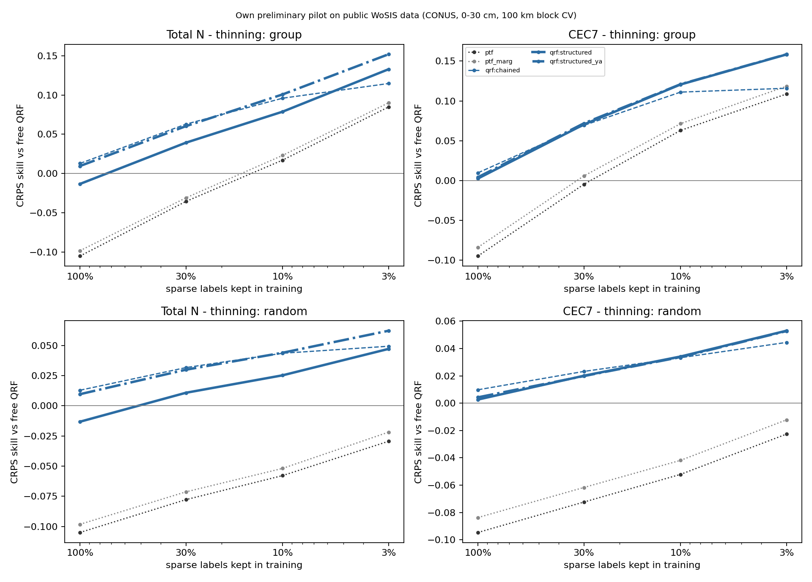
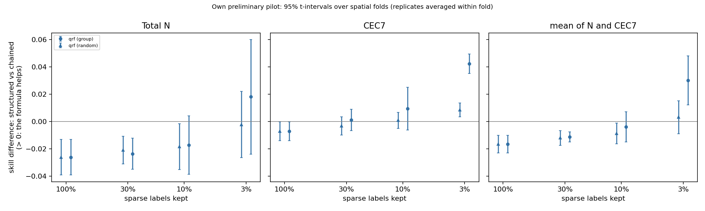
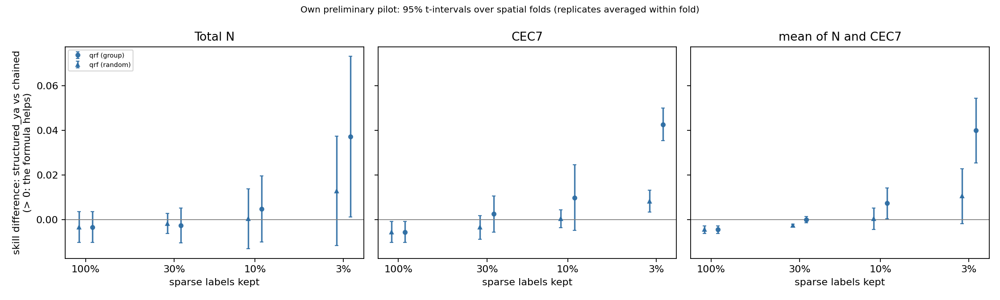
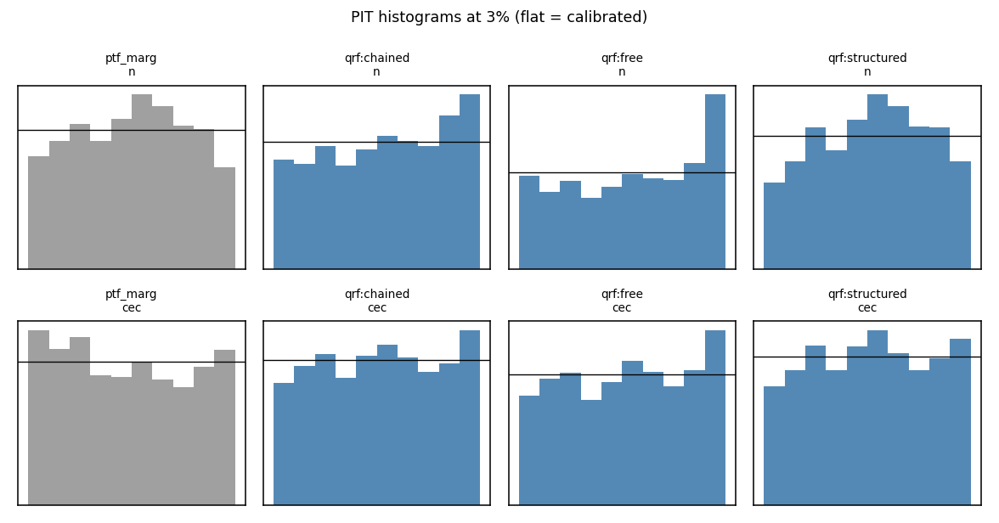

# Results: `cpu_qrf`

Own preliminary pilot on public WoSIS data (conterminous USA, 0-30 cm). Skill = 1 - CRPS(arm) / CRPS(free QRF) on the same held-out sites. Differences are in skill units (> 0: first arm better). Intervals: 95% t-intervals over spatial folds, replicates averaged within fold.

- complete folds used: [0, 1, 2, 3, 4]; incomplete folds excluded: []
- sites scored: 20198; configurations: 95; learners: ['qrf']
- observed envelope-violation rate in the data: N 0.011, CEC7 0.057

## 1. Primary result (pre-registered): 3% of sparse labels, group thinning, averaged over ['qrf']

| contrast                 | cec                     | mean                    | n                       |
|:-------------------------|:------------------------|:------------------------|:------------------------|
| structured vs chained    | +0.042 [+0.035, +0.050] | +0.030 [+0.012, +0.048] | +0.018 [-0.024, +0.060] |
| structured_ya vs chained | +0.043 [+0.035, +0.050] | +0.040 [+0.025, +0.054] | +0.037 [+0.001, +0.073] |

Same on the log scale (CRPS of log N, log CEC7):

| contrast                 | cec                     | mean                    | n                       |
|:-------------------------|:------------------------|:------------------------|:------------------------|
| structured vs chained    | +0.044 [+0.035, +0.053] | +0.035 [+0.022, +0.048] | +0.026 [-0.004, +0.056] |
| structured_ya vs chained | +0.045 [+0.038, +0.052] | +0.043 [+0.032, +0.055] | +0.041 [+0.013, +0.069] |

## 2. Per learner at 3% (group thinning)

|                                     | cec                     | mean                    | n                       |
|:------------------------------------|:------------------------|:------------------------|:------------------------|
| ('qrf', 'chained vs free')          | +0.116 [+0.060, +0.172] | +0.115 [+0.087, +0.144] | +0.115 [+0.100, +0.130] |
| ('qrf', 'structured vs chained')    | +0.042 [+0.035, +0.050] | +0.030 [+0.012, +0.048] | +0.018 [-0.024, +0.060] |
| ('qrf', 'structured vs clip')       | +0.087 [+0.067, +0.107] | +0.092 [+0.068, +0.116] | +0.097 [+0.040, +0.154] |
| ('qrf', 'structured vs free')       | +0.158 [+0.097, +0.220] | +0.146 [+0.119, +0.172] | +0.133 [+0.081, +0.184] |
| ('qrf', 'structured vs ptf')        | +0.050 [+0.026, +0.073] | +0.049 [+0.028, +0.070] | +0.048 [+0.025, +0.071] |
| ('qrf', 'structured vs ptf_marg')   | +0.040 [+0.018, +0.062] | +0.041 [+0.022, +0.060] | +0.043 [+0.024, +0.061] |
| ('qrf', 'structured_ya vs chained') | +0.043 [+0.035, +0.050] | +0.040 [+0.025, +0.054] | +0.037 [+0.001, +0.073] |

## 3. Structured vs chained-free at every level (group and random thinning)

|                         | cec                     | mean                    | n                       |
|:------------------------|:------------------------|:------------------------|:------------------------|
| ('all', 1.0, 'qrf')     | -0.007 [-0.014, -0.000] | -0.017 [-0.023, -0.010] | -0.026 [-0.039, -0.013] |
| ('group', 0.03, 'qrf')  | +0.042 [+0.035, +0.050] | +0.030 [+0.012, +0.048] | +0.018 [-0.024, +0.060] |
| ('group', 0.1, 'qrf')   | +0.010 [-0.006, +0.025] | -0.004 [-0.015, +0.007] | -0.017 [-0.039, +0.004] |
| ('group', 0.3, 'qrf')   | +0.001 [-0.007, +0.009] | -0.011 [-0.015, -0.008] | -0.024 [-0.035, -0.012] |
| ('random', 0.03, 'qrf') | +0.009 [+0.003, +0.014] | +0.003 [-0.009, +0.015] | -0.002 [-0.027, +0.022] |
| ('random', 0.1, 'qrf')  | +0.001 [-0.005, +0.007] | -0.009 [-0.016, -0.001] | -0.018 [-0.035, -0.001] |
| ('random', 0.3, 'qrf')  | -0.003 [-0.010, +0.004] | -0.012 [-0.017, -0.007] | -0.021 [-0.031, -0.011] |

## 4. Formula only (theta from x AND abundant properties) vs chained-free

|                         | cec                     | mean                    | n                       |
|:------------------------|:------------------------|:------------------------|:------------------------|
| ('all', 1.0, 'qrf')     | -0.006 [-0.010, -0.001] | -0.004 [-0.006, -0.003] | -0.003 [-0.010, +0.004] |
| ('group', 0.03, 'qrf')  | +0.043 [+0.035, +0.050] | +0.040 [+0.025, +0.054] | +0.037 [+0.001, +0.073] |
| ('group', 0.1, 'qrf')   | +0.010 [-0.005, +0.025] | +0.007 [+0.000, +0.014] | +0.005 [-0.010, +0.020] |
| ('group', 0.3, 'qrf')   | +0.003 [-0.005, +0.011] | +0.000 [-0.001, +0.001] | -0.003 [-0.010, +0.005] |
| ('random', 0.03, 'qrf') | +0.008 [+0.003, +0.013] | +0.011 [-0.002, +0.023] | +0.013 [-0.012, +0.037] |
| ('random', 0.1, 'qrf')  | +0.000 [-0.004, +0.004] | +0.000 [-0.004, +0.005] | +0.000 [-0.013, +0.014] |
| ('random', 0.3, 'qrf')  | -0.003 [-0.009, +0.002] | -0.003 [-0.003, -0.002] | -0.002 [-0.006, +0.003] |

## 5. Extrapolation: structured vs chained-free on thinned vs retained regions, and group - random on thinned sites

|                                     | cec                     | mean                    | n                       |
|:------------------------------------|:------------------------|:------------------------|:------------------------|
| ('group', 'retained', 0.03, 'qrf')  | -0.013 [-0.053, +0.027] | -0.006 [-0.034, +0.021] | +0.001 [-0.049, +0.050] |
| ('group', 'retained', 0.1, 'qrf')   | -0.011 [-0.029, +0.008] | -0.024 [-0.034, -0.014] | -0.038 [-0.054, -0.022] |
| ('group', 'retained', 0.3, 'qrf')   | -0.004 [-0.015, +0.007] | -0.017 [-0.024, -0.010] | -0.030 [-0.039, -0.021] |
| ('group', 'thinned', 0.03, 'qrf')   | +0.045 [+0.039, +0.050] | +0.032 [+0.013, +0.051] | +0.019 [-0.024, +0.062] |
| ('group', 'thinned', 0.1, 'qrf')    | +0.013 [-0.004, +0.030] | -0.001 [-0.013, +0.012] | -0.015 [-0.038, +0.009] |
| ('group', 'thinned', 0.3, 'qrf')    | +0.003 [-0.009, +0.014] | -0.011 [-0.016, -0.006] | -0.025 [-0.041, -0.008] |
| ('random', 'retained', 0.03, 'qrf') | -0.008 [-0.036, +0.020] | -0.007 [-0.033, +0.018] | -0.006 [-0.041, +0.029] |
| ('random', 'retained', 0.1, 'qrf')  | +0.002 [-0.021, +0.026] | -0.014 [-0.024, -0.005] | -0.031 [-0.050, -0.012] |
| ('random', 'retained', 0.3, 'qrf')  | -0.000 [-0.010, +0.010] | -0.012 [-0.019, -0.004] | -0.023 [-0.032, -0.015] |
| ('random', 'thinned', 0.03, 'qrf')  | +0.009 [+0.005, +0.014] | +0.003 [-0.010, +0.017] | -0.002 [-0.028, +0.023] |
| ('random', 'thinned', 0.1, 'qrf')   | +0.001 [-0.004, +0.006] | -0.008 [-0.016, +0.000] | -0.017 [-0.035, +0.000] |
| ('random', 'thinned', 0.3, 'qrf')   | -0.005 [-0.014, +0.004] | -0.014 [-0.020, -0.008] | -0.023 [-0.037, -0.009] |

Difference-in-differences on thinned sites ([structured - chained] group minus random, same sites):

|               | cec                     | n                       |
|:--------------|:------------------------|:------------------------|
| (0.03, 'qrf') | +0.035 [+0.031, +0.040] | +0.022 [-0.001, +0.045] |
| (0.1, 'qrf')  | +0.012 [-0.003, +0.027] | +0.003 [-0.011, +0.016] |
| (0.3, 'qrf')  | +0.007 [+0.002, +0.013] | -0.002 [-0.008, +0.004] |

## 6. Joint scores (vector clay, OC, pH, N, CEC7): skill vs free QRF

|                        | ptf                     | ptf_marg                | qrf:chained             | qrf:clip                | qrf:free                | qrf:structured          | qrf:structured_ya       |
|:-----------------------|:------------------------|:------------------------|:------------------------|:------------------------|:------------------------|:------------------------|:------------------------|
| ('es', 'all', 1.0)     | -0.034 [-0.052, -0.016] | -0.030 [-0.046, -0.013] | +0.027 [+0.021, +0.034] | +0.008 [+0.006, +0.010] | +0.000 [+0.000, +0.000] | +0.020 [+0.014, +0.026] | +0.025 [+0.018, +0.032] |
| ('es', 'group', 0.03)  | +0.071 [+0.052, +0.089] | +0.075 [+0.059, +0.092] | +0.077 [+0.064, +0.089] | +0.047 [+0.033, +0.062] | +0.000 [+0.000, +0.000] | +0.099 [+0.086, +0.111] | +0.103 [+0.089, +0.116] |
| ('es', 'group', 0.1)   | +0.039 [+0.013, +0.064] | +0.042 [+0.019, +0.065] | +0.072 [+0.059, +0.086] | +0.036 [+0.025, +0.047] | +0.000 [+0.000, +0.000] | +0.074 [+0.055, +0.093] | +0.079 [+0.060, +0.097] |
| ('es', 'group', 0.3)   | +0.006 [-0.015, +0.027] | +0.010 [-0.009, +0.029] | +0.052 [+0.036, +0.068] | +0.022 [+0.012, +0.033] | +0.000 [+0.000, +0.000] | +0.050 [+0.030, +0.069] | +0.054 [+0.035, +0.073] |
| ('es', 'random', 0.03) | +0.005 [-0.015, +0.026] | +0.010 [-0.011, +0.030] | +0.042 [+0.033, +0.051] | +0.021 [+0.017, +0.026] | +0.000 [+0.000, +0.000] | +0.046 [+0.035, +0.057] | +0.049 [+0.037, +0.061] |
| ('es', 'random', 0.1)  | -0.011 [-0.029, +0.007] | -0.007 [-0.024, +0.010] | +0.039 [+0.029, +0.049] | +0.017 [+0.013, +0.020] | +0.000 [+0.000, +0.000] | +0.036 [+0.029, +0.043] | +0.040 [+0.029, +0.050] |
| ('es', 'random', 0.3)  | -0.023 [-0.040, -0.006] | -0.019 [-0.034, -0.003] | +0.034 [+0.025, +0.043] | +0.012 [+0.009, +0.015] | +0.000 [+0.000, +0.000] | +0.029 [+0.021, +0.036] | +0.033 [+0.022, +0.043] |
| ('vs', 'all', 1.0)     | +0.060 [+0.017, +0.103] | +0.099 [+0.069, +0.128] | +0.175 [+0.154, +0.195] | +0.082 [+0.070, +0.095] | +0.000 [+0.000, +0.000] | +0.165 [+0.142, +0.187] | +0.175 [+0.154, +0.197] |
| ('vs', 'group', 0.03)  | +0.210 [+0.169, +0.251] | +0.237 [+0.203, +0.272] | +0.201 [+0.173, +0.230] | +0.132 [+0.107, +0.156] | +0.000 [+0.000, +0.000] | +0.256 [+0.225, +0.287] | +0.265 [+0.238, +0.292] |
| ('vs', 'group', 0.1)   | +0.164 [+0.129, +0.199] | +0.194 [+0.172, +0.216] | +0.212 [+0.201, +0.222] | +0.115 [+0.096, +0.134] | +0.000 [+0.000, +0.000] | +0.228 [+0.208, +0.249] | +0.238 [+0.217, +0.258] |
| ('vs', 'group', 0.3)   | +0.112 [+0.081, +0.143] | +0.146 [+0.122, +0.170] | +0.195 [+0.174, +0.216] | +0.097 [+0.082, +0.112] | +0.000 [+0.000, +0.000] | +0.194 [+0.173, +0.216] | +0.204 [+0.183, +0.226] |
| ('vs', 'random', 0.03) | +0.121 [+0.065, +0.176] | +0.157 [+0.117, +0.196] | +0.170 [+0.149, +0.191] | +0.096 [+0.080, +0.111] | +0.000 [+0.000, +0.000] | +0.200 [+0.165, +0.234] | +0.207 [+0.173, +0.240] |
| ('vs', 'random', 0.1)  | +0.093 [+0.040, +0.147] | +0.132 [+0.095, +0.169] | +0.177 [+0.151, +0.203] | +0.091 [+0.076, +0.105] | +0.000 [+0.000, +0.000] | +0.185 [+0.158, +0.213] | +0.193 [+0.165, +0.221] |
| ('vs', 'random', 0.3)  | +0.077 [+0.033, +0.121] | +0.116 [+0.086, +0.147] | +0.179 [+0.157, +0.201] | +0.087 [+0.074, +0.099] | +0.000 [+0.000, +0.000] | +0.176 [+0.152, +0.200] | +0.185 [+0.161, +0.209] |

## 7. CRPS skill of every arm vs free QRF

|                         | ptf                     | ptf_marg                | qrf:chained             | qrf:clip                | qrf:free                | qrf:oracle_ya           | qrf:structured          | qrf:structured_og       | qrf:structured_ya       |
|:------------------------|:------------------------|:------------------------|:------------------------|:------------------------|:------------------------|:------------------------|:------------------------|:------------------------|:------------------------|
| ('all', 1.0, 'cec')     | -0.095 [-0.125, -0.065] | -0.084 [-0.114, -0.053] | +0.010 [-0.001, +0.020] | -0.007 [-0.014, +0.001] | +0.000 [+0.000, +0.000] | +0.543 [+0.519, +0.568] | +0.003 [-0.012, +0.018] | +0.003 [-0.011, +0.018] | +0.004 [-0.008, +0.017] |
| ('all', 1.0, 'n')       | -0.105 [-0.151, -0.060] | -0.098 [-0.143, -0.053] | +0.013 [+0.005, +0.021] | -0.002 [-0.010, +0.007] | +0.000 [+0.000, +0.000] | +0.462 [+0.414, +0.510] | -0.013 [-0.032, +0.005] |                         | +0.010 [-0.003, +0.022] |
| ('group', 0.03, 'cec')  | +0.109 [+0.034, +0.183] | +0.118 [+0.044, +0.193] | +0.116 [+0.060, +0.172] | +0.072 [+0.027, +0.116] | +0.000 [+0.000, +0.000] | +0.507 [+0.475, +0.538] | +0.158 [+0.097, +0.220] | +0.153 [+0.087, +0.219] | +0.159 [+0.097, +0.220] |
| ('group', 0.03, 'n')    | +0.085 [+0.021, +0.149] | +0.090 [+0.029, +0.151] | +0.115 [+0.100, +0.130] | +0.036 [+0.005, +0.066] | +0.000 [+0.000, +0.000] | +0.459 [+0.371, +0.547] | +0.133 [+0.081, +0.184] |                         | +0.152 [+0.107, +0.197] |
| ('group', 0.1, 'cec')   | +0.063 [+0.011, +0.115] | +0.071 [+0.022, +0.121] | +0.111 [+0.065, +0.157] | +0.062 [+0.039, +0.085] | +0.000 [+0.000, +0.000] | +0.525 [+0.500, +0.550] | +0.121 [+0.062, +0.179] | +0.117 [+0.057, +0.178] | +0.121 [+0.062, +0.179] |
| ('group', 0.1, 'n')     | +0.017 [-0.039, +0.073] | +0.023 [-0.027, +0.073] | +0.096 [+0.069, +0.122] | +0.026 [+0.014, +0.037] | +0.000 [+0.000, +0.000] | +0.452 [+0.393, +0.511] | +0.079 [+0.041, +0.117] |                         | +0.101 [+0.068, +0.134] |
| ('group', 0.3, 'cec')   | -0.005 [-0.018, +0.008] | +0.006 [-0.007, +0.019] | +0.069 [+0.046, +0.093] | +0.029 [+0.010, +0.048] | +0.000 [+0.000, +0.000] | +0.539 [+0.507, +0.571] | +0.070 [+0.040, +0.101] | +0.070 [+0.038, +0.101] | +0.072 [+0.041, +0.103] |
| ('group', 0.3, 'n')     | -0.036 [-0.077, +0.006] | -0.031 [-0.071, +0.009] | +0.063 [+0.043, +0.082] | +0.010 [+0.003, +0.017] | +0.000 [+0.000, +0.000] | +0.454 [+0.382, +0.526] | +0.039 [+0.023, +0.056] |                         | +0.060 [+0.046, +0.075] |
| ('random', 0.03, 'cec') | -0.023 [-0.054, +0.009] | -0.012 [-0.044, +0.019] | +0.044 [+0.035, +0.054] | +0.023 [+0.011, +0.035] | +0.000 [+0.000, +0.000] | +0.514 [+0.482, +0.546] | +0.053 [+0.040, +0.066] | +0.051 [+0.038, +0.064] | +0.053 [+0.041, +0.064] |
| ('random', 0.03, 'n')   | -0.029 [-0.084, +0.025] | -0.022 [-0.072, +0.029] | +0.049 [+0.036, +0.062] | +0.014 [+0.001, +0.027] | +0.000 [+0.000, +0.000] | +0.459 [+0.377, +0.541] | +0.047 [+0.011, +0.084] |                         | +0.062 [+0.025, +0.099] |
| ('random', 0.1, 'cec')  | -0.052 [-0.080, -0.024] | -0.042 [-0.069, -0.015] | +0.033 [+0.028, +0.039] | +0.012 [+0.004, +0.020] | +0.000 [+0.000, +0.000] | +0.531 [+0.504, +0.559] | +0.034 [+0.031, +0.037] | +0.034 [+0.030, +0.037] | +0.034 [+0.030, +0.037] |
| ('random', 0.1, 'n')    | -0.058 [-0.102, -0.014] | -0.052 [-0.097, -0.007] | +0.043 [+0.031, +0.056] | +0.011 [+0.005, +0.017] | +0.000 [+0.000, +0.000] | +0.465 [+0.410, +0.521] | +0.025 [-0.002, +0.053] |                         | +0.044 [+0.019, +0.069] |
| ('random', 0.3, 'cec')  | -0.072 [-0.099, -0.045] | -0.062 [-0.088, -0.036] | +0.023 [+0.016, +0.031] | +0.003 [-0.003, +0.009] | +0.000 [+0.000, +0.000] | +0.538 [+0.509, +0.568] | +0.020 [+0.013, +0.028] | +0.020 [+0.011, +0.029] | +0.020 [+0.011, +0.029] |
| ('random', 0.3, 'n')    | -0.078 [-0.117, -0.039] | -0.071 [-0.110, -0.033] | +0.032 [+0.025, +0.038] | +0.005 [-0.002, +0.012] | +0.000 [+0.000, +0.000] | +0.464 [+0.407, +0.522] | +0.011 [-0.005, +0.027] |                         | +0.030 [+0.021, +0.039] |

## 8. 90% interval coverage

|                         |   ptf |   ptf_marg |   qrf:chained |   qrf:clip |   qrf:free |   qrf:oracle_ya |   qrf:structured |   qrf:structured_og |   qrf:structured_ya |
|:------------------------|------:|-----------:|--------------:|-----------:|-----------:|----------------:|-----------------:|--------------------:|--------------------:|
| (0.03, 'group', 'cec')  | 0.798 |      0.867 |         0.882 |      0.851 |      0.872 |           0.831 |            0.893 |               0.883 |               0.879 |
| (0.03, 'group', 'n')    | 0.869 |      0.92  |         0.871 |      0.808 |      0.825 |           0.843 |            0.925 |             nan     |               0.901 |
| (0.03, 'random', 'cec') | 0.803 |      0.875 |         0.89  |      0.853 |      0.88  |           0.839 |            0.89  |               0.888 |               0.876 |
| (0.03, 'random', 'n')   | 0.87  |      0.928 |         0.885 |      0.85  |      0.877 |           0.878 |            0.931 |             nan     |               0.902 |
| (0.1, 'group', 'cec')   | 0.807 |      0.882 |         0.88  |      0.849 |      0.862 |           0.833 |            0.89  |               0.886 |               0.874 |
| (0.1, 'group', 'n')     | 0.87  |      0.922 |         0.871 |      0.828 |      0.851 |           0.86  |            0.928 |             nan     |               0.894 |
| (0.1, 'random', 'cec')  | 0.803 |      0.876 |         0.88  |      0.848 |      0.877 |           0.839 |            0.887 |               0.887 |               0.873 |
| (0.1, 'random', 'n')    | 0.871 |      0.929 |         0.888 |      0.855 |      0.881 |           0.886 |            0.93  |             nan     |               0.898 |
| (0.3, 'group', 'cec')   | 0.805 |      0.877 |         0.874 |      0.846 |      0.869 |           0.839 |            0.887 |               0.885 |               0.87  |
| (0.3, 'group', 'n')     | 0.871 |      0.926 |         0.876 |      0.835 |      0.859 |           0.872 |            0.929 |             nan     |               0.893 |
| (0.3, 'random', 'cec')  | 0.804 |      0.876 |         0.874 |      0.848 |      0.88  |           0.837 |            0.887 |               0.886 |               0.872 |
| (0.3, 'random', 'n')    | 0.872 |      0.927 |         0.881 |      0.849 |      0.877 |           0.882 |            0.929 |             nan     |               0.894 |
| (1.0, 'all', 'cec')     | 0.804 |      0.876 |         0.871 |      0.846 |      0.88  |           0.839 |            0.887 |               0.886 |               0.871 |
| (1.0, 'all', 'n')       | 0.873 |      0.928 |         0.88  |      0.85  |      0.878 |           0.882 |            0.929 |             nan     |               0.89  |

## 9. Binding: share of paired chained draws outside the envelope, and of free draws vs observed clay/OC

|                  |   n:binding_obs[qrf:free] |   n:binding[qrf:chained] |   n:binding[qrf:structured_ya] |   cec:binding_obs[qrf:free] |   cec:binding[qrf:chained] |   cec:binding[qrf:structured_ya] |
|:-----------------|--------------------------:|-------------------------:|-------------------------------:|----------------------------:|---------------------------:|---------------------------------:|
| (0.03, 'group')  |                     0.201 |                    0.097 |                          0.001 |                       0.354 |                      0.183 |                            0.012 |
| (0.03, 'random') |                     0.178 |                    0.077 |                          0.001 |                       0.279 |                      0.14  |                            0.01  |
| (0.1, 'group')   |                     0.188 |                    0.068 |                          0.002 |                       0.308 |                      0.141 |                            0.013 |
| (0.1, 'random')  |                     0.172 |                    0.054 |                          0.002 |                       0.271 |                      0.115 |                            0.012 |
| (0.3, 'group')   |                     0.168 |                    0.047 |                          0.002 |                       0.284 |                      0.106 |                            0.012 |
| (0.3, 'random')  |                     0.161 |                    0.041 |                          0.002 |                       0.267 |                      0.098 |                            0.012 |
| (1.0, 'all')     |                     0.154 |                    0.03  |                          0.002 |                       0.26  |                      0.085 |                            0.012 |

## 10. Mixed model (equal weight over targets, replicates nested in folds)

```
{
 "qrf": {
  "per_target": {
   "cec": 0.04302220582047264,
   "n": 0.019326221411004846
  },
  "n_sites": 80319,
  "estimate_equal_weight": 0.03123736522471674,
  "se": 0.004195353826211239,
  "p": 9.642836765698073e-14
 }
}
```

## 11. Runtime and learner diagnostics (mean per configuration; seconds cover the 4 models of a learner)

|                      |   configs |   seconds |   n_train |
|:---------------------|----------:|----------:|----------:|
| ('n', 'qrf', 0.03)   |        30 |      3.11 |    271.8  |
| ('n', 'qrf', 0.1)    |        30 |      3.32 |    796.93 |
| ('n', 'qrf', 0.3)    |        30 |      4.26 |   2054.87 |
| ('n', 'qrf', 1.0)    |         5 |      7.56 |   6044.8  |
| ('cec', 'qrf', 0.03) |        30 |      5.5  |    466.27 |
| ('cec', 'qrf', 0.1)  |        30 |      6.07 |   1553.73 |
| ('cec', 'qrf', 0.3)  |        30 |      9.04 |   4666.07 |
| ('cec', 'qrf', 1.0)  |         5 |     19.78 |  15373.6  |








