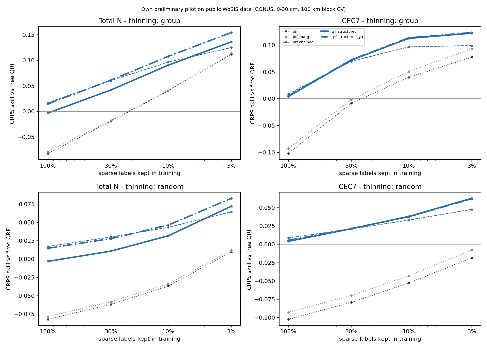
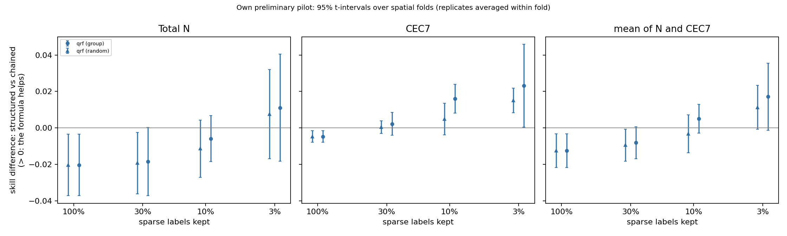
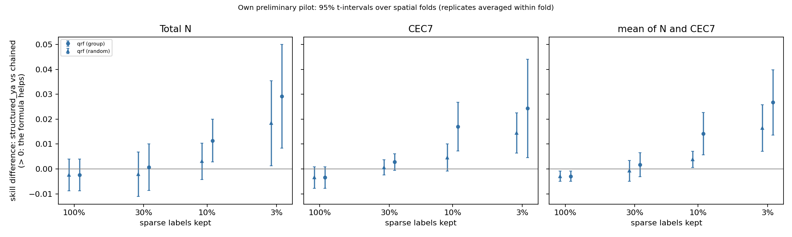
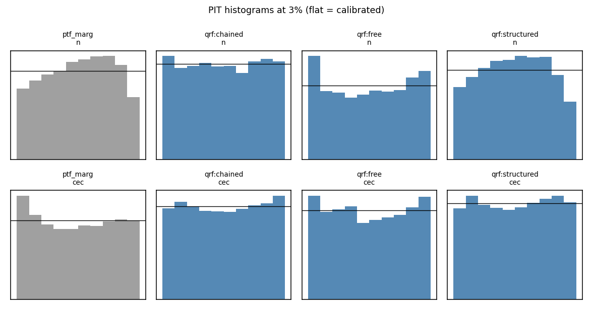

# Results: `cpu_qrf_w1`

Own preliminary pilot on public WoSIS data (conterminous USA, 0-30 cm). Skill = 1 - CRPS(arm) / CRPS(free QRF) on the same held-out sites. Differences are in skill units (> 0: first arm better). Intervals: approximate 95% t-intervals over spatial folds (the folds share training data, so they are somewhat optimistic), replicates averaged within fold.

- complete folds used: [0, 1, 2, 3, 4]; incomplete folds excluded: []
- sites scored: 20198; configurations: 95; learners: ['qrf']
- observed envelope-violation rate in the data: N 0.011, CEC7 0.057

## 0. Key numbers (read this first; points = skill difference x 100)

- **qrf**: formula only (structured_ya vs chained) at 3% by region: mean +2.7 [+1.4, +4.0] (N +2.9 [+0.8, +5.0], CEC7 +2.4 [+0.5, +4.4]); at 3% at random +1.6 [+0.7, +2.6]; with all labels -0.3 [-0.5, -0.1]; chaining alone (chained vs free) at 3%: +11.2 [+9.2, +13.2]
- CEC7-clay Spearman at held-out sites (qrf, 3%): observed 0.74; free 0.02; chained 0.47; structured_ya 0.63; ptf 0.85
- joint variogram-score skill (qrf, 3%): structured_ya +0.243 vs chained +0.188

## 1. Primary result (pre-specified in docs/DESIGN.md): 3% of sparse labels, group thinning, averaged over ['qrf']

| contrast                 | cec                     | mean                    | n                       |
|:-------------------------|:------------------------|:------------------------|:------------------------|
| structured vs chained    | +0.023 [+0.000, +0.046] | +0.017 [-0.001, +0.035] | +0.011 [-0.018, +0.040] |
| structured_ya vs chained | +0.024 [+0.005, +0.044] | +0.027 [+0.014, +0.040] | +0.029 [+0.008, +0.050] |

Same on the log scale (CRPS of log N, log CEC7):

| contrast                 | cec                     | mean                    | n                       |
|:-------------------------|:------------------------|:------------------------|:------------------------|
| structured vs chained    | +0.022 [-0.002, +0.046] | +0.029 [+0.021, +0.037] | +0.035 [+0.016, +0.054] |
| structured_ya vs chained | +0.024 [+0.001, +0.046] | +0.037 [+0.030, +0.044] | +0.049 [+0.034, +0.065] |

## 2. Per learner at 3% (group thinning)

|                                     | cec                     | mean                    | n                       |
|:------------------------------------|:------------------------|:------------------------|:------------------------|
| ('qrf', 'chained vs free')          | +0.099 [+0.082, +0.116] | +0.112 [+0.092, +0.132] | +0.125 [+0.096, +0.154] |
| ('qrf', 'structured vs chained')    | +0.023 [+0.000, +0.046] | +0.017 [-0.001, +0.035] | +0.011 [-0.018, +0.040] |
| ('qrf', 'structured vs clip')       | +0.052 [+0.032, +0.073] | +0.063 [+0.046, +0.079] | +0.073 [+0.050, +0.096] |
| ('qrf', 'structured vs free')       | +0.123 [+0.087, +0.158] | +0.129 [+0.101, +0.157] | +0.136 [+0.101, +0.171] |
| ('qrf', 'structured vs ptf')        | +0.045 [-0.012, +0.102] | +0.035 [+0.006, +0.063] | +0.024 [-0.002, +0.051] |
| ('qrf', 'structured vs ptf_marg')   | +0.029 [-0.013, +0.071] | +0.025 [+0.007, +0.043] | +0.022 [+0.001, +0.042] |
| ('qrf', 'structured_ya vs chained') | +0.024 [+0.005, +0.044] | +0.027 [+0.014, +0.040] | +0.029 [+0.008, +0.050] |

## 3. Structured vs chained-free at every level (group and random thinning)

|                         | cec                     | mean                    | n                       |
|:------------------------|:------------------------|:------------------------|:------------------------|
| ('all', 1.0, 'qrf')     | -0.005 [-0.008, -0.002] | -0.013 [-0.022, -0.003] | -0.020 [-0.037, -0.003] |
| ('group', 0.03, 'qrf')  | +0.023 [+0.000, +0.046] | +0.017 [-0.001, +0.035] | +0.011 [-0.018, +0.040] |
| ('group', 0.1, 'qrf')   | +0.016 [+0.008, +0.024] | +0.005 [-0.003, +0.013] | -0.006 [-0.019, +0.007] |
| ('group', 0.3, 'qrf')   | +0.002 [-0.004, +0.009] | -0.008 [-0.017, +0.001] | -0.019 [-0.037, +0.000] |
| ('random', 0.03, 'qrf') | +0.015 [+0.008, +0.022] | +0.011 [-0.001, +0.023] | +0.008 [-0.017, +0.032] |
| ('random', 0.1, 'qrf')  | +0.005 [-0.004, +0.014] | -0.003 [-0.014, +0.007] | -0.011 [-0.027, +0.004] |
| ('random', 0.3, 'qrf')  | +0.000 [-0.003, +0.004] | -0.009 [-0.018, -0.001] | -0.019 [-0.036, -0.002] |

## 4. Formula only (theta from x AND abundant properties) vs chained-free

|                         | cec                     | mean                    | n                       |
|:------------------------|:------------------------|:------------------------|:------------------------|
| ('all', 1.0, 'qrf')     | -0.003 [-0.008, +0.001] | -0.003 [-0.005, -0.001] | -0.002 [-0.009, +0.004] |
| ('group', 0.03, 'qrf')  | +0.024 [+0.005, +0.044] | +0.027 [+0.014, +0.040] | +0.029 [+0.008, +0.050] |
| ('group', 0.1, 'qrf')   | +0.017 [+0.007, +0.027] | +0.014 [+0.006, +0.023] | +0.011 [+0.003, +0.020] |
| ('group', 0.3, 'qrf')   | +0.003 [-0.001, +0.006] | +0.002 [-0.003, +0.007] | +0.001 [-0.009, +0.010] |
| ('random', 0.03, 'qrf') | +0.014 [+0.006, +0.023] | +0.016 [+0.007, +0.026] | +0.018 [+0.001, +0.035] |
| ('random', 0.1, 'qrf')  | +0.005 [-0.001, +0.010] | +0.004 [+0.001, +0.007] | +0.003 [-0.004, +0.010] |
| ('random', 0.3, 'qrf')  | +0.001 [-0.002, +0.004] | -0.001 [-0.005, +0.003] | -0.002 [-0.011, +0.007] |

## 5. Extrapolation: structured vs chained-free on thinned vs retained regions, and group - random on thinned sites

|                                     | cec                     | mean                    | n                       |
|:------------------------------------|:------------------------|:------------------------|:------------------------|
| ('group', 'retained', 0.03, 'qrf')  | +0.009 [-0.023, +0.042] | +0.003 [-0.052, +0.058] | -0.003 [-0.086, +0.080] |
| ('group', 'retained', 0.1, 'qrf')   | +0.000 [-0.016, +0.016] | -0.005 [-0.025, +0.014] | -0.011 [-0.048, +0.026] |
| ('group', 'retained', 0.3, 'qrf')   | -0.003 [-0.011, +0.005] | -0.010 [-0.022, +0.002] | -0.016 [-0.034, +0.001] |
| ('group', 'thinned', 0.03, 'qrf')   | +0.024 [+0.000, +0.047] | +0.018 [+0.000, +0.035] | +0.012 [-0.016, +0.039] |
| ('group', 'thinned', 0.1, 'qrf')    | +0.018 [+0.008, +0.027] | +0.006 [-0.001, +0.013] | -0.005 [-0.018, +0.008] |
| ('group', 'thinned', 0.3, 'qrf')    | +0.005 [-0.006, +0.017] | -0.006 [-0.014, +0.001] | -0.018 [-0.038, +0.002] |
| ('random', 'retained', 0.03, 'qrf') | +0.012 [-0.032, +0.056] | +0.005 [-0.058, +0.067] | -0.003 [-0.098, +0.092] |
| ('random', 'retained', 0.1, 'qrf')  | +0.009 [-0.016, +0.034] | +0.001 [-0.017, +0.020] | -0.006 [-0.028, +0.015] |
| ('random', 'retained', 0.3, 'qrf')  | +0.004 [-0.000, +0.008] | -0.006 [-0.017, +0.004] | -0.016 [-0.036, +0.003] |
| ('random', 'thinned', 0.03, 'qrf')  | +0.015 [+0.010, +0.020] | +0.011 [-0.000, +0.022] | +0.007 [-0.016, +0.030] |
| ('random', 'thinned', 0.1, 'qrf')   | +0.004 [-0.003, +0.012] | -0.004 [-0.014, +0.007] | -0.012 [-0.028, +0.005] |
| ('random', 'thinned', 0.3, 'qrf')   | -0.001 [-0.006, +0.003] | -0.011 [-0.020, -0.002] | -0.020 [-0.038, -0.003] |

Difference-in-differences on thinned sites ([arm - chained] group minus random, same sites):

|                                           | cec                     | n                       |
|:------------------------------------------|:------------------------|:------------------------|
| ('structured vs chained', 0.03, 'qrf')    | +0.009 [-0.016, +0.034] | +0.005 [-0.018, +0.028] |
| ('structured vs chained', 0.1, 'qrf')     | +0.013 [-0.003, +0.030] | +0.007 [+0.003, +0.011] |
| ('structured vs chained', 0.3, 'qrf')     | +0.007 [-0.007, +0.020] | +0.002 [-0.006, +0.010] |
| ('structured_ya vs chained', 0.03, 'qrf') | +0.010 [-0.016, +0.036] | +0.013 [-0.006, +0.031] |
| ('structured_ya vs chained', 0.1, 'qrf')  | +0.015 [-0.001, +0.030] | +0.010 [+0.004, +0.015] |
| ('structured_ya vs chained', 0.3, 'qrf')  | +0.006 [-0.005, +0.016] | +0.006 [-0.001, +0.013] |

## 6. Joint scores (vector clay, OC, pH, N, CEC7): skill vs free QRF

|                        | ptf                     | ptf_marg                | qrf:chained             | qrf:clip                | qrf:free                | qrf:structured          | qrf:structured_ya       |
|:-----------------------|:------------------------|:------------------------|:------------------------|:------------------------|:------------------------|:------------------------|:------------------------|
| ('es', 'all', 1.0)     | -0.029 [-0.043, -0.014] | -0.025 [-0.039, -0.011] | +0.027 [+0.024, +0.030] | +0.008 [+0.005, +0.012] | +0.000 [+0.000, +0.000] | +0.023 [+0.018, +0.028] | +0.026 [+0.023, +0.029] |
| ('es', 'group', 0.03)  | +0.074 [+0.051, +0.097] | +0.078 [+0.058, +0.098] | +0.074 [+0.059, +0.088] | +0.052 [+0.042, +0.062] | +0.000 [+0.000, +0.000] | +0.094 [+0.079, +0.110] | +0.097 [+0.083, +0.112] |
| ('es', 'group', 0.1)   | +0.040 [+0.024, +0.057] | +0.044 [+0.028, +0.060] | +0.067 [+0.055, +0.079] | +0.032 [+0.025, +0.038] | +0.000 [+0.000, +0.000] | +0.073 [+0.059, +0.087] | +0.076 [+0.062, +0.090] |
| ('es', 'group', 0.3)   | +0.013 [+0.002, +0.023] | +0.016 [+0.003, +0.028] | +0.052 [+0.046, +0.058] | +0.023 [+0.017, +0.029] | +0.000 [+0.000, +0.000] | +0.051 [+0.043, +0.060] | +0.055 [+0.047, +0.063] |
| ('es', 'random', 0.03) | +0.014 [-0.007, +0.034] | +0.017 [-0.000, +0.034] | +0.044 [+0.039, +0.050] | +0.023 [+0.015, +0.031] | +0.000 [+0.000, +0.000] | +0.054 [+0.044, +0.063] | +0.055 [+0.047, +0.063] |
| ('es', 'random', 0.1)  | -0.005 [-0.018, +0.008] | -0.001 [-0.013, +0.011] | +0.038 [+0.033, +0.042] | +0.016 [+0.011, +0.021] | +0.000 [+0.000, +0.000] | +0.040 [+0.037, +0.043] | +0.042 [+0.040, +0.044] |
| ('es', 'random', 0.3)  | -0.017 [-0.031, -0.002] | -0.013 [-0.026, -0.001] | +0.033 [+0.031, +0.035] | +0.012 [+0.008, +0.015] | +0.000 [+0.000, +0.000] | +0.031 [+0.026, +0.036] | +0.034 [+0.031, +0.037] |
| ('vs', 'all', 1.0)     | +0.068 [+0.049, +0.086] | +0.103 [+0.092, +0.115] | +0.174 [+0.166, +0.183] | +0.084 [+0.075, +0.094] | +0.000 [+0.000, +0.000] | +0.171 [+0.163, +0.179] | +0.177 [+0.167, +0.187] |
| ('vs', 'group', 0.03)  | +0.197 [+0.153, +0.241] | +0.224 [+0.188, +0.260] | +0.188 [+0.173, +0.203] | +0.134 [+0.121, +0.147] | +0.000 [+0.000, +0.000] | +0.237 [+0.219, +0.256] | +0.243 [+0.226, +0.261] |
| ('vs', 'group', 0.1)   | +0.145 [+0.100, +0.190] | +0.179 [+0.151, +0.207] | +0.198 [+0.172, +0.225] | +0.109 [+0.093, +0.125] | +0.000 [+0.000, +0.000] | +0.214 [+0.185, +0.243] | +0.222 [+0.192, +0.253] |
| ('vs', 'group', 0.3)   | +0.118 [+0.089, +0.147] | +0.149 [+0.125, +0.172] | +0.193 [+0.180, +0.206] | +0.101 [+0.092, +0.110] | +0.000 [+0.000, +0.000] | +0.197 [+0.182, +0.211] | +0.204 [+0.192, +0.216] |
| ('vs', 'random', 0.03) | +0.130 [+0.097, +0.164] | +0.166 [+0.142, +0.190] | +0.171 [+0.158, +0.184] | +0.101 [+0.084, +0.118] | +0.000 [+0.000, +0.000] | +0.209 [+0.188, +0.231] | +0.213 [+0.190, +0.235] |
| ('vs', 'random', 0.1)  | +0.098 [+0.074, +0.123] | +0.135 [+0.120, +0.149] | +0.174 [+0.162, +0.187] | +0.091 [+0.081, +0.101] | +0.000 [+0.000, +0.000] | +0.190 [+0.178, +0.203] | +0.195 [+0.181, +0.208] |
| ('vs', 'random', 0.3)  | +0.084 [+0.060, +0.107] | +0.120 [+0.106, +0.135] | +0.175 [+0.165, +0.186] | +0.087 [+0.079, +0.096] | +0.000 [+0.000, +0.000] | +0.181 [+0.167, +0.194] | +0.186 [+0.174, +0.198] |

## 7. CRPS skill of every arm vs free QRF

|                         | ptf                     | ptf_marg                | qrf:chained             | qrf:clip                | qrf:free                | qrf:oracle_ya           | qrf:structured          | qrf:structured_og       | qrf:structured_ya       |
|:------------------------|:------------------------|:------------------------|:------------------------|:------------------------|:------------------------|:------------------------|:------------------------|:------------------------|:------------------------|
| ('all', 1.0, 'cec')     | -0.102 [-0.165, -0.040] | -0.093 [-0.148, -0.037] | +0.009 [-0.005, +0.022] | -0.010 [-0.025, +0.005] | +0.000 [+0.000, +0.000] | +0.548 [+0.499, +0.597] | +0.004 [-0.012, +0.020] | +0.004 [-0.012, +0.020] | +0.005 [-0.012, +0.023] |
| ('all', 1.0, 'n')       | -0.082 [-0.101, -0.063] | -0.078 [-0.096, -0.061] | +0.017 [+0.000, +0.034] | +0.001 [-0.013, +0.015] | +0.000 [+0.000, +0.000] | +0.465 [+0.424, +0.507] | -0.003 [-0.021, +0.015] |                         | +0.015 [-0.004, +0.034] |
| ('group', 0.03, 'cec')  | +0.078 [+0.005, +0.150] | +0.093 [+0.035, +0.152] | +0.099 [+0.082, +0.116] | +0.070 [+0.048, +0.092] | +0.000 [+0.000, +0.000] | +0.462 [+0.388, +0.536] | +0.123 [+0.087, +0.158] | +0.115 [+0.083, +0.147] | +0.124 [+0.091, +0.157] |
| ('group', 0.03, 'n')    | +0.112 [+0.091, +0.132] | +0.114 [+0.094, +0.135] | +0.125 [+0.096, +0.154] | +0.063 [+0.033, +0.093] | +0.000 [+0.000, +0.000] | +0.435 [+0.357, +0.512] | +0.136 [+0.101, +0.171] |                         | +0.154 [+0.128, +0.180] |
| ('group', 0.1, 'cec')   | +0.040 [-0.010, +0.090] | +0.051 [+0.008, +0.094] | +0.097 [+0.070, +0.124] | +0.049 [+0.033, +0.065] | +0.000 [+0.000, +0.000] | +0.528 [+0.479, +0.576] | +0.113 [+0.082, +0.144] | +0.108 [+0.071, +0.145] | +0.114 [+0.080, +0.147] |
| ('group', 0.1, 'n')     | +0.040 [+0.015, +0.066] | +0.041 [+0.021, +0.061] | +0.096 [+0.072, +0.120] | +0.023 [+0.008, +0.038] | +0.000 [+0.000, +0.000] | +0.460 [+0.388, +0.533] | +0.090 [+0.071, +0.110] |                         | +0.108 [+0.082, +0.133] |
| ('group', 0.3, 'cec')   | -0.008 [-0.065, +0.048] | -0.002 [-0.049, +0.046] | +0.070 [+0.051, +0.089] | +0.026 [+0.019, +0.034] | +0.000 [+0.000, +0.000] | +0.538 [+0.507, +0.569] | +0.072 [+0.052, +0.092] | +0.072 [+0.051, +0.092] | +0.073 [+0.054, +0.092] |
| ('group', 0.3, 'n')     | -0.019 [-0.033, -0.005] | -0.018 [-0.034, -0.001] | +0.060 [+0.046, +0.075] | +0.014 [-0.005, +0.033] | +0.000 [+0.000, +0.000] | +0.451 [+0.376, +0.525] | +0.042 [+0.019, +0.065] |                         | +0.061 [+0.042, +0.080] |
| ('random', 0.03, 'cec') | -0.018 [-0.075, +0.039] | -0.008 [-0.053, +0.037] | +0.048 [+0.037, +0.058] | +0.023 [+0.012, +0.034] | +0.000 [+0.000, +0.000] | +0.523 [+0.477, +0.570] | +0.063 [+0.053, +0.073] | +0.060 [+0.050, +0.069] | +0.062 [+0.052, +0.072] |
| ('random', 0.03, 'n')   | +0.010 [-0.025, +0.044] | +0.012 [-0.020, +0.043] | +0.065 [+0.045, +0.084] | +0.021 [-0.000, +0.043] | +0.000 [+0.000, +0.000] | +0.473 [+0.400, +0.547] | +0.072 [+0.041, +0.103] |                         | +0.083 [+0.054, +0.111] |
| ('random', 0.1, 'cec')  | -0.053 [-0.112, +0.006] | -0.043 [-0.089, +0.003] | +0.033 [+0.029, +0.038] | +0.011 [+0.001, +0.021] | +0.000 [+0.000, +0.000] | +0.538 [+0.494, +0.582] | +0.038 [+0.025, +0.051] | +0.037 [+0.025, +0.049] | +0.038 [+0.028, +0.048] |
| ('random', 0.1, 'n')    | -0.037 [-0.054, -0.020] | -0.034 [-0.045, -0.023] | +0.043 [+0.031, +0.055] | +0.011 [-0.007, +0.029] | +0.000 [+0.000, +0.000] | +0.468 [+0.412, +0.524] | +0.032 [+0.024, +0.039] |                         | +0.046 [+0.036, +0.057] |
| ('random', 0.3, 'cec')  | -0.079 [-0.146, -0.012] | -0.070 [-0.127, -0.012] | +0.021 [+0.008, +0.034] | -0.000 [-0.013, +0.012] | +0.000 [+0.000, +0.000] | +0.544 [+0.496, +0.592] | +0.021 [+0.006, +0.037] | +0.021 [+0.006, +0.036] | +0.022 [+0.006, +0.037] |
| ('random', 0.3, 'n')    | -0.062 [-0.071, -0.053] | -0.058 [-0.069, -0.048] | +0.030 [+0.016, +0.045] | +0.005 [-0.008, +0.017] | +0.000 [+0.000, +0.000] | +0.462 [+0.406, +0.518] | +0.011 [-0.004, +0.026] |                         | +0.028 [+0.010, +0.046] |

## 8. 90% interval coverage

|                         |   ptf |   ptf_marg |   qrf:chained |   qrf:clip |   qrf:free |   qrf:oracle_ya |   qrf:structured |   qrf:structured_og |   qrf:structured_ya |
|:------------------------|------:|-----------:|--------------:|-----------:|-----------:|----------------:|-----------------:|--------------------:|--------------------:|
| (0.03, 'group', 'cec')  | 0.801 |      0.889 |         0.898 |      0.867 |      0.878 |           0.858 |            0.91  |               0.901 |               0.906 |
| (0.03, 'group', 'n')    | 0.887 |      0.933 |         0.893 |      0.848 |      0.854 |           0.835 |            0.934 |             nan     |               0.928 |
| (0.03, 'random', 'cec') | 0.814 |      0.906 |         0.908 |      0.862 |      0.888 |           0.882 |            0.908 |               0.907 |               0.912 |
| (0.03, 'random', 'n')   | 0.89  |      0.945 |         0.91  |      0.867 |      0.89  |           0.899 |            0.943 |             nan     |               0.936 |
| (0.1, 'group', 'cec')   | 0.812 |      0.902 |         0.895 |      0.86  |      0.879 |           0.879 |            0.909 |               0.906 |               0.909 |
| (0.1, 'group', 'n')     | 0.889 |      0.942 |         0.9   |      0.845 |      0.868 |           0.879 |            0.943 |             nan     |               0.929 |
| (0.1, 'random', 'cec')  | 0.815 |      0.904 |         0.906 |      0.859 |      0.886 |           0.876 |            0.904 |               0.903 |               0.909 |
| (0.1, 'random', 'n')    | 0.89  |      0.944 |         0.911 |      0.87  |      0.894 |           0.894 |            0.943 |             nan     |               0.928 |
| (0.3, 'group', 'cec')   | 0.814 |      0.895 |         0.902 |      0.86  |      0.883 |           0.871 |            0.903 |               0.902 |               0.908 |
| (0.3, 'group', 'n')     | 0.888 |      0.943 |         0.907 |      0.854 |      0.875 |           0.887 |            0.941 |             nan     |               0.929 |
| (0.3, 'random', 'cec')  | 0.814 |      0.901 |         0.904 |      0.858 |      0.887 |           0.879 |            0.902 |               0.902 |               0.907 |
| (0.3, 'random', 'n')    | 0.89  |      0.944 |         0.909 |      0.869 |      0.895 |           0.901 |            0.941 |             nan     |               0.928 |
| (1.0, 'all', 'cec')     | 0.814 |      0.902 |         0.902 |      0.858 |      0.885 |           0.882 |            0.902 |               0.902 |               0.909 |
| (1.0, 'all', 'n')       | 0.89  |      0.944 |         0.912 |      0.864 |      0.89  |           0.9   |            0.942 |             nan     |               0.925 |

## 9. Binding: share of paired chained draws outside the envelope, and of free draws vs observed clay/OC

|                  |   n:binding_obs[qrf:free] |   n:binding[qrf:chained] |   n:binding[qrf:structured_ya] |   cec:binding_obs[qrf:free] |   cec:binding[qrf:chained] |   cec:binding[qrf:structured_ya] |
|:-----------------|--------------------------:|-------------------------:|-------------------------------:|----------------------------:|---------------------------:|---------------------------------:|
| (0.03, 'group')  |                     0.221 |                    0.109 |                          0.001 |                       0.327 |                      0.171 |                            0.014 |
| (0.03, 'random') |                     0.183 |                    0.081 |                          0.001 |                       0.282 |                      0.14  |                            0.01  |
| (0.1, 'group')   |                     0.186 |                    0.064 |                          0.002 |                       0.303 |                      0.127 |                            0.012 |
| (0.1, 'random')  |                     0.171 |                    0.054 |                          0.002 |                       0.271 |                      0.115 |                            0.012 |
| (0.3, 'group')   |                     0.172 |                    0.05  |                          0.002 |                       0.283 |                      0.105 |                            0.013 |
| (0.3, 'random')  |                     0.163 |                    0.042 |                          0.002 |                       0.261 |                      0.098 |                            0.013 |
| (1.0, 'all')     |                     0.159 |                    0.03  |                          0.002 |                       0.257 |                      0.086 |                            0.013 |

## 10. Mixed model (exploratory: fold-x-replicate-x-target means, fold random intercept, replicates within fold; the primary inference is section 1)

```
{
 "qrf": {
  "per_target": {
   "cec": 0.023175913143842614,
   "n": 0.011063001704593938
  },
  "n_sites": 20198,
  "n_units": 30,
  "note": "exploratory; the primary inference is the fold-level t-interval (section 1)",
  "estimate_equal_weight": 0.017119457424218276,
  "se": 0.008144840301502808,
  "df": 4,
  "p_t": 0.10343384596074219,
  "converged": false,
  "boundary": true,
  "warnings": [
   "Gradient optimization failed, |grad| = 1",
   "Maximum Likelihood optimization failed to converge",
   "MixedLM optimization failed, trying a different optimizer may help",
   "Retrying MixedLM optimization with cg",
   "Retrying MixedLM optimization with lbfgs",
   "The MLE may be on the boundary of the parameter space"
  ]
 }
}
```

## 11. Runtime and learner diagnostics (mean per configuration; seconds cover the 4 models of a learner)

labels_kept = realised share of the target's training labels (the level is a share of profiles with any sparse label; N is missing by region, so its share varies more).

|                      |   configs |   seconds |   n_train |   labels_kept_mean |   labels_kept_min |   labels_kept_max |
|:---------------------|----------:|----------:|----------:|-------------------:|------------------:|------------------:|
| ('n', 'qrf', 0.03)   |        30 |     3.77  |   259.933 |              0.043 |             0.024 |             0.064 |
| ('n', 'qrf', 0.1)    |        30 |     4.283 |   792.333 |              0.131 |             0.023 |             0.163 |
| ('n', 'qrf', 0.3)    |        30 |     5.353 |  2068.73  |              0.341 |             0.05  |             0.518 |
| ('n', 'qrf', 1.0)    |         5 |     9.78  |  6044.8   |              1     |             1     |             1     |
| ('cec', 'qrf', 0.03) |        30 |     6.463 |   492.4   |              0.032 |             0.028 |             0.036 |
| ('cec', 'qrf', 0.1)  |        30 |     6.97  |  1596.2   |              0.104 |             0.092 |             0.126 |
| ('cec', 'qrf', 0.3)  |        30 |     9.967 |  4616.93  |              0.301 |             0.288 |             0.321 |
| ('cec', 'qrf', 1.0)  |         5 |    20.74  | 15373.6   |              1     |             1     |             1     |

## 12. Figure-1 check: rank correlation with the abundant driver at held-out sites

Spearman of (clay, CEC7) and (OC, N) pooled over sites and draws, each sparse draw paired with the y_A draw it was made with; in brackets the per-site median 'map'. A coherent joint predictive reproduces the observed correlation; independent draws (free) attenuate it. rank_correlation.csv has the gaps to the observed value with fold-level 95% intervals.

**CEC7 vs clay**: Spearman on joint draws (median map in brackets)

|                  | observed   | ptf           | ptf_marg      | qrf:chained   | qrf:clip      | qrf:free      | qrf:structured   | qrf:structured_og   | qrf:structured_ya   |
|:-----------------|:-----------|:--------------|:--------------|:--------------|:--------------|:--------------|:-----------------|:--------------------|:--------------------|
| ('all', 1.0)     | +0.74      | +0.87 (+0.83) | +0.73 (+0.79) | +0.70 (+0.66) | +0.40 (+0.64) | +0.14 (+0.56) | +0.73 (+0.69)    | +0.73 (+0.69)       | +0.74 (+0.69)       |
| ('group', 0.03)  | +0.74      | +0.85 (+0.80) | +0.72 (+0.76) | +0.47 (+0.58) | +0.32 (+0.43) | +0.02 (+0.15) | +0.63 (+0.65)    | +0.65 (+0.64)       | +0.63 (+0.67)       |
| ('group', 0.1)   | +0.74      | +0.87 (+0.83) | +0.74 (+0.80) | +0.58 (+0.64) | +0.33 (+0.47) | +0.04 (+0.24) | +0.69 (+0.67)    | +0.70 (+0.67)       | +0.70 (+0.69)       |
| ('group', 0.3)   | +0.74      | +0.87 (+0.83) | +0.73 (+0.79) | +0.66 (+0.65) | +0.36 (+0.52) | +0.08 (+0.36) | +0.71 (+0.67)    | +0.71 (+0.66)       | +0.72 (+0.68)       |
| ('random', 0.03) | +0.74      | +0.87 (+0.83) | +0.73 (+0.79) | +0.57 (+0.65) | +0.34 (+0.54) | +0.07 (+0.37) | +0.71 (+0.70)    | +0.71 (+0.70)       | +0.72 (+0.71)       |
| ('random', 0.1)  | +0.74      | +0.87 (+0.83) | +0.73 (+0.80) | +0.64 (+0.66) | +0.37 (+0.60) | +0.10 (+0.46) | +0.73 (+0.71)    | +0.73 (+0.71)       | +0.73 (+0.71)       |
| ('random', 0.3)  | +0.74      | +0.87 (+0.83) | +0.73 (+0.79) | +0.68 (+0.66) | +0.39 (+0.62) | +0.12 (+0.51) | +0.73 (+0.70)    | +0.73 (+0.70)       | +0.74 (+0.70)       |

**N vs OC**: Spearman on joint draws (median map in brackets)

|                  | observed   | ptf           | ptf_marg      | qrf:chained   | qrf:clip      | qrf:free      | qrf:structured   | qrf:structured_ya   |
|:-----------------|:-----------|:--------------|:--------------|:--------------|:--------------|:--------------|:-----------------|:--------------------|
| ('all', 1.0)     | +0.86      | +1.00 (+1.00) | +0.88 (+0.99) | +0.81 (+0.86) | +0.47 (+0.82) | +0.32 (+0.78) | +0.86 (+0.85)    | +0.86 (+0.86)       |
| ('group', 0.03)  | +0.86      | +1.00 (+1.00) | +0.91 (+0.99) | +0.58 (+0.85) | +0.36 (+0.61) | +0.12 (+0.40) | +0.90 (+0.94)    | +0.89 (+0.95)       |
| ('group', 0.1)   | +0.86      | +1.00 (+1.00) | +0.89 (+0.99) | +0.69 (+0.87) | +0.40 (+0.70) | +0.22 (+0.61) | +0.87 (+0.89)    | +0.86 (+0.90)       |
| ('group', 0.3)   | +0.86      | +1.00 (+1.00) | +0.89 (+0.99) | +0.74 (+0.85) | +0.43 (+0.74) | +0.26 (+0.66) | +0.86 (+0.86)    | +0.86 (+0.88)       |
| ('random', 0.03) | +0.86      | +1.00 (+1.00) | +0.88 (+0.99) | +0.65 (+0.87) | +0.42 (+0.78) | +0.24 (+0.71) | +0.87 (+0.89)    | +0.86 (+0.91)       |
| ('random', 0.1)  | +0.86      | +1.00 (+1.00) | +0.88 (+0.99) | +0.73 (+0.88) | +0.45 (+0.81) | +0.28 (+0.76) | +0.87 (+0.88)    | +0.86 (+0.89)       |
| ('random', 0.3)  | +0.86      | +1.00 (+1.00) | +0.89 (+0.99) | +0.77 (+0.87) | +0.46 (+0.82) | +0.31 (+0.78) | +0.87 (+0.86)    | +0.86 (+0.88)       |









