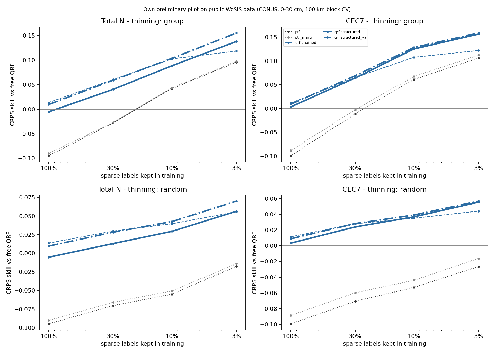
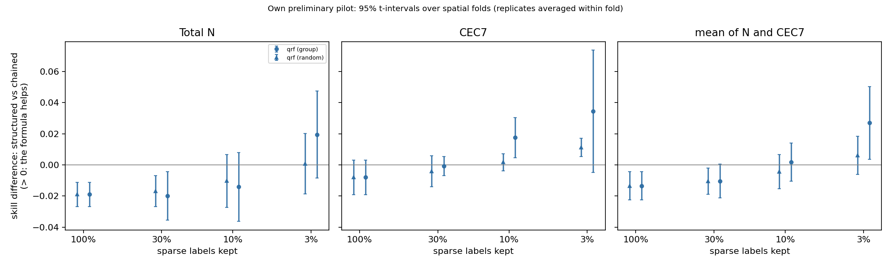
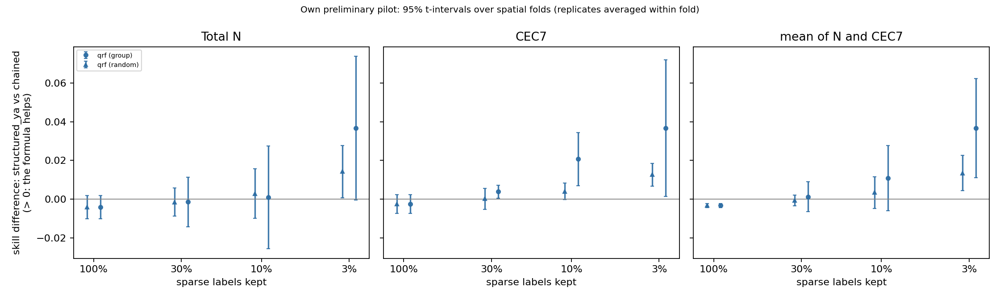
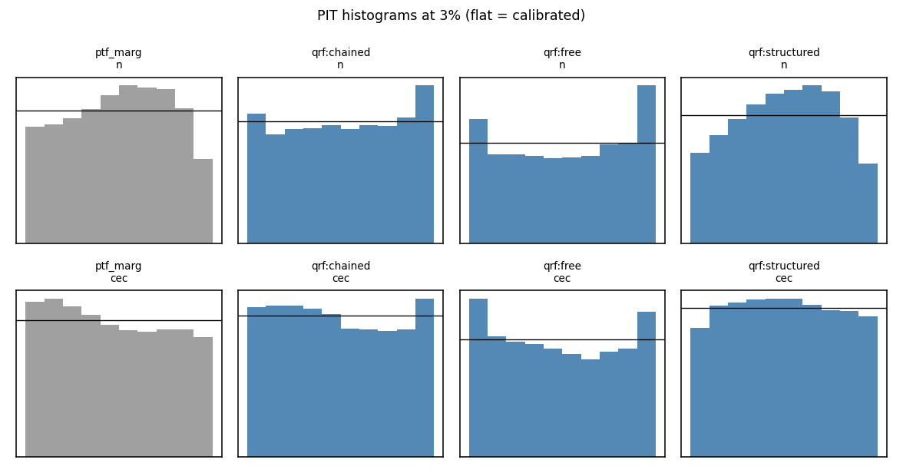

# Results: `cpu_qrf_w1_s2`

Own preliminary pilot on public WoSIS data (conterminous USA, 0-30 cm). Skill = 1 - CRPS(arm) / CRPS(free QRF) on the same held-out sites. Differences are in skill units (> 0: first arm better). Intervals: approximate 95% t-intervals over spatial folds (the folds share training data, so they are somewhat optimistic), replicates averaged within fold.

- complete folds used: [0, 1, 2, 3, 4]; incomplete folds excluded: []
- sites scored: 20198; configurations: 95; learners: ['qrf']
- observed envelope-violation rate in the data: N 0.011, CEC7 0.057

## 0. Key numbers (read this first; points = skill difference x 100)

- **qrf**: formula only (structured_ya vs chained) at 3% by region: mean +3.7 [+1.1, +6.2] (N +3.7 [-0.0, +7.4], CEC7 +3.7 [+0.1, +7.2]); at 3% at random +1.3 [+0.4, +2.3]; with all labels -0.3 [-0.4, -0.2]; chaining alone (chained vs free) at 3%: +12.0 [+9.3, +14.7]
- CEC7-clay Spearman at held-out sites (qrf, 3%): observed 0.75; free 0.01; chained 0.47; structured_ya 0.66; ptf 0.87
- joint variogram-score skill (qrf, 3%): structured_ya +0.239 vs chained +0.191

## 1. Primary result (pre-specified in docs/DESIGN.md): 3% of sparse labels, group thinning, averaged over ['qrf']

| contrast                 | cec                     | mean                    | n                       |
|:-------------------------|:------------------------|:------------------------|:------------------------|
| structured vs chained    | +0.035 [-0.005, +0.074] | +0.027 [+0.004, +0.050] | +0.020 [-0.008, +0.047] |
| structured_ya vs chained | +0.037 [+0.001, +0.072] | +0.037 [+0.011, +0.062] | +0.037 [-0.000, +0.074] |

Same on the log scale (CRPS of log N, log CEC7):

| contrast                 | cec                     | mean                    | n                       |
|:-------------------------|:------------------------|:------------------------|:------------------------|
| structured vs chained    | +0.041 [+0.010, +0.071] | +0.036 [+0.024, +0.047] | +0.031 [+0.002, +0.060] |
| structured_ya vs chained | +0.041 [+0.012, +0.070] | +0.043 [+0.028, +0.058] | +0.044 [+0.007, +0.081] |

## 2. Per learner at 3% (group thinning)

|                                     | cec                     | mean                    | n                       |
|:------------------------------------|:------------------------|:------------------------|:------------------------|
| ('qrf', 'chained vs free')          | +0.122 [+0.089, +0.155] | +0.120 [+0.093, +0.147] | +0.119 [+0.094, +0.144] |
| ('qrf', 'structured vs chained')    | +0.035 [-0.005, +0.074] | +0.027 [+0.004, +0.050] | +0.020 [-0.008, +0.047] |
| ('qrf', 'structured vs clip')       | +0.078 [+0.017, +0.140] | +0.085 [+0.047, +0.123] | +0.091 [+0.062, +0.120] |
| ('qrf', 'structured vs free')       | +0.156 [+0.090, +0.222] | +0.147 [+0.107, +0.187] | +0.138 [+0.100, +0.177] |
| ('qrf', 'structured vs ptf')        | +0.051 [+0.020, +0.081] | +0.046 [+0.034, +0.059] | +0.042 [+0.006, +0.079] |
| ('qrf', 'structured vs ptf_marg')   | +0.044 [+0.014, +0.074] | +0.042 [+0.031, +0.054] | +0.040 [+0.012, +0.068] |
| ('qrf', 'structured_ya vs chained') | +0.037 [+0.001, +0.072] | +0.037 [+0.011, +0.062] | +0.037 [-0.000, +0.074] |

## 3. Structured vs chained-free at every level (group and random thinning)

|                         | cec                     | mean                    | n                       |
|:------------------------|:------------------------|:------------------------|:------------------------|
| ('all', 1.0, 'qrf')     | -0.008 [-0.019, +0.003] | -0.014 [-0.023, -0.004] | -0.019 [-0.027, -0.011] |
| ('group', 0.03, 'qrf')  | +0.035 [-0.005, +0.074] | +0.027 [+0.004, +0.050] | +0.020 [-0.008, +0.047] |
| ('group', 0.1, 'qrf')   | +0.018 [+0.005, +0.030] | +0.002 [-0.011, +0.014] | -0.014 [-0.036, +0.008] |
| ('group', 0.3, 'qrf')   | -0.001 [-0.007, +0.005] | -0.010 [-0.021, +0.000] | -0.020 [-0.036, -0.004] |
| ('random', 0.03, 'qrf') | +0.011 [+0.005, +0.017] | +0.006 [-0.006, +0.018] | +0.001 [-0.019, +0.020] |
| ('random', 0.1, 'qrf')  | +0.002 [-0.004, +0.007] | -0.004 [-0.015, +0.007] | -0.010 [-0.027, +0.007] |
| ('random', 0.3, 'qrf')  | -0.004 [-0.014, +0.006] | -0.010 [-0.019, -0.002] | -0.017 [-0.027, -0.007] |

## 4. Formula only (theta from x AND abundant properties) vs chained-free

|                         | cec                     | mean                    | n                       |
|:------------------------|:------------------------|:------------------------|:------------------------|
| ('all', 1.0, 'qrf')     | -0.002 [-0.007, +0.002] | -0.003 [-0.004, -0.002] | -0.004 [-0.010, +0.002] |
| ('group', 0.03, 'qrf')  | +0.037 [+0.001, +0.072] | +0.037 [+0.011, +0.062] | +0.037 [-0.000, +0.074] |
| ('group', 0.1, 'qrf')   | +0.021 [+0.007, +0.034] | +0.011 [-0.006, +0.028] | +0.001 [-0.026, +0.028] |
| ('group', 0.3, 'qrf')   | +0.004 [+0.000, +0.007] | +0.001 [-0.007, +0.009] | -0.001 [-0.014, +0.011] |
| ('random', 0.03, 'qrf') | +0.013 [+0.007, +0.018] | +0.013 [+0.004, +0.023] | +0.014 [+0.001, +0.028] |
| ('random', 0.1, 'qrf')  | +0.004 [-0.000, +0.008] | +0.003 [-0.005, +0.012] | +0.003 [-0.010, +0.016] |
| ('random', 0.3, 'qrf')  | +0.000 [-0.005, +0.006] | -0.001 [-0.003, +0.002] | -0.001 [-0.009, +0.006] |

## 5. Extrapolation: structured vs chained-free on thinned vs retained regions, and group - random on thinned sites

|                                     | cec                     | mean                    | n                       |
|:------------------------------------|:------------------------|:------------------------|:------------------------|
| ('group', 'retained', 0.03, 'qrf')  | -0.003 [-0.059, +0.053] | -0.013 [-0.066, +0.040] | -0.023 [-0.106, +0.061] |
| ('group', 'retained', 0.1, 'qrf')   | -0.002 [-0.010, +0.006] | -0.013 [-0.037, +0.012] | -0.023 [-0.069, +0.022] |
| ('group', 'retained', 0.3, 'qrf')   | -0.006 [-0.019, +0.006] | -0.014 [-0.026, -0.002] | -0.022 [-0.039, -0.005] |
| ('group', 'thinned', 0.03, 'qrf')   | +0.035 [-0.004, +0.075] | +0.028 [+0.005, +0.052] | +0.021 [-0.007, +0.050] |
| ('group', 'thinned', 0.1, 'qrf')    | +0.019 [+0.006, +0.032] | +0.002 [-0.013, +0.017] | -0.016 [-0.043, +0.012] |
| ('group', 'thinned', 0.3, 'qrf')    | +0.002 [-0.006, +0.010] | -0.008 [-0.021, +0.004] | -0.019 [-0.037, -0.000] |
| ('random', 'retained', 0.03, 'qrf') | +0.001 [-0.014, +0.016] | +0.010 [-0.000, +0.019] | +0.018 [-0.013, +0.049] |
| ('random', 'retained', 0.1, 'qrf')  | +0.002 [-0.011, +0.016] | -0.015 [-0.041, +0.012] | -0.032 [-0.085, +0.021] |
| ('random', 'retained', 0.3, 'qrf')  | -0.004 [-0.017, +0.009] | -0.010 [-0.021, +0.002] | -0.015 [-0.037, +0.006] |
| ('random', 'thinned', 0.03, 'qrf')  | +0.012 [+0.006, +0.018] | +0.006 [-0.008, +0.019] | -0.000 [-0.022, +0.022] |
| ('random', 'thinned', 0.1, 'qrf')   | +0.001 [-0.004, +0.007] | -0.005 [-0.017, +0.007] | -0.010 [-0.030, +0.009] |
| ('random', 'thinned', 0.3, 'qrf')   | -0.005 [-0.013, +0.003] | -0.010 [-0.018, -0.002] | -0.015 [-0.024, -0.007] |

Difference-in-differences on thinned sites ([arm - chained] group minus random, same sites):

|                                           | cec                     | n                       |
|:------------------------------------------|:------------------------|:------------------------|
| ('structured vs chained', 0.03, 'qrf')    | +0.024 [-0.014, +0.062] | +0.021 [-0.021, +0.063] |
| ('structured vs chained', 0.1, 'qrf')     | +0.018 [+0.002, +0.033] | -0.005 [-0.046, +0.036] |
| ('structured vs chained', 0.3, 'qrf')     | +0.007 [-0.004, +0.018] | -0.003 [-0.018, +0.011] |
| ('structured_ya vs chained', 0.03, 'qrf') | +0.024 [-0.010, +0.058] | +0.025 [-0.017, +0.066] |
| ('structured_ya vs chained', 0.1, 'qrf')  | +0.018 [+0.004, +0.033] | -0.002 [-0.041, +0.037] |
| ('structured_ya vs chained', 0.3, 'qrf')  | +0.007 [-0.001, +0.016] | +0.002 [-0.009, +0.012] |

## 6. Joint scores (vector clay, OC, pH, N, CEC7): skill vs free QRF

|                        | ptf                     | ptf_marg                | qrf:chained             | qrf:clip                | qrf:free                | qrf:structured          | qrf:structured_ya       |
|:-----------------------|:------------------------|:------------------------|:------------------------|:------------------------|:------------------------|:------------------------|:------------------------|
| ('es', 'all', 1.0)     | -0.029 [-0.037, -0.022] | -0.026 [-0.036, -0.015] | +0.030 [+0.023, +0.036] | +0.009 [+0.006, +0.011] | +0.000 [+0.000, +0.000] | +0.024 [+0.019, +0.029] | +0.029 [+0.022, +0.036] |
| ('es', 'group', 0.03)  | +0.070 [+0.050, +0.091] | +0.074 [+0.058, +0.091] | +0.078 [+0.062, +0.094] | +0.049 [+0.040, +0.059] | +0.000 [+0.000, +0.000] | +0.098 [+0.079, +0.117] | +0.102 [+0.077, +0.127] |
| ('es', 'group', 0.1)   | +0.047 [+0.017, +0.078] | +0.051 [+0.022, +0.080] | +0.076 [+0.047, +0.104] | +0.040 [+0.030, +0.049] | +0.000 [+0.000, +0.000] | +0.079 [+0.052, +0.105] | +0.084 [+0.052, +0.116] |
| ('es', 'group', 0.3)   | +0.007 [-0.016, +0.030] | +0.010 [-0.012, +0.031] | +0.052 [+0.030, +0.073] | +0.022 [+0.018, +0.025] | +0.000 [+0.000, +0.000] | +0.048 [+0.033, +0.063] | +0.054 [+0.032, +0.077] |
| ('es', 'random', 0.03) | +0.009 [-0.012, +0.030] | +0.013 [-0.007, +0.033] | +0.044 [+0.027, +0.061] | +0.023 [+0.016, +0.030] | +0.000 [+0.000, +0.000] | +0.050 [+0.037, +0.063] | +0.054 [+0.035, +0.073] |
| ('es', 'random', 0.1)  | -0.008 [-0.021, +0.004] | -0.005 [-0.018, +0.008] | +0.039 [+0.029, +0.049] | +0.016 [+0.014, +0.018] | +0.000 [+0.000, +0.000] | +0.039 [+0.034, +0.043] | +0.043 [+0.033, +0.053] |
| ('es', 'random', 0.3)  | -0.018 [-0.030, -0.005] | -0.014 [-0.028, -0.001] | +0.035 [+0.025, +0.046] | +0.012 [+0.010, +0.014] | +0.000 [+0.000, +0.000] | +0.032 [+0.026, +0.038] | +0.036 [+0.026, +0.047] |
| ('vs', 'all', 1.0)     | +0.069 [+0.027, +0.112] | +0.103 [+0.076, +0.131] | +0.178 [+0.145, +0.212] | +0.085 [+0.066, +0.104] | +0.000 [+0.000, +0.000] | +0.171 [+0.142, +0.200] | +0.182 [+0.146, +0.218] |
| ('vs', 'group', 0.03)  | +0.192 [+0.144, +0.240] | +0.211 [+0.172, +0.250] | +0.191 [+0.151, +0.231] | +0.122 [+0.098, +0.147] | +0.000 [+0.000, +0.000] | +0.228 [+0.183, +0.272] | +0.239 [+0.194, +0.284] |
| ('vs', 'group', 0.1)   | +0.163 [+0.111, +0.214] | +0.192 [+0.155, +0.229] | +0.211 [+0.177, +0.244] | +0.119 [+0.093, +0.145] | +0.000 [+0.000, +0.000] | +0.226 [+0.194, +0.257] | +0.236 [+0.197, +0.275] |
| ('vs', 'group', 0.3)   | +0.111 [+0.079, +0.144] | +0.144 [+0.122, +0.166] | +0.193 [+0.155, +0.231] | +0.099 [+0.081, +0.117] | +0.000 [+0.000, +0.000] | +0.194 [+0.162, +0.225] | +0.205 [+0.167, +0.244] |
| ('vs', 'random', 0.03) | +0.120 [+0.073, +0.167] | +0.151 [+0.118, +0.185] | +0.167 [+0.133, +0.202] | +0.096 [+0.073, +0.119] | +0.000 [+0.000, +0.000] | +0.197 [+0.163, +0.231] | +0.205 [+0.165, +0.244] |
| ('vs', 'random', 0.1)  | +0.101 [+0.065, +0.137] | +0.134 [+0.110, +0.158] | +0.179 [+0.150, +0.207] | +0.092 [+0.075, +0.109] | +0.000 [+0.000, +0.000] | +0.191 [+0.164, +0.218] | +0.199 [+0.166, +0.231] |
| ('vs', 'random', 0.3)  | +0.086 [+0.045, +0.128] | +0.121 [+0.092, +0.150] | +0.181 [+0.149, +0.213] | +0.089 [+0.070, +0.107] | +0.000 [+0.000, +0.000] | +0.183 [+0.155, +0.211] | +0.192 [+0.158, +0.225] |

## 7. CRPS skill of every arm vs free QRF

|                         | ptf                     | ptf_marg                | qrf:chained             | qrf:clip                | qrf:free                | qrf:oracle_ya           | qrf:structured          | qrf:structured_og       | qrf:structured_ya       |
|:------------------------|:------------------------|:------------------------|:------------------------|:------------------------|:------------------------|:------------------------|:------------------------|:------------------------|:------------------------|
| ('all', 1.0, 'cec')     | -0.099 [-0.167, -0.031] | -0.089 [-0.150, -0.027] | +0.011 [-0.002, +0.025] | -0.006 [-0.016, +0.004] | +0.000 [+0.000, +0.000] | +0.549 [+0.528, +0.570] | +0.003 [-0.009, +0.016] | +0.004 [-0.008, +0.015] | +0.009 [-0.003, +0.021] |
| ('all', 1.0, 'n')       | -0.095 [-0.152, -0.038] | -0.090 [-0.136, -0.045] | +0.014 [-0.002, +0.029] | -0.001 [-0.004, +0.001] | +0.000 [+0.000, +0.000] | +0.461 [+0.408, +0.514] | -0.005 [-0.022, +0.011] |                         | +0.010 [-0.008, +0.027] |
| ('group', 0.03, 'cec')  | +0.106 [+0.020, +0.192] | +0.112 [+0.033, +0.191] | +0.122 [+0.089, +0.155] | +0.078 [+0.054, +0.101] | +0.000 [+0.000, +0.000] | +0.494 [+0.403, +0.585] | +0.156 [+0.090, +0.222] | +0.148 [+0.076, +0.221] | +0.159 [+0.095, +0.222] |
| ('group', 0.03, 'n')    | +0.096 [+0.026, +0.165] | +0.098 [+0.039, +0.156] | +0.119 [+0.094, +0.144] | +0.047 [+0.018, +0.076] | +0.000 [+0.000, +0.000] | +0.433 [+0.378, +0.489] | +0.138 [+0.100, +0.177] |                         | +0.155 [+0.113, +0.197] |
| ('group', 0.1, 'cec')   | +0.061 [-0.005, +0.127] | +0.067 [+0.007, +0.128] | +0.108 [+0.074, +0.142] | +0.055 [+0.034, +0.075] | +0.000 [+0.000, +0.000] | +0.528 [+0.507, +0.549] | +0.125 [+0.079, +0.171] | +0.123 [+0.077, +0.169] | +0.128 [+0.081, +0.176] |
| ('group', 0.1, 'n')     | +0.042 [-0.023, +0.107] | +0.044 [-0.016, +0.103] | +0.103 [+0.067, +0.138] | +0.032 [+0.017, +0.048] | +0.000 [+0.000, +0.000] | +0.453 [+0.395, +0.511] | +0.089 [+0.043, +0.134] |                         | +0.104 [+0.050, +0.158] |
| ('group', 0.3, 'cec')   | -0.012 [-0.056, +0.032] | -0.003 [-0.044, +0.039] | +0.065 [+0.044, +0.085] | +0.030 [+0.023, +0.038] | +0.000 [+0.000, +0.000] | +0.533 [+0.491, +0.574] | +0.064 [+0.046, +0.083] | +0.064 [+0.046, +0.081] | +0.069 [+0.049, +0.089] |
| ('group', 0.3, 'n')     | -0.028 [-0.108, +0.052] | -0.027 [-0.097, +0.043] | +0.060 [+0.030, +0.091] | +0.012 [+0.007, +0.018] | +0.000 [+0.000, +0.000] | +0.444 [+0.360, +0.528] | +0.040 [+0.007, +0.074] |                         | +0.059 [+0.020, +0.099] |
| ('random', 0.03, 'cec') | -0.027 [-0.088, +0.035] | -0.016 [-0.077, +0.045] | +0.044 [+0.033, +0.055] | +0.026 [+0.006, +0.045] | +0.000 [+0.000, +0.000] | +0.525 [+0.499, +0.551] | +0.055 [+0.039, +0.072] | +0.052 [+0.036, +0.069] | +0.057 [+0.041, +0.072] |
| ('random', 0.03, 'n')   | -0.018 [-0.079, +0.044] | -0.014 [-0.067, +0.039] | +0.056 [+0.033, +0.078] | +0.018 [+0.009, +0.026] | +0.000 [+0.000, +0.000] | +0.459 [+0.407, +0.510] | +0.056 [+0.024, +0.089] |                         | +0.070 [+0.038, +0.102] |
| ('random', 0.1, 'cec')  | -0.053 [-0.119, +0.013] | -0.044 [-0.105, +0.018] | +0.035 [+0.023, +0.047] | +0.013 [+0.000, +0.026] | +0.000 [+0.000, +0.000] | +0.537 [+0.516, +0.558] | +0.037 [+0.023, +0.051] | +0.036 [+0.023, +0.050] | +0.039 [+0.025, +0.053] |
| ('random', 0.1, 'n')    | -0.055 [-0.115, +0.005] | -0.051 [-0.100, -0.001] | +0.040 [+0.028, +0.051] | +0.008 [+0.005, +0.010] | +0.000 [+0.000, +0.000] | +0.462 [+0.413, +0.512] | +0.029 [+0.007, +0.052] |                         | +0.043 [+0.020, +0.065] |
| ('random', 0.3, 'cec')  | -0.071 [-0.124, -0.018] | -0.060 [-0.108, -0.012] | +0.028 [+0.008, +0.048] | +0.002 [-0.010, +0.015] | +0.000 [+0.000, +0.000] | +0.544 [+0.520, +0.569] | +0.024 [+0.010, +0.038] | +0.024 [+0.010, +0.038] | +0.028 [+0.010, +0.046] |
| ('random', 0.3, 'n')    | -0.070 [-0.139, -0.001] | -0.066 [-0.124, -0.008] | +0.030 [+0.010, +0.049] | +0.002 [-0.002, +0.006] | +0.000 [+0.000, +0.000] | +0.464 [+0.422, +0.506] | +0.013 [-0.013, +0.039] |                         | +0.028 [+0.002, +0.054] |

## 8. 90% interval coverage

|                         |   ptf |   ptf_marg |   qrf:chained |   qrf:clip |   qrf:free |   qrf:oracle_ya |   qrf:structured |   qrf:structured_og |   qrf:structured_ya |
|:------------------------|------:|-----------:|--------------:|-----------:|-----------:|----------------:|-----------------:|--------------------:|--------------------:|
| (0.03, 'group', 'cec')  | 0.83  |      0.904 |         0.888 |      0.847 |      0.85  |           0.869 |            0.918 |               0.908 |               0.912 |
| (0.03, 'group', 'n')    | 0.882 |      0.933 |         0.871 |      0.818 |      0.827 |           0.872 |            0.94  |             nan     |               0.932 |
| (0.03, 'random', 'cec') | 0.826 |      0.908 |         0.91  |      0.869 |      0.895 |           0.88  |            0.909 |               0.907 |               0.913 |
| (0.03, 'random', 'n')   | 0.89  |      0.945 |         0.905 |      0.863 |      0.883 |           0.899 |            0.945 |             nan     |               0.933 |
| (0.1, 'group', 'cec')   | 0.826 |      0.906 |         0.903 |      0.86  |      0.878 |           0.887 |            0.914 |               0.911 |               0.914 |
| (0.1, 'group', 'n')     | 0.89  |      0.939 |         0.898 |      0.844 |      0.859 |           0.879 |            0.94  |             nan     |               0.93  |
| (0.1, 'random', 'cec')  | 0.826 |      0.909 |         0.911 |      0.864 |      0.893 |           0.883 |            0.909 |               0.907 |               0.915 |
| (0.1, 'random', 'n')    | 0.89  |      0.943 |         0.914 |      0.87  |      0.896 |           0.9   |            0.944 |             nan     |               0.931 |
| (0.3, 'group', 'cec')   | 0.828 |      0.909 |         0.909 |      0.87  |      0.894 |           0.882 |            0.909 |               0.907 |               0.912 |
| (0.3, 'group', 'n')     | 0.889 |      0.941 |         0.904 |      0.852 |      0.874 |           0.885 |            0.943 |             nan     |               0.929 |
| (0.3, 'random', 'cec')  | 0.826 |      0.906 |         0.91  |      0.864 |      0.893 |           0.881 |            0.907 |               0.906 |               0.913 |
| (0.3, 'random', 'n')    | 0.89  |      0.945 |         0.912 |      0.868 |      0.895 |           0.902 |            0.944 |             nan     |               0.93  |
| (1.0, 'all', 'cec')     | 0.826 |      0.906 |         0.906 |      0.863 |      0.895 |           0.882 |            0.907 |               0.906 |               0.914 |
| (1.0, 'all', 'n')       | 0.89  |      0.944 |         0.915 |      0.865 |      0.894 |           0.903 |            0.944 |             nan     |               0.928 |

## 9. Binding: share of paired chained draws outside the envelope, and of free draws vs observed clay/OC

|                  |   n:binding_obs[qrf:free] |   n:binding[qrf:chained] |   n:binding[qrf:structured_ya] |   cec:binding_obs[qrf:free] |   cec:binding[qrf:chained] |   cec:binding[qrf:structured_ya] |
|:-----------------|--------------------------:|-------------------------:|-------------------------------:|----------------------------:|---------------------------:|---------------------------------:|
| (0.03, 'group')  |                     0.201 |                    0.098 |                          0.002 |                       0.332 |                      0.178 |                            0.02  |
| (0.03, 'random') |                     0.178 |                    0.077 |                          0.002 |                       0.281 |                      0.14  |                            0.011 |
| (0.1, 'group')   |                     0.193 |                    0.068 |                          0.002 |                       0.309 |                      0.136 |                            0.015 |
| (0.1, 'random')  |                     0.17  |                    0.054 |                          0.002 |                       0.273 |                      0.114 |                            0.012 |
| (0.3, 'group')   |                     0.169 |                    0.047 |                          0.002 |                       0.292 |                      0.108 |                            0.014 |
| (0.3, 'random')  |                     0.165 |                    0.043 |                          0.002 |                       0.27  |                      0.097 |                            0.013 |
| (1.0, 'all')     |                     0.157 |                    0.03  |                          0.002 |                       0.264 |                      0.083 |                            0.013 |

## 10. Mixed model (exploratory: fold-x-replicate-x-target means, fold random intercept, replicates within fold; the primary inference is section 1)

```
{
 "qrf": {
  "per_target": {
   "cec": 0.03450970648329216,
   "n": 0.019505568308295574
  },
  "n_sites": 20198,
  "n_units": 30,
  "note": "exploratory; the primary inference is the fold-level t-interval (section 1)",
  "estimate_equal_weight": 0.027007637395793854,
  "se": 0.008409634100482172,
  "df": 4,
  "p_t": 0.03254208077890254,
  "converged": true,
  "boundary": true,
  "warnings": [
   "Maximum Likelihood optimization failed to converge",
   "Retrying MixedLM optimization with lbfgs",
   "The MLE may be on the boundary of the parameter space"
  ]
 }
}
```

## 11. Runtime and learner diagnostics (mean per configuration; seconds cover the 4 models of a learner)

labels_kept = realised share of the target's training labels (the level is a share of profiles with any sparse label; N is missing by region, so its share varies more).

|                      |   configs |   seconds |   n_train |   labels_kept_mean |   labels_kept_min |   labels_kept_max |
|:---------------------|----------:|----------:|----------:|-------------------:|------------------:|------------------:|
| ('n', 'qrf', 0.03)   |        30 |     2.28  |   293.533 |              0.049 |             0.031 |             0.065 |
| ('n', 'qrf', 0.1)    |        30 |     2.583 |   803.2   |              0.133 |             0.024 |             0.187 |
| ('n', 'qrf', 0.3)    |        30 |     2.98  |  2127     |              0.351 |             0.042 |             0.534 |
| ('n', 'qrf', 1.0)    |         5 |     5.08  |  6044.8   |              1     |             1     |             1     |
| ('cec', 'qrf', 0.03) |        30 |     3.89  |   463.4   |              0.03  |             0.021 |             0.036 |
| ('cec', 'qrf', 0.1)  |        30 |     4.257 |  1556.27  |              0.101 |             0.086 |             0.122 |
| ('cec', 'qrf', 0.3)  |        30 |     5.597 |  4629.27  |              0.301 |             0.278 |             0.346 |
| ('cec', 'qrf', 1.0)  |         5 |    12.26  | 15373.6   |              1     |             1     |             1     |

## 12. Figure-1 check: rank correlation with the abundant driver at held-out sites

Spearman of (clay, CEC7) and (OC, N) pooled over sites and draws, each sparse draw paired with the y_A draw it was made with; in brackets the per-site median 'map'. A coherent joint predictive reproduces the observed correlation; independent draws (free) attenuate it. rank_correlation.csv has the gaps to the observed value with fold-level 95% intervals.

**CEC7 vs clay**: Spearman on joint draws (median map in brackets)

|                  | observed   | ptf           | ptf_marg      | qrf:chained   | qrf:clip      | qrf:free      | qrf:structured   | qrf:structured_og   | qrf:structured_ya   |
|:-----------------|:-----------|:--------------|:--------------|:--------------|:--------------|:--------------|:-----------------|:--------------------|:--------------------|
| ('all', 1.0)     | +0.75      | +0.87 (+0.84) | +0.74 (+0.81) | +0.70 (+0.67) | +0.40 (+0.67) | +0.14 (+0.59) | +0.73 (+0.71)    | +0.73 (+0.71)       | +0.74 (+0.70)       |
| ('group', 0.03)  | +0.75      | +0.87 (+0.84) | +0.74 (+0.80) | +0.47 (+0.61) | +0.30 (+0.34) | +0.01 (+0.03) | +0.65 (+0.68)    | +0.67 (+0.67)       | +0.66 (+0.70)       |
| ('group', 0.1)   | +0.75      | +0.87 (+0.84) | +0.73 (+0.81) | +0.57 (+0.63) | +0.32 (+0.41) | +0.03 (+0.19) | +0.68 (+0.66)    | +0.68 (+0.66)       | +0.69 (+0.68)       |
| ('group', 0.3)   | +0.75      | +0.87 (+0.84) | +0.73 (+0.81) | +0.65 (+0.64) | +0.37 (+0.57) | +0.08 (+0.41) | +0.71 (+0.68)    | +0.71 (+0.68)       | +0.72 (+0.68)       |
| ('random', 0.03) | +0.75      | +0.87 (+0.84) | +0.73 (+0.81) | +0.58 (+0.66) | +0.34 (+0.59) | +0.07 (+0.41) | +0.72 (+0.72)    | +0.72 (+0.72)       | +0.72 (+0.72)       |
| ('random', 0.1)  | +0.75      | +0.87 (+0.84) | +0.73 (+0.81) | +0.64 (+0.66) | +0.37 (+0.62) | +0.10 (+0.49) | +0.73 (+0.71)    | +0.73 (+0.71)       | +0.73 (+0.71)       |
| ('random', 0.3)  | +0.75      | +0.87 (+0.84) | +0.74 (+0.81) | +0.68 (+0.67) | +0.39 (+0.65) | +0.12 (+0.55) | +0.73 (+0.71)    | +0.73 (+0.71)       | +0.74 (+0.71)       |

**N vs OC**: Spearman on joint draws (median map in brackets)

|                  | observed   | ptf           | ptf_marg      | qrf:chained   | qrf:clip      | qrf:free      | qrf:structured   | qrf:structured_ya   |
|:-----------------|:-----------|:--------------|:--------------|:--------------|:--------------|:--------------|:-----------------|:--------------------|
| ('all', 1.0)     | +0.86      | +1.00 (+1.00) | +0.89 (+0.99) | +0.80 (+0.87) | +0.47 (+0.83) | +0.32 (+0.79) | +0.86 (+0.85)    | +0.86 (+0.86)       |
| ('group', 0.03)  | +0.86      | +1.00 (+1.00) | +0.90 (+0.99) | +0.57 (+0.83) | +0.38 (+0.64) | +0.16 (+0.46) | +0.87 (+0.92)    | +0.87 (+0.94)       |
| ('group', 0.1)   | +0.86      | +1.00 (+1.00) | +0.90 (+0.99) | +0.70 (+0.88) | +0.40 (+0.70) | +0.20 (+0.57) | +0.87 (+0.90)    | +0.87 (+0.92)       |
| ('group', 0.3)   | +0.86      | +1.00 (+1.00) | +0.89 (+0.99) | +0.75 (+0.87) | +0.44 (+0.76) | +0.28 (+0.70) | +0.88 (+0.89)    | +0.87 (+0.90)       |
| ('random', 0.03) | +0.86      | +1.00 (+1.00) | +0.89 (+0.99) | +0.67 (+0.89) | +0.44 (+0.80) | +0.26 (+0.74) | +0.87 (+0.89)    | +0.86 (+0.91)       |
| ('random', 0.1)  | +0.86      | +1.00 (+1.00) | +0.89 (+0.99) | +0.73 (+0.88) | +0.45 (+0.80) | +0.29 (+0.75) | +0.87 (+0.88)    | +0.86 (+0.89)       |
| ('random', 0.3)  | +0.86      | +1.00 (+1.00) | +0.89 (+0.99) | +0.77 (+0.87) | +0.46 (+0.81) | +0.30 (+0.77) | +0.87 (+0.86)    | +0.86 (+0.88)       |









