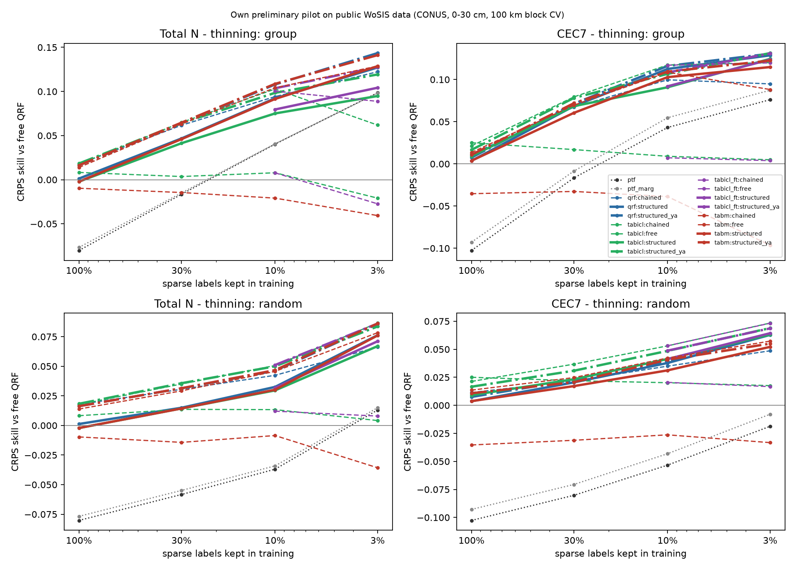
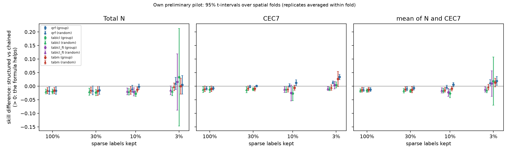
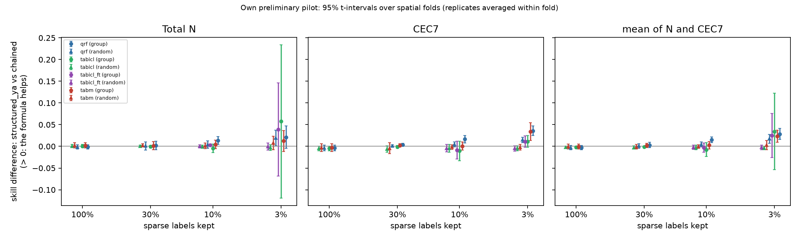
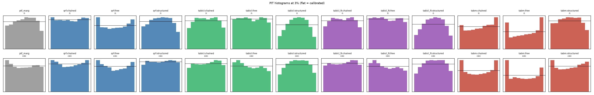

# Results: `gpu_full`

Own preliminary pilot on public WoSIS data (conterminous USA, 0-30 cm). Skill = 1 - CRPS(arm) / CRPS(free QRF) on the same held-out sites. Differences are in skill units (> 0: first arm better). Intervals: approximate 95% t-intervals over spatial folds (the folds share training data, so they are somewhat optimistic), replicates averaged within fold.

- complete folds used: [0, 1, 2, 3, 4]; incomplete folds excluded: []
- sites scored: 20198; configurations: 125; learners: ['qrf', 'tabm', 'tabicl', 'tabicl_ft']
- observed envelope-violation rate in the data: N 0.011, CEC7 0.057

## 0. Key numbers (read this first; points = skill difference x 100)

- **qrf**: formula only (structured_ya vs chained) at 3% by region: mean +2.8 [+1.6, +4.1] (N +2.1 [-0.5, +4.7], CEC7 +3.6 [+2.5, +4.7]); at 3% at random +1.7 [+0.7, +2.8]; with all labels -0.3 [-0.8, +0.2]; chaining alone (chained vs free) at 3%: +10.9 [+9.9, +11.8]
- **tabm**: formula only (structured_ya vs chained) at 3% by region: mean +2.3 [+0.9, +3.7] (N +1.2 [-1.2, +3.6], CEC7 +3.4 [+1.4, +5.5]); at 3% at random +0.3 [-0.8, +1.3]; with all labels -0.0 [-0.6, +0.6]; chaining alone (chained vs free) at 3%: +17.7 [+13.3, +22.1]
- **tabicl**: formula only (structured_ya vs chained) at 3% by region: mean +3.4 [-5.3, +12.2] (N +5.7 [-11.9, +23.4], CEC7 +1.1 [-0.2, +2.5]); at 3% at random -0.4 [-0.8, +0.0]; with all labels -0.2 [-0.5, +0.1]; chaining alone (chained vs free) at 3%: +9.9 [-0.7, +20.5]
- **tabicl_ft**: formula only (structured_ya vs chained) at 3% by region: mean +2.5 [-2.6, +7.6] (N +3.9 [-6.8, +14.6], CEC7 +1.1 [-0.2, +2.4]); at 3% at random -0.2 [-0.8, +0.3]; with all labels n/a; chaining alone (chained vs free) at 3%: +11.6 [+5.2, +18.0]
- CEC7-clay Spearman at held-out sites (qrf, 3%): observed 0.74; free 0.01; chained 0.44; structured_ya 0.62; ptf 0.85
- CEC7-clay Spearman at held-out sites (tabm, 3%): observed 0.74; free 0.00; chained 0.72; structured_ya 0.71; ptf 0.85
- CEC7-clay Spearman at held-out sites (tabicl, 3%): observed 0.74; free 0.01; chained 0.59; structured_ya 0.60; ptf 0.85
- CEC7-clay Spearman at held-out sites (tabicl_ft, 3%): observed 0.74; free 0.01; chained 0.59; structured_ya 0.60; ptf 0.85
- joint variogram-score skill (qrf, 3%): structured_ya +0.239 vs chained +0.185
- joint variogram-score skill (tabm, 3%): structured_ya +0.240 vs chained +0.227
- joint variogram-score skill (tabicl, 3%): structured_ya +0.193 vs chained +0.175
- joint variogram-score skill (tabicl_ft, 3%): structured_ya +0.208 vs chained +0.188

## 1. Primary result (pre-specified in docs/DESIGN.md): 3% of sparse labels, group thinning, averaged over ['qrf', 'tabm', 'tabicl']

| contrast                 | cec                     | mean                    | n                       |
|:-------------------------|:------------------------|:------------------------|:------------------------|
| structured vs chained    | +0.022 [+0.011, +0.032] | +0.017 [-0.015, +0.049] | +0.013 [-0.051, +0.076] |
| structured_ya vs chained | +0.027 [+0.019, +0.036] | +0.029 [-0.002, +0.059] | +0.030 [-0.030, +0.090] |

Same on the log scale (CRPS of log N, log CEC7):

| contrast                 | cec                     | mean                    | n                       |
|:-------------------------|:------------------------|:------------------------|:------------------------|
| structured vs chained    | +0.020 [+0.013, +0.028] | +0.016 [-0.000, +0.032] | +0.011 [-0.021, +0.043] |
| structured_ya vs chained | +0.026 [+0.019, +0.034] | +0.025 [+0.010, +0.039] | +0.023 [-0.003, +0.050] |

## 2. Per learner at 3% (group thinning)

|                                           | cec                     | mean                    | n                       |
|:------------------------------------------|:------------------------|:------------------------|:------------------------|
| ('qrf', 'chained vs free')                | +0.095 [+0.081, +0.108] | +0.109 [+0.099, +0.118] | +0.122 [+0.106, +0.139] |
| ('qrf', 'structured vs chained')          | +0.034 [+0.024, +0.043] | +0.019 [+0.003, +0.036] | +0.005 [-0.029, +0.039] |
| ('qrf', 'structured vs clip')             | +0.064 [+0.044, +0.083] | +0.067 [+0.043, +0.091] | +0.070 [+0.035, +0.105] |
| ('qrf', 'structured vs free')             | +0.129 [+0.112, +0.146] | +0.128 [+0.105, +0.151] | +0.127 [+0.087, +0.167] |
| ('qrf', 'structured vs ptf')              | +0.053 [+0.005, +0.100] | +0.041 [+0.013, +0.069] | +0.029 [+0.006, +0.051] |
| ('qrf', 'structured vs ptf_marg')         | +0.041 [+0.014, +0.068] | +0.035 [+0.020, +0.051] | +0.029 [+0.013, +0.045] |
| ('qrf', 'structured_ya vs chained')       | +0.036 [+0.025, +0.047] | +0.028 [+0.016, +0.041] | +0.021 [-0.005, +0.047] |
| ('tabicl', 'chained vs free')             | +0.115 [+0.072, +0.158] | +0.099 [-0.007, +0.205] | +0.083 [-0.105, +0.271] |
| ('tabicl', 'structured vs chained')       | +0.004 [-0.007, +0.016] | +0.019 [-0.070, +0.107] | +0.033 [-0.147, +0.212] |
| ('tabicl', 'structured vs clip')          | +0.041 [+0.004, +0.078] | +0.034 [-0.021, +0.090] | +0.028 [-0.051, +0.107] |
| ('tabicl', 'structured vs free')          | +0.120 [+0.080, +0.159] | +0.118 [+0.067, +0.168] | +0.116 [+0.049, +0.182] |
| ('tabicl', 'structured vs ptf')           | +0.048 [-0.006, +0.103] | +0.022 [-0.010, +0.055] | -0.004 [-0.043, +0.036] |
| ('tabicl', 'structured vs ptf_marg')      | +0.037 [+0.002, +0.072] | +0.017 [-0.006, +0.039] | -0.003 [-0.037, +0.030] |
| ('tabicl', 'structured_ya vs chained')    | +0.011 [-0.002, +0.025] | +0.034 [-0.053, +0.122] | +0.057 [-0.119, +0.234] |
| ('tabicl_ft', 'chained vs free')          | +0.116 [+0.079, +0.153] | +0.116 [+0.052, +0.180] | +0.116 [+0.007, +0.225] |
| ('tabicl_ft', 'structured vs chained')    | +0.004 [-0.010, +0.018] | +0.010 [-0.038, +0.057] | +0.015 [-0.088, +0.119] |
| ('tabicl_ft', 'structured vs clip')       | +0.040 [+0.004, +0.076] | +0.040 [-0.016, +0.096] | +0.040 [-0.040, +0.121] |
| ('tabicl_ft', 'structured vs free')       | +0.120 [+0.084, +0.155] | +0.126 [+0.078, +0.173] | +0.132 [+0.065, +0.199] |
| ('tabicl_ft', 'structured vs ptf')        | +0.048 [-0.004, +0.099] | +0.027 [-0.004, +0.057] | +0.006 [-0.030, +0.041] |
| ('tabicl_ft', 'structured vs ptf_marg')   | +0.036 [+0.004, +0.069] | +0.021 [+0.001, +0.042] | +0.006 [-0.023, +0.035] |
| ('tabicl_ft', 'structured_ya vs chained') | +0.011 [-0.002, +0.024] | +0.025 [-0.026, +0.076] | +0.039 [-0.068, +0.146] |
| ('tabm', 'chained vs free')               | +0.185 [+0.130, +0.239] | +0.177 [+0.133, +0.221] | +0.169 [+0.118, +0.221] |
| ('tabm', 'structured vs chained')         | +0.027 [-0.001, +0.055] | +0.013 [-0.003, +0.029] | -0.000 [-0.029, +0.029] |
| ('tabm', 'structured vs clip')            | +0.081 [+0.046, +0.117] | +0.098 [+0.060, +0.137] | +0.115 [+0.066, +0.164] |
| ('tabm', 'structured vs free')            | +0.211 [+0.169, +0.254] | +0.190 [+0.150, +0.231] | +0.169 [+0.120, +0.219] |
| ('tabm', 'structured vs ptf')             | +0.039 [-0.010, +0.087] | +0.034 [+0.005, +0.064] | +0.030 [+0.017, +0.043] |
| ('tabm', 'structured vs ptf_marg')        | +0.027 [+0.001, +0.054] | +0.029 [+0.010, +0.048] | +0.030 [+0.014, +0.047] |
| ('tabm', 'structured_ya vs chained')      | +0.034 [+0.014, +0.055] | +0.023 [+0.009, +0.037] | +0.012 [-0.012, +0.036] |

## 3. Structured vs chained-free at every level (group and random thinning)

|                               | cec                     | mean                    | n                       |
|:------------------------------|:------------------------|:------------------------|:------------------------|
| ('all', 1.0, 'qrf')           | -0.008 [-0.014, -0.002] | -0.012 [-0.019, -0.005] | -0.017 [-0.030, -0.003] |
| ('all', 1.0, 'tabicl')        | -0.012 [-0.023, -0.001] | -0.016 [-0.022, -0.010] | -0.020 [-0.029, -0.011] |
| ('all', 1.0, 'tabm')          | -0.010 [-0.020, +0.001] | -0.013 [-0.022, -0.004] | -0.016 [-0.027, -0.005] |
| ('group', 0.03, 'qrf')        | +0.034 [+0.024, +0.043] | +0.019 [+0.003, +0.036] | +0.005 [-0.029, +0.039] |
| ('group', 0.03, 'tabicl')     | +0.004 [-0.007, +0.016] | +0.019 [-0.070, +0.107] | +0.033 [-0.147, +0.212] |
| ('group', 0.03, 'tabicl_ft')  | +0.004 [-0.010, +0.018] | +0.010 [-0.038, +0.057] | +0.015 [-0.088, +0.119] |
| ('group', 0.03, 'tabm')       | +0.027 [-0.001, +0.055] | +0.013 [-0.003, +0.029] | -0.000 [-0.029, +0.029] |
| ('group', 0.1, 'qrf')         | +0.013 [+0.002, +0.023] | +0.005 [-0.002, +0.013] | -0.002 [-0.012, +0.008] |
| ('group', 0.1, 'tabicl')      | -0.026 [-0.053, +0.000] | -0.027 [-0.043, -0.012] | -0.028 [-0.038, -0.018] |
| ('group', 0.1, 'tabicl_ft')   | -0.025 [-0.054, +0.004] | -0.023 [-0.038, -0.008] | -0.021 [-0.036, -0.006] |
| ('group', 0.1, 'tabm')        | -0.006 [-0.015, +0.003] | -0.009 [-0.017, -0.001] | -0.013 [-0.022, -0.004] |
| ('group', 0.3, 'qrf')         | +0.001 [-0.001, +0.004] | -0.007 [-0.014, +0.000] | -0.015 [-0.030, +0.000] |
| ('group', 0.3, 'tabicl')      | -0.011 [-0.016, -0.006] | -0.017 [-0.024, -0.011] | -0.023 [-0.035, -0.012] |
| ('group', 0.3, 'tabm')        | -0.009 [-0.018, -0.001] | -0.013 [-0.024, -0.002] | -0.017 [-0.034, -0.000] |
| ('random', 0.03, 'qrf')       | +0.014 [+0.009, +0.019] | +0.012 [+0.000, +0.024] | +0.010 [-0.013, +0.033] |
| ('random', 0.03, 'tabicl')    | -0.010 [-0.017, -0.004] | -0.015 [-0.024, -0.006] | -0.020 [-0.035, -0.004] |
| ('random', 0.03, 'tabicl_ft') | -0.009 [-0.016, -0.002] | -0.012 [-0.022, -0.002] | -0.015 [-0.031, +0.001] |
| ('random', 0.03, 'tabm')      | -0.005 [-0.015, +0.005] | -0.004 [-0.014, +0.007] | -0.002 [-0.017, +0.012] |
| ('random', 0.1, 'qrf')        | +0.003 [-0.004, +0.009] | -0.003 [-0.011, +0.004] | -0.010 [-0.023, +0.003] |
| ('random', 0.1, 'tabicl')     | -0.012 [-0.023, -0.000] | -0.016 [-0.025, -0.008] | -0.021 [-0.033, -0.009] |
| ('random', 0.1, 'tabicl_ft')  | -0.012 [-0.023, -0.000] | -0.016 [-0.025, -0.006] | -0.019 [-0.032, -0.007] |
| ('random', 0.1, 'tabm')       | -0.011 [-0.022, -0.000] | -0.013 [-0.022, -0.005] | -0.016 [-0.030, -0.001] |
| ('random', 0.3, 'qrf')        | -0.001 [-0.005, +0.003] | -0.008 [-0.016, -0.001] | -0.016 [-0.032, +0.001] |
| ('random', 0.3, 'tabicl')     | -0.013 [-0.024, -0.003] | -0.017 [-0.025, -0.009] | -0.021 [-0.034, -0.008] |
| ('random', 0.3, 'tabm')       | -0.008 [-0.016, +0.001] | -0.011 [-0.020, -0.003] | -0.015 [-0.026, -0.004] |

## 4. Formula only (theta from x AND abundant properties) vs chained-free

|                               | cec                     | mean                    | n                       |
|:------------------------------|:------------------------|:------------------------|:------------------------|
| ('all', 1.0, 'qrf')           | -0.004 [-0.011, +0.003] | -0.003 [-0.008, +0.002] | -0.001 [-0.006, +0.003] |
| ('all', 1.0, 'tabicl')        | -0.005 [-0.010, +0.001] | -0.002 [-0.005, +0.001] | +0.001 [-0.003, +0.004] |
| ('all', 1.0, 'tabm')          | -0.003 [-0.012, +0.007] | -0.000 [-0.006, +0.006] | +0.002 [-0.004, +0.008] |
| ('group', 0.03, 'qrf')        | +0.036 [+0.025, +0.047] | +0.028 [+0.016, +0.041] | +0.021 [-0.005, +0.047] |
| ('group', 0.03, 'tabicl')     | +0.011 [-0.002, +0.025] | +0.034 [-0.053, +0.122] | +0.057 [-0.119, +0.234] |
| ('group', 0.03, 'tabicl_ft')  | +0.011 [-0.002, +0.024] | +0.025 [-0.026, +0.076] | +0.039 [-0.068, +0.146] |
| ('group', 0.03, 'tabm')       | +0.034 [+0.014, +0.055] | +0.023 [+0.009, +0.037] | +0.012 [-0.012, +0.036] |
| ('group', 0.1, 'qrf')         | +0.016 [+0.008, +0.025] | +0.015 [+0.008, +0.022] | +0.014 [+0.005, +0.023] |
| ('group', 0.1, 'tabicl')      | -0.011 [-0.033, +0.012] | -0.007 [-0.023, +0.008] | -0.004 [-0.014, +0.005] |
| ('group', 0.1, 'tabicl_ft')   | -0.009 [-0.029, +0.012] | -0.003 [-0.013, +0.008] | +0.003 [+0.001, +0.005] |
| ('group', 0.1, 'tabm')        | +0.001 [-0.009, +0.010] | +0.003 [-0.006, +0.011] | +0.004 [-0.005, +0.014] |
| ('group', 0.3, 'qrf')         | +0.004 [+0.001, +0.007] | +0.003 [-0.003, +0.009] | +0.002 [-0.008, +0.012] |
| ('group', 0.3, 'tabicl')      | -0.001 [-0.004, +0.002] | -0.001 [-0.002, +0.001] | -0.001 [-0.003, +0.002] |
| ('group', 0.3, 'tabm')        | +0.002 [-0.001, +0.006] | +0.002 [-0.003, +0.007] | +0.002 [-0.008, +0.011] |
| ('random', 0.03, 'qrf')       | +0.015 [+0.009, +0.021] | +0.017 [+0.007, +0.028] | +0.019 [+0.001, +0.038] |
| ('random', 0.03, 'tabicl')    | -0.005 [-0.010, +0.001] | -0.004 [-0.008, +0.000] | -0.003 [-0.009, +0.004] |
| ('random', 0.03, 'tabicl_ft') | -0.005 [-0.011, +0.002] | -0.002 [-0.008, +0.003] | -0.000 [-0.008, +0.008] |
| ('random', 0.03, 'tabm')      | -0.002 [-0.009, +0.004] | +0.003 [-0.008, +0.013] | +0.008 [-0.008, +0.024] |
| ('random', 0.1, 'qrf')        | +0.005 [-0.001, +0.010] | +0.004 [-0.001, +0.010] | +0.004 [-0.005, +0.012] |
| ('random', 0.1, 'tabicl')     | -0.004 [-0.014, +0.005] | -0.003 [-0.008, +0.003] | -0.001 [-0.005, +0.003] |
| ('random', 0.1, 'tabicl_ft')  | -0.004 [-0.013, +0.004] | -0.002 [-0.007, +0.003] | +0.000 [-0.004, +0.004] |
| ('random', 0.1, 'tabm')       | -0.002 [-0.007, +0.003] | -0.000 [-0.004, +0.004] | +0.001 [-0.005, +0.008] |
| ('random', 0.3, 'qrf')        | +0.001 [-0.002, +0.004] | +0.001 [-0.004, +0.006] | +0.001 [-0.009, +0.010] |
| ('random', 0.3, 'tabicl')     | -0.006 [-0.013, +0.001] | -0.003 [-0.006, +0.001] | +0.001 [-0.002, +0.003] |
| ('random', 0.3, 'tabm')       | -0.004 [-0.017, +0.008] | -0.001 [-0.007, +0.005] | +0.002 [-0.001, +0.006] |

## 5. Extrapolation: structured vs chained-free on thinned vs retained regions, and group - random on thinned sites

|                                           | cec                     | mean                    | n                       |
|:------------------------------------------|:------------------------|:------------------------|:------------------------|
| ('group', 'retained', 0.03, 'qrf')        | +0.011 [+0.004, +0.018] | +0.006 [-0.026, +0.037] | +0.001 [-0.059, +0.060] |
| ('group', 'retained', 0.03, 'tabicl')     | -0.013 [-0.023, -0.003] | -0.018 [-0.026, -0.010] | -0.023 [-0.043, -0.004] |
| ('group', 'retained', 0.03, 'tabicl_ft')  | -0.013 [-0.023, -0.003] | -0.015 [-0.023, -0.007] | -0.018 [-0.034, -0.001] |
| ('group', 'retained', 0.03, 'tabm')       | -0.007 [-0.023, +0.010] | -0.004 [-0.024, +0.016] | -0.001 [-0.034, +0.031] |
| ('group', 'retained', 0.1, 'qrf')         | -0.007 [-0.020, +0.006] | -0.013 [-0.028, +0.002] | -0.019 [-0.038, +0.001] |
| ('group', 'retained', 0.1, 'tabicl')      | -0.010 [-0.027, +0.008] | -0.017 [-0.029, -0.004] | -0.024 [-0.040, -0.007] |
| ('group', 'retained', 0.1, 'tabicl_ft')   | -0.010 [-0.026, +0.007] | -0.016 [-0.030, -0.002] | -0.022 [-0.038, -0.005] |
| ('group', 'retained', 0.1, 'tabm')        | -0.009 [-0.024, +0.006] | -0.010 [-0.021, +0.000] | -0.012 [-0.023, -0.000] |
| ('group', 'retained', 0.3, 'qrf')         | -0.005 [-0.013, +0.003] | -0.011 [-0.023, +0.002] | -0.017 [-0.038, +0.005] |
| ('group', 'retained', 0.3, 'tabicl')      | -0.012 [-0.022, -0.001] | -0.017 [-0.029, -0.005] | -0.022 [-0.044, -0.001] |
| ('group', 'retained', 0.3, 'tabm')        | -0.011 [-0.022, -0.000] | -0.012 [-0.021, -0.003] | -0.013 [-0.032, +0.006] |
| ('group', 'thinned', 0.03, 'qrf')         | +0.035 [+0.025, +0.044] | +0.020 [+0.004, +0.035] | +0.005 [-0.030, +0.039] |
| ('group', 'thinned', 0.03, 'tabicl')      | +0.005 [-0.007, +0.017] | +0.020 [-0.073, +0.112] | +0.035 [-0.152, +0.222] |
| ('group', 'thinned', 0.03, 'tabicl_ft')   | +0.004 [-0.010, +0.019] | +0.010 [-0.039, +0.060] | +0.017 [-0.091, +0.125] |
| ('group', 'thinned', 0.03, 'tabm')        | +0.028 [-0.002, +0.058] | +0.014 [-0.003, +0.030] | -0.001 [-0.031, +0.030] |
| ('group', 'thinned', 0.1, 'qrf')          | +0.015 [+0.003, +0.026] | +0.007 [-0.000, +0.015] | -0.000 [-0.011, +0.010] |
| ('group', 'thinned', 0.1, 'tabicl')       | -0.027 [-0.053, -0.001] | -0.028 [-0.042, -0.013] | -0.028 [-0.038, -0.019] |
| ('group', 'thinned', 0.1, 'tabicl_ft')    | -0.025 [-0.055, +0.004] | -0.023 [-0.038, -0.009] | -0.021 [-0.037, -0.005] |
| ('group', 'thinned', 0.1, 'tabm')         | -0.005 [-0.014, +0.003] | -0.009 [-0.017, -0.002] | -0.013 [-0.022, -0.005] |
| ('group', 'thinned', 0.3, 'qrf')          | +0.004 [-0.001, +0.010] | -0.005 [-0.012, +0.002] | -0.014 [-0.031, +0.003] |
| ('group', 'thinned', 0.3, 'tabicl')       | -0.010 [-0.018, -0.002] | -0.016 [-0.022, -0.011] | -0.023 [-0.035, -0.011] |
| ('group', 'thinned', 0.3, 'tabm')         | -0.007 [-0.014, +0.001] | -0.012 [-0.025, +0.000] | -0.018 [-0.040, +0.004] |
| ('random', 'retained', 0.03, 'qrf')       | +0.012 [-0.025, +0.050] | +0.012 [-0.041, +0.065] | +0.011 [-0.068, +0.090] |
| ('random', 'retained', 0.03, 'tabicl')    | -0.007 [-0.029, +0.014] | -0.008 [-0.046, +0.030] | -0.009 [-0.067, +0.049] |
| ('random', 'retained', 0.03, 'tabicl_ft') | -0.006 [-0.029, +0.016] | -0.008 [-0.045, +0.029] | -0.009 [-0.063, +0.044] |
| ('random', 'retained', 0.03, 'tabm')      | -0.018 [-0.048, +0.012] | -0.008 [-0.048, +0.032] | +0.002 [-0.059, +0.064] |
| ('random', 'retained', 0.1, 'qrf')        | +0.007 [-0.017, +0.031] | +0.002 [-0.009, +0.013] | -0.003 [-0.025, +0.018] |
| ('random', 'retained', 0.1, 'tabicl')     | +0.000 [-0.019, +0.019] | -0.006 [-0.016, +0.004] | -0.013 [-0.033, +0.008] |
| ('random', 'retained', 0.1, 'tabicl_ft')  | -0.001 [-0.019, +0.018] | -0.006 [-0.018, +0.007] | -0.011 [-0.031, +0.010] |
| ('random', 'retained', 0.1, 'tabm')       | -0.009 [-0.024, +0.006] | -0.012 [-0.023, -0.001] | -0.014 [-0.034, +0.006] |
| ('random', 'retained', 0.3, 'qrf')        | +0.004 [+0.002, +0.006] | -0.006 [-0.016, +0.005] | -0.015 [-0.037, +0.006] |
| ('random', 'retained', 0.3, 'tabicl')     | -0.010 [-0.018, -0.003] | -0.013 [-0.021, -0.005] | -0.016 [-0.035, +0.002] |
| ('random', 'retained', 0.3, 'tabm')       | +0.000 [-0.012, +0.013] | -0.008 [-0.021, +0.005] | -0.017 [-0.037, +0.003] |
| ('random', 'thinned', 0.03, 'qrf')        | +0.014 [+0.010, +0.018] | +0.012 [+0.000, +0.023] | +0.009 [-0.013, +0.031] |
| ('random', 'thinned', 0.03, 'tabicl')     | -0.011 [-0.018, -0.003] | -0.015 [-0.025, -0.006] | -0.020 [-0.036, -0.004] |
| ('random', 'thinned', 0.03, 'tabicl_ft')  | -0.009 [-0.017, -0.001] | -0.012 [-0.023, -0.002] | -0.016 [-0.033, +0.001] |
| ('random', 'thinned', 0.03, 'tabm')       | -0.005 [-0.015, +0.005] | -0.004 [-0.015, +0.007] | -0.003 [-0.018, +0.012] |
| ('random', 'thinned', 0.1, 'qrf')         | +0.002 [-0.003, +0.008] | -0.004 [-0.012, +0.004] | -0.010 [-0.025, +0.005] |
| ('random', 'thinned', 0.1, 'tabicl')      | -0.013 [-0.024, -0.002] | -0.017 [-0.026, -0.008] | -0.021 [-0.033, -0.009] |
| ('random', 'thinned', 0.1, 'tabicl_ft')   | -0.013 [-0.024, -0.002] | -0.016 [-0.026, -0.007] | -0.020 [-0.032, -0.007] |
| ('random', 'thinned', 0.1, 'tabm')        | -0.011 [-0.022, +0.000] | -0.013 [-0.023, -0.003] | -0.015 [-0.032, +0.001] |
| ('random', 'thinned', 0.3, 'qrf')         | -0.003 [-0.008, +0.002] | -0.010 [-0.018, -0.002] | -0.016 [-0.032, +0.000] |
| ('random', 'thinned', 0.3, 'tabicl')      | -0.013 [-0.025, -0.002] | -0.018 [-0.026, -0.009] | -0.022 [-0.035, -0.009] |
| ('random', 'thinned', 0.3, 'tabm')        | -0.009 [-0.015, -0.003] | -0.013 [-0.020, -0.006] | -0.017 [-0.027, -0.007] |

Difference-in-differences on thinned sites ([arm - chained] group minus random, same sites):

|                                                 | cec                     | n                       |
|:------------------------------------------------|:------------------------|:------------------------|
| ('structured vs chained', 0.03, 'qrf')          | +0.010 [-0.014, +0.034] | +0.002 [-0.023, +0.027] |
| ('structured vs chained', 0.03, 'tabicl')       | +0.011 [-0.009, +0.032] | +0.037 [-0.121, +0.195] |
| ('structured vs chained', 0.03, 'tabicl_ft')    | +0.009 [-0.018, +0.037] | -0.005 [-0.051, +0.040] |
| ('structured vs chained', 0.03, 'tabm')         | +0.033 [-0.012, +0.079] | -0.014 [-0.029, +0.002] |
| ('structured vs chained', 0.1, 'qrf')           | +0.016 [+0.000, +0.031] | +0.009 [+0.002, +0.015] |
| ('structured vs chained', 0.1, 'tabicl')        | -0.008 [-0.039, +0.024] | -0.005 [-0.010, -0.001] |
| ('structured vs chained', 0.1, 'tabicl_ft')     | -0.007 [-0.043, +0.029] | +0.003 [-0.015, +0.021] |
| ('structured vs chained', 0.1, 'tabm')          | +0.008 [-0.001, +0.018] | +0.001 [-0.017, +0.019] |
| ('structured vs chained', 0.3, 'qrf')           | +0.006 [-0.007, +0.019] | -0.002 [-0.012, +0.009] |
| ('structured vs chained', 0.3, 'tabicl')        | +0.005 [-0.013, +0.024] | -0.005 [-0.011, +0.002] |
| ('structured vs chained', 0.3, 'tabm')          | +0.003 [-0.012, +0.017] | -0.006 [-0.026, +0.014] |
| ('structured_ya vs chained', 0.03, 'qrf')       | +0.010 [-0.014, +0.035] | +0.010 [-0.007, +0.026] |
| ('structured_ya vs chained', 0.03, 'tabicl')    | +0.012 [-0.007, +0.031] | +0.041 [-0.100, +0.181] |
| ('structured_ya vs chained', 0.03, 'tabicl_ft') | +0.012 [-0.010, +0.034] | -0.001 [-0.025, +0.024] |
| ('structured_ya vs chained', 0.03, 'tabm')      | +0.039 [-0.002, +0.080] | -0.009 [-0.029, +0.010] |
| ('structured_ya vs chained', 0.1, 'qrf')        | +0.016 [+0.002, +0.030] | +0.011 [+0.004, +0.018] |
| ('structured_ya vs chained', 0.1, 'tabicl')     | -0.004 [-0.028, +0.020] | -0.005 [-0.020, +0.011] |
| ('structured_ya vs chained', 0.1, 'tabicl_ft')  | -0.001 [-0.021, +0.019] | +0.004 [+0.002, +0.006] |
| ('structured_ya vs chained', 0.1, 'tabm')       | +0.001 [-0.010, +0.013] | +0.003 [-0.006, +0.013] |
| ('structured_ya vs chained', 0.3, 'qrf')        | +0.005 [-0.004, +0.015] | +0.002 [-0.004, +0.008] |
| ('structured_ya vs chained', 0.3, 'tabicl')     | +0.009 [-0.004, +0.021] | -0.001 [-0.005, +0.003] |
| ('structured_ya vs chained', 0.3, 'tabm')       | +0.010 [-0.004, +0.024] | -0.004 [-0.011, +0.004] |

## 6. Joint scores (vector clay, OC, pH, N, CEC7): skill vs free QRF

|                        | ptf                     | ptf_marg                | qrf:chained             | qrf:clip                | qrf:free                | qrf:structured          | qrf:structured_ya       | tabicl:chained          | tabicl:clip             | tabicl:free             | tabicl:structured       | tabicl:structured_ya    | tabicl_ft:chained       | tabicl_ft:clip          | tabicl_ft:free          | tabicl_ft:structured    | tabicl_ft:structured_ya   | tabm:chained            | tabm:clip               | tabm:free               | tabm:structured         | tabm:structured_ya      |
|:-----------------------|:------------------------|:------------------------|:------------------------|:------------------------|:------------------------|:------------------------|:------------------------|:------------------------|:------------------------|:------------------------|:------------------------|:------------------------|:------------------------|:------------------------|:------------------------|:------------------------|:--------------------------|:------------------------|:------------------------|:------------------------|:------------------------|:------------------------|
| ('es', 'all', 1.0)     | -0.029 [-0.043, -0.015] | -0.025 [-0.039, -0.012] | +0.027 [+0.024, +0.031] | +0.008 [+0.005, +0.011] | +0.000 [+0.000, +0.000] | +0.024 [+0.018, +0.030] | +0.027 [+0.022, +0.031] | +0.033 [+0.026, +0.040] | +0.016 [+0.010, +0.021] | +0.008 [+0.002, +0.015] | +0.025 [+0.018, +0.033] | +0.031 [+0.024, +0.039] |                         |                         |                         |                         |                           | +0.027 [+0.023, +0.032] | +0.002 [-0.002, +0.007] | -0.011 [-0.018, -0.003] | +0.021 [+0.016, +0.027] | +0.028 [+0.024, +0.031] |
| ('es', 'group', 0.03)  | +0.068 [+0.044, +0.092] | +0.070 [+0.049, +0.091] | +0.072 [+0.063, +0.080] | +0.048 [+0.040, +0.055] | +0.000 [+0.000, +0.000] | +0.091 [+0.079, +0.103] | +0.095 [+0.083, +0.108] | +0.082 [+0.058, +0.107] | +0.055 [+0.045, +0.066] | -0.000 [-0.011, +0.010] | +0.085 [+0.071, +0.100] | +0.089 [+0.074, +0.105] | +0.085 [+0.066, +0.103] | +0.055 [+0.043, +0.066] | -0.003 [-0.014, +0.008] | +0.087 [+0.073, +0.102] | +0.093 [+0.078, +0.108]   | +0.077 [+0.060, +0.095] | +0.029 [+0.013, +0.045] | -0.035 [-0.053, -0.016] | +0.089 [+0.078, +0.099] | +0.092 [+0.078, +0.105] |
| ('es', 'group', 0.1)   | +0.042 [+0.029, +0.054] | +0.045 [+0.034, +0.057] | +0.068 [+0.059, +0.077] | +0.032 [+0.030, +0.035] | +0.000 [+0.000, +0.000] | +0.074 [+0.063, +0.085] | +0.078 [+0.067, +0.089] | +0.078 [+0.068, +0.089] | +0.039 [+0.035, +0.043] | +0.005 [-0.004, +0.014] | +0.070 [+0.056, +0.083] | +0.077 [+0.063, +0.090] | +0.078 [+0.068, +0.088] | +0.039 [+0.034, +0.043] | +0.004 [-0.005, +0.014] | +0.071 [+0.058, +0.084] | +0.078 [+0.065, +0.090]   | +0.076 [+0.065, +0.087] | +0.029 [+0.021, +0.036] | -0.010 [-0.023, +0.003] | +0.071 [+0.062, +0.080] | +0.077 [+0.066, +0.088] |
| ('es', 'group', 0.3)   | +0.009 [-0.006, +0.025] | +0.012 [-0.003, +0.028] | +0.051 [+0.045, +0.058] | +0.023 [+0.018, +0.027] | +0.000 [+0.000, +0.000] | +0.050 [+0.041, +0.060] | +0.055 [+0.045, +0.064] | +0.058 [+0.046, +0.069] | +0.027 [+0.022, +0.032] | +0.003 [-0.004, +0.009] | +0.050 [+0.038, +0.062] | +0.057 [+0.045, +0.069] |                         |                         |                         |                         |                           | +0.053 [+0.046, +0.061] | +0.015 [+0.010, +0.021] | -0.014 [-0.020, -0.009] | +0.047 [+0.038, +0.057] | +0.054 [+0.046, +0.063] |
| ('es', 'random', 0.03) | +0.014 [-0.005, +0.032] | +0.017 [+0.001, +0.033] | +0.046 [+0.040, +0.051] | +0.024 [+0.016, +0.031] | +0.000 [+0.000, +0.000] | +0.054 [+0.046, +0.062] | +0.056 [+0.049, +0.064] | +0.062 [+0.056, +0.068] | +0.027 [+0.018, +0.037] | +0.004 [-0.003, +0.011] | +0.055 [+0.046, +0.063] | +0.060 [+0.053, +0.067] | +0.062 [+0.056, +0.068] | +0.028 [+0.018, +0.037] | +0.005 [-0.001, +0.011] | +0.055 [+0.047, +0.064] | +0.060 [+0.053, +0.068]   | +0.054 [+0.047, +0.062] | +0.015 [+0.002, +0.028] | -0.017 [-0.027, -0.007] | +0.051 [+0.040, +0.061] | +0.054 [+0.043, +0.065] |
| ('es', 'random', 0.1)  | -0.005 [-0.017, +0.007] | -0.001 [-0.013, +0.011] | +0.039 [+0.036, +0.042] | +0.016 [+0.012, +0.021] | +0.000 [+0.000, +0.000] | +0.040 [+0.037, +0.043] | +0.043 [+0.040, +0.045] | +0.050 [+0.045, +0.055] | +0.023 [+0.020, +0.027] | +0.008 [+0.004, +0.011] | +0.042 [+0.037, +0.047] | +0.047 [+0.044, +0.051] | +0.050 [+0.045, +0.055] | +0.023 [+0.019, +0.027] | +0.008 [+0.005, +0.011] | +0.042 [+0.037, +0.048] | +0.048 [+0.044, +0.051]   | +0.043 [+0.039, +0.047] | +0.011 [+0.003, +0.020] | -0.009 [-0.015, -0.003] | +0.037 [+0.032, +0.042] | +0.043 [+0.040, +0.046] |
| ('es', 'random', 0.3)  | -0.017 [-0.029, -0.004] | -0.013 [-0.025, -0.001] | +0.033 [+0.031, +0.035] | +0.012 [+0.009, +0.015] | +0.000 [+0.000, +0.000] | +0.032 [+0.026, +0.037] | +0.035 [+0.031, +0.039] | +0.042 [+0.037, +0.048] | +0.020 [+0.016, +0.023] | +0.009 [+0.007, +0.011] | +0.034 [+0.029, +0.040] | +0.040 [+0.035, +0.045] |                         |                         |                         |                         |                           | +0.036 [+0.032, +0.039] | +0.005 [-0.005, +0.014] | -0.013 [-0.021, -0.004] | +0.029 [+0.024, +0.034] | +0.035 [+0.031, +0.039] |
| ('vs', 'all', 1.0)     | +0.068 [+0.050, +0.085] | +0.103 [+0.092, +0.113] | +0.177 [+0.169, +0.184] | +0.084 [+0.075, +0.093] | +0.000 [+0.000, +0.000] | +0.171 [+0.163, +0.179] | +0.180 [+0.171, +0.188] | +0.190 [+0.181, +0.198] | +0.091 [+0.082, +0.099] | +0.002 [-0.005, +0.010] | +0.169 [+0.160, +0.179] | +0.186 [+0.177, +0.196] |                         |                         |                         |                         |                           | +0.184 [+0.180, +0.188] | +0.086 [+0.079, +0.093] | +0.010 [+0.002, +0.018] | +0.170 [+0.162, +0.177] | +0.182 [+0.174, +0.191] |
| ('vs', 'group', 0.03)  | +0.188 [+0.141, +0.235] | +0.211 [+0.174, +0.248] | +0.185 [+0.166, +0.204] | +0.127 [+0.110, +0.144] | +0.000 [+0.000, +0.000] | +0.229 [+0.206, +0.252] | +0.239 [+0.216, +0.263] | +0.175 [+0.088, +0.262] | +0.110 [+0.099, +0.122] | -0.071 [-0.104, -0.039] | +0.181 [+0.154, +0.207] | +0.193 [+0.168, +0.218] | +0.188 [+0.126, +0.249] | +0.110 [+0.095, +0.126] | -0.075 [-0.115, -0.035] | +0.191 [+0.161, +0.221] | +0.208 [+0.187, +0.228]   | +0.227 [+0.191, +0.264] | +0.134 [+0.109, +0.159] | +0.009 [-0.023, +0.042] | +0.232 [+0.215, +0.249] | +0.240 [+0.221, +0.259] |
| ('vs', 'group', 0.1)   | +0.149 [+0.105, +0.193] | +0.181 [+0.151, +0.212] | +0.201 [+0.175, +0.227] | +0.109 [+0.096, +0.121] | +0.000 [+0.000, +0.000] | +0.216 [+0.187, +0.245] | +0.227 [+0.197, +0.257] | +0.218 [+0.181, +0.255] | +0.105 [+0.083, +0.127] | -0.022 [-0.049, +0.005] | +0.186 [+0.148, +0.225] | +0.209 [+0.164, +0.254] | +0.217 [+0.182, +0.252] | +0.105 [+0.084, +0.125] | -0.022 [-0.043, -0.001] | +0.191 [+0.151, +0.230] | +0.213 [+0.171, +0.255]   | +0.227 [+0.193, +0.261] | +0.121 [+0.108, +0.135] | +0.029 [+0.016, +0.043] | +0.217 [+0.185, +0.249] | +0.228 [+0.193, +0.264] |
| ('vs', 'group', 0.3)   | +0.117 [+0.087, +0.147] | +0.149 [+0.127, +0.171] | +0.196 [+0.182, +0.211] | +0.101 [+0.091, +0.111] | +0.000 [+0.000, +0.000] | +0.198 [+0.184, +0.213] | +0.209 [+0.194, +0.223] | +0.208 [+0.182, +0.234] | +0.097 [+0.083, +0.112] | -0.020 [-0.044, +0.004] | +0.183 [+0.156, +0.210] | +0.204 [+0.177, +0.231] |                         |                         |                         |                         |                           | +0.209 [+0.197, +0.221] | +0.101 [+0.090, +0.113] | +0.010 [-0.002, +0.021] | +0.197 [+0.183, +0.211] | +0.210 [+0.197, +0.223] |
| ('vs', 'random', 0.03) | +0.131 [+0.098, +0.164] | +0.166 [+0.143, +0.188] | +0.174 [+0.163, +0.185] | +0.102 [+0.086, +0.117] | +0.000 [+0.000, +0.000] | +0.210 [+0.189, +0.230] | +0.217 [+0.196, +0.237] | +0.229 [+0.213, +0.245] | +0.109 [+0.095, +0.124] | +0.004 [-0.005, +0.014] | +0.209 [+0.187, +0.231] | +0.224 [+0.206, +0.242] | +0.229 [+0.212, +0.245] | +0.115 [+0.102, +0.128] | +0.014 [+0.007, +0.020] | +0.211 [+0.190, +0.233] | +0.225 [+0.207, +0.243]   | +0.218 [+0.203, +0.234] | +0.105 [+0.089, +0.121] | +0.009 [-0.008, +0.026] | +0.209 [+0.188, +0.230] | +0.220 [+0.197, +0.243] |
| ('vs', 'random', 0.1)  | +0.099 [+0.073, +0.124] | +0.135 [+0.121, +0.148] | +0.177 [+0.165, +0.189] | +0.091 [+0.082, +0.100] | +0.000 [+0.000, +0.000] | +0.191 [+0.177, +0.204] | +0.198 [+0.184, +0.211] | +0.210 [+0.199, +0.222] | +0.104 [+0.097, +0.110] | +0.013 [+0.006, +0.020] | +0.191 [+0.177, +0.205] | +0.207 [+0.194, +0.219] | +0.210 [+0.199, +0.221] | +0.104 [+0.097, +0.112] | +0.014 [+0.006, +0.023] | +0.192 [+0.178, +0.206] | +0.207 [+0.195, +0.219]   | +0.200 [+0.192, +0.209] | +0.095 [+0.084, +0.107] | +0.014 [+0.002, +0.026] | +0.188 [+0.172, +0.203] | +0.201 [+0.188, +0.214] |
| ('vs', 'random', 0.3)  | +0.085 [+0.061, +0.109] | +0.121 [+0.107, +0.135] | +0.178 [+0.168, +0.188] | +0.088 [+0.079, +0.096] | +0.000 [+0.000, +0.000] | +0.181 [+0.167, +0.195] | +0.190 [+0.177, +0.203] | +0.201 [+0.190, +0.213] | +0.098 [+0.092, +0.103] | +0.010 [+0.005, +0.014] | +0.182 [+0.169, +0.196] | +0.198 [+0.186, +0.210] |                         |                         |                         |                         |                           | +0.193 [+0.185, +0.201] | +0.088 [+0.075, +0.100] | +0.009 [-0.008, +0.025] | +0.180 [+0.168, +0.192] | +0.192 [+0.181, +0.203] |

## 7. CRPS skill of every arm vs free QRF

|                         | ptf                     | ptf_marg                | qrf:chained             | qrf:clip                | qrf:free                | qrf:oracle_ya           | qrf:structured          | qrf:structured_og       | qrf:structured_ya       | tabicl:chained          | tabicl:clip             | tabicl:free             | tabicl:oracle_ya        | tabicl:structured       | tabicl:structured_og    | tabicl:structured_ya    | tabicl_ft:chained       | tabicl_ft:clip          | tabicl_ft:free          | tabicl_ft:oracle_ya     | tabicl_ft:structured    | tabicl_ft:structured_og   | tabicl_ft:structured_ya   | tabm:chained            | tabm:clip               | tabm:free               | tabm:oracle_ya          | tabm:structured         | tabm:structured_og      | tabm:structured_ya      |
|:------------------------|:------------------------|:------------------------|:------------------------|:------------------------|:------------------------|:------------------------|:------------------------|:------------------------|:------------------------|:------------------------|:------------------------|:------------------------|:------------------------|:------------------------|:------------------------|:------------------------|:------------------------|:------------------------|:------------------------|:------------------------|:------------------------|:--------------------------|:--------------------------|:------------------------|:------------------------|:------------------------|:------------------------|:------------------------|:------------------------|:------------------------|
| ('all', 1.0, 'cec')     | -0.103 [-0.162, -0.044] | -0.093 [-0.145, -0.040] | +0.011 [+0.003, +0.020] | -0.009 [-0.021, +0.003] | +0.000 [+0.000, +0.000] | +0.548 [+0.499, +0.597] | +0.004 [-0.009, +0.017] | +0.004 [-0.010, +0.018] | +0.007 [-0.006, +0.021] | +0.021 [+0.011, +0.031] | +0.011 [-0.002, +0.025] | +0.025 [+0.014, +0.036] | +0.550 [+0.495, +0.606] | +0.009 [-0.010, +0.028] | +0.008 [-0.011, +0.027] | +0.017 [+0.003, +0.031] |                         |                         |                         |                         |                         |                           |                           | +0.014 [+0.005, +0.022] | -0.029 [-0.042, -0.016] | -0.035 [-0.055, -0.015] | +0.539 [+0.490, +0.588] | +0.004 [-0.006, +0.013] | +0.003 [-0.005, +0.012] | +0.011 [+0.003, +0.019] |
| ('all', 1.0, 'n')       | -0.080 [-0.103, -0.057] | -0.077 [-0.098, -0.056] | +0.018 [+0.001, +0.034] | +0.000 [-0.013, +0.013] | +0.000 [+0.000, +0.000] | +0.467 [+0.425, +0.509] | +0.001 [-0.014, +0.017] |                         | +0.016 [+0.000, +0.032] | +0.018 [-0.001, +0.037] | +0.010 [-0.017, +0.036] | +0.008 [-0.011, +0.027] | +0.471 [+0.431, +0.510] | -0.002 [-0.022, +0.017] |                         | +0.018 [-0.004, +0.040] |                         |                         |                         |                         |                         |                           |                           | +0.014 [-0.003, +0.031] | -0.006 [-0.030, +0.018] | -0.010 [-0.021, +0.002] | +0.460 [+0.410, +0.510] | -0.002 [-0.023, +0.019] |                         | +0.016 [-0.004, +0.037] |
| ('group', 0.03, 'cec')  | +0.076 [+0.020, +0.132] | +0.087 [+0.047, +0.127] | +0.095 [+0.081, +0.108] | +0.065 [+0.048, +0.082] | +0.000 [+0.000, +0.000] | +0.469 [+0.417, +0.520] | +0.129 [+0.112, +0.146] | +0.120 [+0.111, +0.129] | +0.131 [+0.112, +0.149] | +0.120 [+0.095, +0.145] | +0.084 [+0.054, +0.113] | +0.005 [-0.021, +0.031] | +0.453 [+0.421, +0.485] | +0.124 [+0.105, +0.144] | +0.116 [+0.095, +0.137] | +0.131 [+0.109, +0.154] | +0.120 [+0.096, +0.143] | +0.084 [+0.052, +0.116] | +0.004 [-0.022, +0.029] | +0.452 [+0.414, +0.490] | +0.124 [+0.108, +0.140] | +0.115 [+0.098, +0.132]   | +0.131 [+0.110, +0.151]   | +0.088 [+0.064, +0.112] | +0.033 [+0.005, +0.062] | -0.096 [-0.134, -0.059] | +0.442 [+0.403, +0.482] | +0.115 [+0.094, +0.136] | +0.109 [+0.092, +0.126] | +0.122 [+0.102, +0.143] |
| ('group', 0.03, 'n')    | +0.099 [+0.074, +0.123] | +0.098 [+0.068, +0.129] | +0.122 [+0.106, +0.139] | +0.057 [+0.040, +0.074] | +0.000 [+0.000, +0.000] | +0.422 [+0.318, +0.525] | +0.127 [+0.087, +0.167] |                         | +0.143 [+0.112, +0.175] | +0.062 [-0.160, +0.283] | +0.067 [+0.041, +0.092] | -0.021 [-0.066, +0.025] | +0.375 [+0.231, +0.519] | +0.095 [+0.033, +0.156] |                         | +0.119 [+0.069, +0.170] | +0.089 [-0.051, +0.228] | +0.064 [+0.035, +0.092] | -0.027 [-0.073, +0.018] | +0.393 [+0.261, +0.525] | +0.104 [+0.046, +0.163] |                           | +0.128 [+0.083, +0.172]   | +0.129 [+0.100, +0.157] | +0.014 [-0.039, +0.066] | -0.041 [-0.092, +0.011] | +0.411 [+0.363, +0.458] | +0.129 [+0.112, +0.145] |                         | +0.141 [+0.135, +0.148] |
| ('group', 0.1, 'cec')   | +0.043 [-0.012, +0.098] | +0.055 [+0.011, +0.098] | +0.100 [+0.073, +0.126] | +0.049 [+0.037, +0.060] | +0.000 [+0.000, +0.000] | +0.523 [+0.491, +0.556] | +0.113 [+0.077, +0.148] | +0.108 [+0.070, +0.146] | +0.116 [+0.082, +0.150] | +0.117 [+0.087, +0.148] | +0.058 [+0.036, +0.080] | +0.009 [-0.005, +0.023] | +0.478 [+0.384, +0.571] | +0.091 [+0.042, +0.140] | +0.084 [+0.031, +0.137] | +0.107 [+0.062, +0.151] | +0.117 [+0.088, +0.146] | +0.058 [+0.033, +0.082] | +0.007 [-0.010, +0.024] | +0.479 [+0.383, +0.574] | +0.092 [+0.044, +0.140] | +0.085 [+0.032, +0.139]   | +0.108 [+0.067, +0.150]   | +0.109 [+0.074, +0.143] | +0.030 [+0.009, +0.052] | -0.039 [-0.063, -0.014] | +0.497 [+0.452, +0.542] | +0.103 [+0.071, +0.135] | +0.098 [+0.062, +0.134] | +0.109 [+0.080, +0.139] |
| ('group', 0.1, 'n')     | +0.040 [+0.009, +0.071] | +0.041 [+0.015, +0.066] | +0.094 [+0.076, +0.113] | +0.025 [+0.006, +0.044] | +0.000 [+0.000, +0.000] | +0.460 [+0.388, +0.533] | +0.092 [+0.071, +0.114] |                         | +0.108 [+0.086, +0.130] | +0.103 [+0.077, +0.129] | +0.041 [+0.017, +0.064] | +0.008 [-0.008, +0.024] | +0.436 [+0.367, +0.505] | +0.075 [+0.044, +0.106] |                         | +0.098 [+0.063, +0.134] | +0.100 [+0.073, +0.128] | +0.039 [+0.015, +0.064] | +0.008 [-0.009, +0.025] | +0.445 [+0.382, +0.507] | +0.080 [+0.051, +0.108] |                           | +0.104 [+0.074, +0.133]   | +0.104 [+0.087, +0.122] | +0.013 [-0.018, +0.044] | -0.021 [-0.045, +0.003] | +0.446 [+0.368, +0.523] | +0.092 [+0.068, +0.115] |                         | +0.109 [+0.087, +0.130] |
| ('group', 0.3, 'cec')   | -0.017 [-0.067, +0.034] | -0.008 [-0.052, +0.035] | +0.067 [+0.055, +0.079] | +0.025 [+0.016, +0.035] | +0.000 [+0.000, +0.000] | +0.536 [+0.506, +0.567] | +0.069 [+0.057, +0.080] | +0.068 [+0.056, +0.079] | +0.071 [+0.058, +0.084] | +0.079 [+0.066, +0.092] | +0.039 [+0.029, +0.048] | +0.017 [-0.001, +0.035] | +0.531 [+0.493, +0.569] | +0.068 [+0.058, +0.079] | +0.065 [+0.054, +0.077] | +0.078 [+0.065, +0.091] |                         |                         |                         |                         |                         |                           |                           | +0.070 [+0.056, +0.083] | +0.012 [-0.007, +0.031] | -0.033 [-0.055, -0.010] | +0.519 [+0.494, +0.544] | +0.061 [+0.047, +0.074] | +0.059 [+0.045, +0.074] | +0.072 [+0.058, +0.086] |
| ('group', 0.3, 'n')     | -0.017 [-0.035, +0.002] | -0.015 [-0.030, -0.000] | +0.062 [+0.049, +0.075] | +0.014 [-0.004, +0.033] | +0.000 [+0.000, +0.000] | +0.456 [+0.392, +0.521] | +0.047 [+0.028, +0.066] |                         | +0.064 [+0.049, +0.079] | +0.065 [+0.051, +0.079] | +0.023 [+0.003, +0.044] | +0.004 [-0.002, +0.009] | +0.457 [+0.394, +0.521] | +0.041 [+0.018, +0.065] |                         | +0.064 [+0.048, +0.080] |                         |                         |                         |                         |                         |                           |                           | +0.063 [+0.049, +0.077] | +0.002 [-0.015, +0.019] | -0.015 [-0.028, -0.001] | +0.450 [+0.379, +0.521] | +0.046 [+0.026, +0.066] |                         | +0.065 [+0.050, +0.080] |
| ('random', 0.03, 'cec') | -0.019 [-0.072, +0.035] | -0.008 [-0.049, +0.033] | +0.049 [+0.040, +0.057] | +0.024 [+0.014, +0.034] | +0.000 [+0.000, +0.000] | +0.524 [+0.477, +0.570] | +0.063 [+0.056, +0.070] | +0.060 [+0.052, +0.068] | +0.064 [+0.056, +0.071] | +0.073 [+0.066, +0.081] | +0.041 [+0.028, +0.054] | +0.018 [+0.012, +0.023] | +0.529 [+0.474, +0.584] | +0.063 [+0.050, +0.076] | +0.061 [+0.046, +0.075] | +0.069 [+0.057, +0.081] | +0.073 [+0.067, +0.080] | +0.040 [+0.025, +0.054] | +0.017 [+0.010, +0.023] | +0.532 [+0.477, +0.586] | +0.064 [+0.052, +0.077] | +0.062 [+0.048, +0.076]   | +0.069 [+0.057, +0.081]   | +0.057 [+0.052, +0.063] | +0.013 [-0.004, +0.030] | -0.033 [-0.050, -0.016] | +0.496 [+0.451, +0.542] | +0.052 [+0.043, +0.062] | +0.050 [+0.039, +0.061] | +0.055 [+0.046, +0.064] |
| ('random', 0.03, 'n')   | +0.013 [-0.019, +0.045] | +0.015 [-0.013, +0.043] | +0.066 [+0.049, +0.083] | +0.021 [+0.001, +0.042] | +0.000 [+0.000, +0.000] | +0.475 [+0.403, +0.547] | +0.076 [+0.049, +0.104] |                         | +0.086 [+0.061, +0.111] | +0.087 [+0.056, +0.117] | +0.025 [+0.002, +0.049] | +0.004 [-0.012, +0.020] | +0.470 [+0.405, +0.536] | +0.067 [+0.034, +0.100] |                         | +0.084 [+0.054, +0.113] | +0.086 [+0.056, +0.117] | +0.025 [+0.001, +0.050] | +0.008 [-0.007, +0.023] | +0.474 [+0.406, +0.541] | +0.071 [+0.041, +0.101] |                           | +0.086 [+0.057, +0.115]   | +0.078 [+0.048, +0.108] | +0.000 [-0.026, +0.026] | -0.036 [-0.056, -0.016] | +0.470 [+0.407, +0.532] | +0.076 [+0.043, +0.109] |                         | +0.086 [+0.052, +0.120] |
| ('random', 0.1, 'cec')  | -0.053 [-0.111, +0.004] | -0.043 [-0.087, +0.001] | +0.035 [+0.029, +0.041] | +0.012 [+0.003, +0.021] | +0.000 [+0.000, +0.000] | +0.538 [+0.494, +0.583] | +0.038 [+0.027, +0.049] | +0.037 [+0.027, +0.047] | +0.040 [+0.030, +0.049] | +0.053 [+0.038, +0.068] | +0.029 [+0.019, +0.038] | +0.020 [+0.013, +0.027] | +0.541 [+0.492, +0.591] | +0.041 [+0.029, +0.054] | +0.040 [+0.028, +0.052] | +0.049 [+0.038, +0.059] | +0.053 [+0.039, +0.067] | +0.028 [+0.018, +0.039] | +0.020 [+0.014, +0.026] | +0.541 [+0.492, +0.591] | +0.041 [+0.029, +0.054] | +0.040 [+0.028, +0.051]   | +0.049 [+0.038, +0.059]   | +0.042 [+0.035, +0.049] | +0.002 [-0.008, +0.011] | -0.026 [-0.046, -0.006] | +0.519 [+0.482, +0.557] | +0.031 [+0.017, +0.045] | +0.030 [+0.016, +0.045] | +0.041 [+0.031, +0.050] |
| ('random', 0.1, 'n')    | -0.037 [-0.058, -0.016] | -0.034 [-0.049, -0.019] | +0.042 [+0.029, +0.056] | +0.010 [-0.008, +0.028] | +0.000 [+0.000, +0.000] | +0.468 [+0.411, +0.525] | +0.033 [+0.024, +0.041] |                         | +0.046 [+0.038, +0.054] | +0.051 [+0.037, +0.064] | +0.021 [-0.000, +0.042] | +0.013 [+0.006, +0.021] | +0.469 [+0.416, +0.522] | +0.030 [+0.016, +0.043] |                         | +0.050 [+0.036, +0.064] | +0.051 [+0.037, +0.064] | +0.019 [-0.005, +0.043] | +0.012 [+0.005, +0.019] | +0.471 [+0.416, +0.525] | +0.032 [+0.018, +0.045] |                           | +0.051 [+0.038, +0.064]   | +0.046 [+0.034, +0.057] | +0.003 [-0.026, +0.032] | -0.009 [-0.025, +0.008] | +0.451 [+0.390, +0.513] | +0.030 [+0.017, +0.043] |                         | +0.047 [+0.034, +0.060] |
| ('random', 0.3, 'cec')  | -0.080 [-0.144, -0.016] | -0.071 [-0.125, -0.016] | +0.022 [+0.010, +0.033] | +0.001 [-0.009, +0.010] | +0.000 [+0.000, +0.000] | +0.544 [+0.497, +0.591] | +0.021 [+0.007, +0.034] | +0.020 [+0.007, +0.034] | +0.023 [+0.010, +0.036] | +0.037 [+0.026, +0.048] | +0.017 [+0.006, +0.028] | +0.022 [+0.014, +0.030] | +0.548 [+0.497, +0.598] | +0.023 [+0.007, +0.040] | +0.022 [+0.007, +0.038] | +0.031 [+0.019, +0.043] |                         |                         |                         |                         |                         |                           |                           | +0.025 [+0.015, +0.034] | -0.014 [-0.019, -0.010] | -0.031 [-0.041, -0.021] | +0.532 [+0.485, +0.578] | +0.017 [+0.000, +0.034] | +0.017 [+0.000, +0.034] | +0.021 [-0.000, +0.042] |
| ('random', 0.3, 'n')    | -0.058 [-0.072, -0.045] | -0.055 [-0.070, -0.040] | +0.031 [+0.017, +0.044] | +0.005 [-0.009, +0.019] | +0.000 [+0.000, +0.000] | +0.463 [+0.407, +0.519] | +0.015 [+0.002, +0.028] |                         | +0.031 [+0.021, +0.042] | +0.035 [+0.026, +0.044] | +0.016 [-0.005, +0.038] | +0.014 [+0.003, +0.024] | +0.466 [+0.416, +0.517] | +0.014 [-0.002, +0.031] |                         | +0.036 [+0.024, +0.047] |                         |                         |                         |                         |                         |                           |                           | +0.029 [+0.014, +0.044] | -0.009 [-0.038, +0.020] | -0.014 [-0.035, +0.007] | +0.457 [+0.413, +0.500] | +0.014 [-0.004, +0.033] |                         | +0.031 [+0.016, +0.047] |

## 8. 90% interval coverage

|                         |   ptf |   ptf_marg |   qrf:chained |   qrf:clip |   qrf:free |   qrf:oracle_ya |   qrf:structured |   qrf:structured_og |   qrf:structured_ya |   tabicl:chained |   tabicl:clip |   tabicl:free |   tabicl:oracle_ya |   tabicl:structured |   tabicl:structured_og |   tabicl:structured_ya |   tabicl_ft:chained |   tabicl_ft:clip |   tabicl_ft:free |   tabicl_ft:oracle_ya |   tabicl_ft:structured |   tabicl_ft:structured_og |   tabicl_ft:structured_ya |   tabm:chained |   tabm:clip |   tabm:free |   tabm:oracle_ya |   tabm:structured |   tabm:structured_og |   tabm:structured_ya |
|:------------------------|------:|-----------:|--------------:|-----------:|-----------:|----------------:|-----------------:|--------------------:|--------------------:|-----------------:|--------------:|--------------:|-------------------:|--------------------:|-----------------------:|-----------------------:|--------------------:|-----------------:|-----------------:|----------------------:|-----------------------:|--------------------------:|--------------------------:|---------------:|------------:|------------:|-----------------:|------------------:|---------------------:|---------------------:|
| (0.03, 'group', 'cec')  | 0.807 |      0.897 |         0.886 |      0.86  |      0.87  |           0.869 |            0.913 |               0.905 |               0.907 |            0.921 |         0.891 |         0.909 |              0.925 |               0.945 |                  0.941 |                  0.939 |               0.917 |            0.891 |            0.909 |                 0.918 |                  0.942 |                     0.938 |                     0.938 |          0.818 |       0.8   |       0.76  |            0.758 |             0.873 |                0.873 |                0.863 |
| (0.03, 'group', 'n')    | 0.886 |      0.931 |         0.89  |      0.844 |      0.853 |           0.846 |            0.935 |             nan     |               0.928 |            0.934 |         0.891 |         0.915 |              0.947 |               0.958 |                nan     |                  0.946 |               0.93  |            0.889 |            0.912 |                 0.935 |                  0.954 |                   nan     |                     0.942 |          0.854 |       0.776 |       0.776 |            0.783 |             0.925 |              nan     |                0.904 |
| (0.03, 'random', 'cec') | 0.816 |      0.909 |         0.905 |      0.862 |      0.888 |           0.88  |            0.909 |               0.907 |               0.909 |            0.891 |         0.874 |         0.907 |              0.89  |               0.913 |                  0.911 |                  0.907 |               0.891 |            0.871 |            0.903 |                 0.886 |                  0.911 |                     0.909 |                     0.907 |          0.883 |       0.855 |       0.864 |            0.844 |             0.899 |                0.898 |                0.895 |
| (0.03, 'random', 'n')   | 0.892 |      0.943 |         0.906 |      0.868 |      0.891 |           0.902 |            0.945 |             nan     |               0.935 |            0.909 |         0.867 |         0.893 |              0.913 |               0.944 |                nan     |                  0.915 |               0.907 |            0.859 |            0.883 |                 0.902 |                  0.942 |                   nan     |                     0.914 |          0.894 |       0.827 |       0.84  |            0.869 |             0.937 |              nan     |                0.915 |
| (0.1, 'group', 'cec')   | 0.813 |      0.907 |         0.887 |      0.855 |      0.874 |           0.885 |            0.911 |               0.908 |               0.906 |            0.905 |         0.878 |         0.903 |              0.927 |               0.934 |                  0.93  |                  0.92  |               0.905 |            0.878 |            0.903 |                 0.927 |                  0.934 |                     0.931 |                     0.92  |          0.856 |       0.819 |       0.802 |            0.79  |             0.886 |                0.882 |                0.87  |
| (0.1, 'group', 'n')     | 0.89  |      0.938 |         0.895 |      0.847 |      0.867 |           0.876 |            0.941 |             nan     |               0.928 |            0.923 |         0.881 |         0.908 |              0.944 |               0.955 |                nan     |                  0.93  |               0.922 |            0.88  |            0.908 |                 0.935 |                  0.952 |                   nan     |                     0.928 |          0.884 |       0.813 |       0.823 |            0.821 |             0.931 |              nan     |                0.906 |
| (0.1, 'random', 'cec')  | 0.816 |      0.907 |         0.901 |      0.859 |      0.887 |           0.877 |            0.905 |               0.904 |               0.906 |            0.889 |         0.868 |         0.9   |              0.886 |               0.909 |                  0.906 |                  0.902 |               0.889 |            0.866 |            0.898 |                 0.885 |                  0.909 |                     0.906 |                     0.902 |          0.886 |       0.858 |       0.87  |            0.814 |             0.887 |                0.885 |                0.892 |
| (0.1, 'random', 'n')    | 0.892 |      0.942 |         0.91  |      0.868 |      0.894 |           0.896 |            0.943 |             nan     |               0.931 |            0.907 |         0.869 |         0.898 |              0.912 |               0.944 |                nan     |                  0.91  |               0.906 |            0.868 |            0.896 |                 0.904 |                  0.942 |                   nan     |                     0.91  |          0.899 |       0.84  |       0.864 |            0.865 |             0.938 |              nan     |                0.909 |
| (0.3, 'group', 'cec')   | 0.817 |      0.902 |         0.896 |      0.861 |      0.885 |           0.877 |            0.905 |               0.904 |               0.904 |            0.902 |         0.877 |         0.909 |              0.914 |               0.924 |                  0.922 |                  0.91  |             nan     |          nan     |          nan     |               nan     |                nan     |                   nan     |                   nan     |          0.877 |       0.851 |       0.86  |            0.808 |             0.887 |                0.885 |                0.888 |
| (0.3, 'group', 'n')     | 0.89  |      0.94  |         0.902 |      0.858 |      0.879 |           0.887 |            0.941 |             nan     |               0.929 |            0.913 |         0.875 |         0.903 |              0.925 |               0.948 |                nan     |                  0.919 |             nan     |          nan     |          nan     |               nan     |                nan     |                   nan     |                   nan     |          0.895 |       0.837 |       0.857 |            0.862 |             0.936 |              nan     |                0.905 |
| (0.3, 'random', 'cec')  | 0.817 |      0.905 |         0.9   |      0.859 |      0.888 |           0.877 |            0.903 |               0.901 |               0.905 |            0.891 |         0.866 |         0.902 |              0.886 |               0.906 |                  0.904 |                  0.897 |             nan     |          nan     |          nan     |               nan     |                nan     |                   nan     |                   nan     |          0.885 |       0.859 |       0.88  |            0.833 |             0.89  |                0.888 |                0.89  |
| (0.3, 'random', 'n')    | 0.891 |      0.942 |         0.91  |      0.867 |      0.895 |           0.9   |            0.942 |             nan     |               0.931 |            0.906 |         0.871 |         0.9   |              0.914 |               0.944 |                nan     |                  0.911 |             nan     |          nan     |          nan     |               nan     |                nan     |                   nan     |                   nan     |          0.906 |       0.845 |       0.87  |            0.865 |             0.936 |              nan     |                0.91  |
| (1.0, 'all', 'cec')     | 0.816 |      0.905 |         0.898 |      0.855 |      0.888 |           0.882 |            0.901 |               0.901 |               0.904 |            0.891 |         0.869 |         0.904 |              0.894 |               0.907 |                  0.905 |                  0.894 |             nan     |          nan     |          nan     |               nan     |                nan     |                   nan     |                   nan     |          0.885 |       0.852 |       0.874 |            0.846 |             0.893 |                0.892 |                0.887 |
| (1.0, 'all', 'n')       | 0.891 |      0.942 |         0.907 |      0.864 |      0.892 |           0.899 |            0.943 |             nan     |               0.925 |            0.905 |         0.866 |         0.896 |              0.912 |               0.943 |                nan     |                  0.91  |             nan     |          nan     |          nan     |               nan     |                nan     |                   nan     |                   nan     |          0.906 |       0.859 |       0.884 |            0.882 |             0.936 |              nan     |                0.908 |

## 9. Binding: share of paired chained draws outside the envelope, and of free draws vs observed clay/OC

|                  |   n:binding_obs[qrf:free] |   n:binding[qrf:chained] |   n:binding[qrf:structured_ya] |   n:binding_obs[tabm:free] |   n:binding[tabm:chained] |   n:binding[tabm:structured_ya] |   n:binding_obs[tabicl:free] |   n:binding[tabicl:chained] |   n:binding[tabicl:structured_ya] |   cec:binding_obs[qrf:free] |   cec:binding[qrf:chained] |   cec:binding[qrf:structured_ya] |   cec:binding_obs[tabm:free] |   cec:binding[tabm:chained] |   cec:binding[tabm:structured_ya] |   cec:binding_obs[tabicl:free] |   cec:binding[tabicl:chained] |   cec:binding[tabicl:structured_ya] |   n:binding_obs[tabicl_ft:free] |   n:binding[tabicl_ft:chained] |   n:binding[tabicl_ft:structured_ya] |   cec:binding_obs[tabicl_ft:free] |   cec:binding[tabicl_ft:chained] |   cec:binding[tabicl_ft:structured_ya] |
|:-----------------|--------------------------:|-------------------------:|-------------------------------:|---------------------------:|--------------------------:|--------------------------------:|-----------------------------:|----------------------------:|----------------------------------:|----------------------------:|---------------------------:|---------------------------------:|-----------------------------:|----------------------------:|----------------------------------:|-------------------------------:|------------------------------:|------------------------------------:|--------------------------------:|-------------------------------:|-------------------------------------:|----------------------------------:|---------------------------------:|---------------------------------------:|
| (0.03, 'group')  |                     0.217 |                    0.107 |                          0.002 |                      0.188 |                     0.023 |                           0.002 |                        0.257 |                       0.075 |                             0.002 |                       0.316 |                      0.174 |                            0.017 |                        0.304 |                       0.075 |                             0.017 |                          0.336 |                         0.136 |                               0.021 |                           0.258 |                          0.07  |                                0.002 |                             0.339 |                            0.134 |                                  0.021 |
| (0.03, 'random') |                     0.184 |                    0.081 |                          0.001 |                      0.179 |                     0.014 |                           0.002 |                        0.181 |                       0.011 |                             0.002 |                       0.282 |                      0.141 |                            0.01  |                        0.271 |                       0.06  |                             0.01  |                          0.282 |                         0.066 |                               0.012 |                           0.176 |                          0.011 |                                0.002 |                             0.28  |                            0.066 |                                  0.012 |
| (0.1, 'group')   |                     0.188 |                    0.066 |                          0.002 |                      0.171 |                     0.008 |                           0.002 |                        0.207 |                       0.035 |                             0.003 |                       0.3   |                      0.131 |                            0.014 |                        0.27  |                       0.054 |                             0.015 |                          0.303 |                         0.093 |                               0.018 |                           0.207 |                          0.036 |                                0.002 |                             0.304 |                            0.092 |                                  0.018 |
| (0.1, 'random')  |                     0.171 |                    0.054 |                          0.002 |                      0.156 |                     0.01  |                           0.002 |                        0.167 |                       0.009 |                             0.002 |                       0.27  |                      0.115 |                            0.012 |                        0.261 |                       0.056 |                             0.014 |                          0.267 |                         0.064 |                               0.015 |                           0.166 |                          0.01  |                                0.002 |                             0.266 |                            0.064 |                                  0.015 |
| (0.3, 'group')   |                     0.172 |                    0.048 |                          0.002 |                      0.159 |                     0.01  |                           0.002 |                        0.185 |                       0.022 |                             0.002 |                       0.28  |                      0.104 |                            0.013 |                        0.265 |                       0.055 |                             0.014 |                          0.283 |                         0.079 |                               0.015 |                         nan     |                        nan     |                              nan     |                           nan     |                          nan     |                                nan     |
| (0.3, 'random')  |                     0.164 |                    0.042 |                          0.002 |                      0.151 |                     0.008 |                           0.002 |                        0.161 |                       0.01  |                             0.002 |                       0.261 |                      0.099 |                            0.013 |                        0.256 |                       0.056 |                             0.014 |                          0.26  |                         0.064 |                               0.015 |                         nan     |                        nan     |                              nan     |                           nan     |                          nan     |                                nan     |
| (1.0, 'all')     |                     0.158 |                    0.03  |                          0.002 |                      0.152 |                     0.008 |                           0.002 |                        0.157 |                       0.013 |                             0.003 |                       0.256 |                      0.086 |                            0.013 |                        0.247 |                       0.056 |                             0.015 |                          0.254 |                         0.065 |                               0.015 |                         nan     |                        nan     |                              nan     |                           nan     |                          nan     |                                nan     |

## 10. Mixed model (exploratory: fold-x-replicate-x-target means, fold random intercept, replicates within fold; the primary inference is section 1)

```
{
 "qrf": {
  "per_target": {
   "cec": 0.03385149098885549,
   "n": 0.004853730204583497
  },
  "n_sites": 20198,
  "n_units": 50,
  "note": "exploratory; the primary inference is the fold-level t-interval (section 1)",
  "estimate_equal_weight": 0.019352610596719493,
  "se": 0.006109627256835802,
  "df": 4,
  "p_t": 0.03393707021212753,
  "converged": true,
  "boundary": true,
  "warnings": [
   "The MLE may be on the boundary of the parameter space"
  ]
 },
 "tabm": {
  "per_target": {
   "cec": 0.026627839020989613,
   "n": -0.0001563464704220266
  },
  "n_sites": 20198,
  "n_units": 50,
  "note": "exploratory; the primary inference is the fold-level t-interval (section 1)",
  "estimate_equal_weight": 0.01323574627528379,
  "se": 0.008860129183909512,
  "df": 4,
  "p_t": 0.20951583092606046,
  "converged": false,
  "boundary": true,
  "warnings": [
   "Gradient optimization failed, |grad| = 2",
   "Maximum Likelihood optimization failed to converge",
   "MixedLM optimization failed, trying a different optimizer may help",
   "Retrying MixedLM optimization with cg",
   "Retrying MixedLM optimization with lbfgs",
   "The Hessian matrix at the estimated parameter values is not positive definite",
   "The MLE may be on the boundary of the parameter space"
  ]
 },
 "tabicl": {
  "per_target": {
   "cec": 0.0044679045060630005,
   "n": 0.032937895222856936
  },
  "n_sites": 20198,
  "n_units": 50,
  "note": "exploratory; the primary inference is the fold-level t-interval (section 1)",
  "estimate_equal_weight": 0.018702899864459967,
  "se": 0.0319448072151106,
  "df": 4,
  "p_t": 0.5896669856303702,
  "converged": false,
  "boundary": true,
  "warnings": [
   "Gradient optimization failed, |grad| = 1",
   "Maximum Likelihood optimization failed to converge",
   "MixedLM optimization failed, trying a different optimizer may help",
   "Retrying MixedLM optimization with cg",
   "Retrying MixedLM optimization with lbfgs",
   "The MLE may be on the boundary of the parameter space"
  ]
 },
 "tabicl_ft": {
  "per_target": {
   "cec": 0.003940301848363162,
   "n": 0.015432450463988903
  },
  "n_sites": 20198,
  "n_units": 50,
  "note": "exploratory; the primary inference is the fold-level t-interval (section 1)",
  "estimate_equal_weight": 0.00968637615617603,
  "se": 0.018068377625082264,
  "df": 4,
  "p_t": 0.6203159183225639,
  "converged": true,
  "boundary": true,
  "warnings": [
   "Maximum Likelihood optimization failed to converge",
   "Retrying MixedLM optimization with lbfgs",
   "The MLE may be on the boundary of the parameter space"
  ]
 }
}
```

## 11. Runtime and learner diagnostics (mean per configuration; seconds cover the 4 models of a learner)

labels_kept = realised share of the target's training labels (the level is a share of profiles with any sparse label; N is missing by region, so its share varies more).

|                            |   configs |   seconds |   n_train |   labels_kept_mean |   labels_kept_min |   labels_kept_max |   epochs |      ess |   ft_gain |
|:---------------------------|----------:|----------:|----------:|-------------------:|------------------:|------------------:|---------:|---------:|----------:|
| ('n', 'qrf', 0.03)         |        40 |     2.478 |    260.5  |              0.043 |             0.024 |             0.064 |  nan     |  nan     |   nan     |
| ('n', 'qrf', 0.1)          |        40 |     2.688 |    775.75 |              0.128 |             0.023 |             0.163 |  nan     |  nan     |   nan     |
| ('n', 'qrf', 0.3)          |        40 |     3.068 |   2006.7  |              0.332 |             0.05  |             0.518 |  nan     |  nan     |   nan     |
| ('n', 'qrf', 1.0)          |         5 |     5.38  |   6044.8  |              1     |             1     |             1     |  nan     |  nan     |   nan     |
| ('n', 'tabm', 0.03)        |        40 |     5.722 |    260.5  |              0.043 |             0.024 |             0.064 |   41.175 |  nan     |   nan     |
| ('n', 'tabm', 0.1)         |        40 |     9.91  |    775.75 |              0.128 |             0.023 |             0.163 |   41.45  |  nan     |   nan     |
| ('n', 'tabm', 0.3)         |        40 |    12.545 |   2006.7  |              0.332 |             0.05  |             0.518 |   47.65  |  nan     |   nan     |
| ('n', 'tabm', 1.0)         |         5 |    25.7   |   6044.8  |              1     |             1     |             1     |   61.4   |  nan     |   nan     |
| ('n', 'tabicl', 0.03)      |        40 |    67.85  |    260.5  |              0.043 |             0.024 |             0.064 |  nan     |  260.5   |   nan     |
| ('n', 'tabicl', 0.1)       |        40 |    73.22  |    775.75 |              0.128 |             0.023 |             0.163 |  nan     |  775.75  |   nan     |
| ('n', 'tabicl', 0.3)       |        40 |    46.082 |   2006.7  |              0.332 |             0.05  |             0.518 |  nan     | 2006.7   |   nan     |
| ('n', 'tabicl', 1.0)       |         5 |    47.34  |   6044.8  |              1     |             1     |             1     |  nan     | 6044.8   |   nan     |
| ('n', 'tabicl_ft', 0.03)   |        40 |    94.012 |    260.5  |              0.043 |             0.024 |             0.064 |   17.1   |  260.5   |     0.006 |
| ('n', 'tabicl_ft', 0.1)    |        40 |   113.008 |    775.75 |              0.128 |             0.023 |             0.163 |   14.95  |  775.75  |     0.002 |
| ('cec', 'qrf', 0.03)       |        40 |     3.795 |    489.4  |              0.032 |             0.026 |             0.036 |  nan     |  nan     |   nan     |
| ('cec', 'qrf', 0.1)        |        40 |     4.165 |   1593.78 |              0.104 |             0.092 |             0.126 |  nan     |  nan     |   nan     |
| ('cec', 'qrf', 0.3)        |        40 |     5.5   |   4640.32 |              0.302 |             0.288 |             0.321 |  nan     |  nan     |   nan     |
| ('cec', 'qrf', 1.0)        |         5 |    11.9   |  15373.6  |              1     |             1     |             1     |  nan     |  nan     |   nan     |
| ('cec', 'tabm', 0.03)      |        40 |    11.1   |    489.4  |              0.032 |             0.026 |             0.036 |   48.025 |  nan     |   nan     |
| ('cec', 'tabm', 0.1)       |        40 |    15.952 |   1593.78 |              0.104 |             0.092 |             0.126 |   62.6   |  nan     |   nan     |
| ('cec', 'tabm', 0.3)       |        40 |    24.74  |   4640.32 |              0.302 |             0.288 |             0.321 |   70.575 |  nan     |   nan     |
| ('cec', 'tabm', 1.0)       |         5 |    53.08  |  15373.6  |              1     |             1     |             1     |   53.8   |  nan     |   nan     |
| ('cec', 'tabicl', 0.03)    |        40 |   174.318 |    489.4  |              0.032 |             0.026 |             0.036 |  nan     |  286.879 |   nan     |
| ('cec', 'tabicl', 0.1)     |        40 |    96.645 |   1593.78 |              0.104 |             0.092 |             0.126 |  nan     |  948.918 |   nan     |
| ('cec', 'tabicl', 0.3)     |        40 |   105.352 |   4640.32 |              0.302 |             0.288 |             0.321 |  nan     | 2868.97  |   nan     |
| ('cec', 'tabicl', 1.0)     |         5 |   150.9   |  15373.6  |              1     |             1     |             1     |  nan     | 9646.14  |   nan     |
| ('cec', 'tabicl_ft', 0.03) |        40 |   218.652 |    489.4  |              0.032 |             0.026 |             0.036 |   16.075 |  286.879 |     0.007 |
| ('cec', 'tabicl_ft', 0.1)  |        40 |   159.84  |   1593.78 |              0.104 |             0.092 |             0.126 |   11.775 |  948.918 |     0.002 |

## 12. Figure-1 check: rank correlation with the abundant driver at held-out sites

Spearman of (clay, CEC7) and (OC, N) pooled over sites and draws, each sparse draw paired with the y_A draw it was made with; in brackets the per-site median 'map'. A coherent joint predictive reproduces the observed correlation; independent draws (free) attenuate it. rank_correlation.csv has the gaps to the observed value with fold-level 95% intervals.

**CEC7 vs clay**: Spearman on joint draws (median map in brackets)

|                  | observed   | ptf           | ptf_marg      | qrf:chained   | qrf:clip      | qrf:free      | qrf:structured   | qrf:structured_og   | qrf:structured_ya   | tabicl:chained   | tabicl:clip   | tabicl:free   | tabicl:structured   | tabicl:structured_og   | tabicl:structured_ya   | tabicl_ft:chained   | tabicl_ft:clip   | tabicl_ft:free   | tabicl_ft:structured   | tabicl_ft:structured_og   | tabicl_ft:structured_ya   | tabm:chained   | tabm:clip     | tabm:free     | tabm:structured   | tabm:structured_og   | tabm:structured_ya   |
|:-----------------|:-----------|:--------------|:--------------|:--------------|:--------------|:--------------|:-----------------|:--------------------|:--------------------|:-----------------|:--------------|:--------------|:--------------------|:-----------------------|:-----------------------|:--------------------|:-----------------|:-----------------|:-----------------------|:--------------------------|:--------------------------|:---------------|:--------------|:--------------|:------------------|:---------------------|:---------------------|
| ('all', 1.0)     | +0.74      | +0.87 (+0.84) | +0.73 (+0.80) | +0.70 (+0.65) | +0.40 (+0.65) | +0.14 (+0.57) | +0.73 (+0.69)    | +0.73 (+0.68)       | +0.74 (+0.68)       | +0.73 (+0.62)    | +0.40 (+0.60) | +0.13 (+0.51) | +0.72 (+0.66)       | +0.72 (+0.65)          | +0.75 (+0.66)          |                     |                  |                  |                        |                           |                           | +0.76 (+0.65)  | +0.40 (+0.59) | +0.12 (+0.49) | +0.75 (+0.68)     | +0.75 (+0.68)        | +0.76 (+0.66)        |
| ('group', 0.03)  | +0.74      | +0.85 (+0.81) | +0.70 (+0.76) | +0.44 (+0.52) | +0.31 (+0.39) | +0.01 (+0.12) | +0.61 (+0.64)    | +0.63 (+0.63)       | +0.62 (+0.65)       | +0.59 (+0.58)    | +0.35 (+0.44) | +0.01 (+0.10) | +0.59 (+0.62)       | +0.59 (+0.60)          | +0.60 (+0.63)          | +0.59 (+0.58)       | +0.35 (+0.44)    | +0.01 (+0.10)    | +0.59 (+0.62)          | +0.59 (+0.60)             | +0.60 (+0.63)             | +0.72 (+0.65)  | +0.38 (+0.41) | +0.00 (+0.05) | +0.70 (+0.65)     | +0.69 (+0.63)        | +0.71 (+0.65)        |
| ('group', 0.1)   | +0.74      | +0.87 (+0.83) | +0.73 (+0.80) | +0.57 (+0.61) | +0.33 (+0.45) | +0.04 (+0.23) | +0.68 (+0.65)    | +0.69 (+0.65)       | +0.69 (+0.66)       | +0.67 (+0.60)    | +0.35 (+0.48) | +0.04 (+0.23) | +0.65 (+0.63)       | +0.65 (+0.62)          | +0.67 (+0.65)          | +0.67 (+0.60)       | +0.35 (+0.48)    | +0.04 (+0.23)    | +0.65 (+0.63)          | +0.65 (+0.62)             | +0.67 (+0.65)             | +0.74 (+0.65)  | +0.36 (+0.46) | +0.04 (+0.21) | +0.73 (+0.65)     | +0.73 (+0.65)        | +0.74 (+0.67)        |
| ('group', 0.3)   | +0.74      | +0.87 (+0.83) | +0.74 (+0.80) | +0.66 (+0.64) | +0.36 (+0.53) | +0.08 (+0.37) | +0.71 (+0.66)    | +0.71 (+0.66)       | +0.72 (+0.67)       | +0.70 (+0.61)    | +0.37 (+0.52) | +0.08 (+0.36) | +0.68 (+0.64)       | +0.68 (+0.64)          | +0.71 (+0.65)          |                     |                  |                  |                        |                           |                           | +0.75 (+0.65)  | +0.37 (+0.48) | +0.06 (+0.30) | +0.75 (+0.68)     | +0.75 (+0.68)        | +0.76 (+0.67)        |
| ('random', 0.03) | +0.74      | +0.87 (+0.83) | +0.73 (+0.80) | +0.57 (+0.64) | +0.34 (+0.54) | +0.07 (+0.37) | +0.71 (+0.70)    | +0.71 (+0.70)       | +0.72 (+0.71)       | +0.75 (+0.66)    | +0.37 (+0.57) | +0.07 (+0.39) | +0.72 (+0.68)       | +0.72 (+0.68)          | +0.74 (+0.69)          | +0.75 (+0.66)       | +0.37 (+0.57)    | +0.07 (+0.39)    | +0.72 (+0.69)          | +0.73 (+0.68)             | +0.74 (+0.69)             | +0.74 (+0.66)  | +0.35 (+0.48) | +0.04 (+0.23) | +0.74 (+0.69)     | +0.74 (+0.69)        | +0.75 (+0.69)        |
| ('random', 0.1)  | +0.74      | +0.87 (+0.84) | +0.73 (+0.80) | +0.64 (+0.65) | +0.37 (+0.60) | +0.09 (+0.46) | +0.73 (+0.71)    | +0.73 (+0.71)       | +0.73 (+0.71)       | +0.75 (+0.64)    | +0.39 (+0.60) | +0.10 (+0.47) | +0.73 (+0.68)       | +0.73 (+0.68)          | +0.75 (+0.68)          | +0.75 (+0.64)       | +0.39 (+0.60)    | +0.11 (+0.47)    | +0.73 (+0.68)          | +0.73 (+0.68)             | +0.75 (+0.67)             | +0.75 (+0.66)  | +0.37 (+0.53) | +0.07 (+0.36) | +0.76 (+0.69)     | +0.76 (+0.69)        | +0.76 (+0.67)        |
| ('random', 0.3)  | +0.74      | +0.87 (+0.84) | +0.73 (+0.80) | +0.68 (+0.66) | +0.39 (+0.62) | +0.12 (+0.51) | +0.73 (+0.70)    | +0.73 (+0.70)       | +0.74 (+0.70)       | +0.74 (+0.63)    | +0.40 (+0.60) | +0.12 (+0.50) | +0.73 (+0.68)       | +0.73 (+0.67)          | +0.75 (+0.67)          |                     |                  |                  |                        |                           |                           | +0.76 (+0.65)  | +0.39 (+0.56) | +0.10 (+0.43) | +0.76 (+0.69)     | +0.76 (+0.69)        | +0.76 (+0.67)        |

**N vs OC**: Spearman on joint draws (median map in brackets)

|                  | observed   | ptf           | ptf_marg      | qrf:chained   | qrf:clip      | qrf:free      | qrf:structured   | qrf:structured_ya   | tabicl:chained   | tabicl:clip   | tabicl:free   | tabicl:structured   | tabicl:structured_ya   | tabicl_ft:chained   | tabicl_ft:clip   | tabicl_ft:free   | tabicl_ft:structured   | tabicl_ft:structured_ya   | tabm:chained   | tabm:clip     | tabm:free     | tabm:structured   | tabm:structured_ya   |
|:-----------------|:-----------|:--------------|:--------------|:--------------|:--------------|:--------------|:-----------------|:--------------------|:-----------------|:--------------|:--------------|:--------------------|:-----------------------|:--------------------|:-----------------|:-----------------|:-----------------------|:--------------------------|:---------------|:--------------|:--------------|:------------------|:---------------------|
| ('all', 1.0)     | +0.86      | +1.00 (+1.00) | +0.88 (+0.99) | +0.80 (+0.86) | +0.47 (+0.82) | +0.32 (+0.78) | +0.86 (+0.85)    | +0.86 (+0.85)       | +0.85 (+0.82)    | +0.48 (+0.81) | +0.33 (+0.77) | +0.85 (+0.82)       | +0.84 (+0.82)          |                     |                  |                  |                        |                           | +0.87 (+0.84)  | +0.48 (+0.82) | +0.33 (+0.79) | +0.88 (+0.85)     | +0.87 (+0.84)        |
| ('group', 0.03)  | +0.86      | +1.00 (+1.00) | +0.91 (+0.99) | +0.58 (+0.84) | +0.38 (+0.63) | +0.15 (+0.45) | +0.89 (+0.94)    | +0.89 (+0.94)       | +0.73 (+0.85)    | +0.37 (+0.66) | +0.12 (+0.43) | +0.79 (+0.89)       | +0.76 (+0.85)          | +0.74 (+0.86)       | +0.37 (+0.66)    | +0.12 (+0.43)    | +0.81 (+0.90)          | +0.79 (+0.88)             | +0.83 (+0.84)  | +0.38 (+0.65) | +0.17 (+0.45) | +0.91 (+0.93)     | +0.91 (+0.92)        |
| ('group', 0.1)   | +0.86      | +1.00 (+1.00) | +0.89 (+0.99) | +0.69 (+0.87) | +0.41 (+0.71) | +0.22 (+0.61) | +0.87 (+0.90)    | +0.87 (+0.91)       | +0.80 (+0.85)    | +0.41 (+0.72) | +0.21 (+0.62) | +0.81 (+0.86)       | +0.79 (+0.86)          | +0.80 (+0.85)       | +0.41 (+0.72)    | +0.21 (+0.62)    | +0.82 (+0.87)          | +0.81 (+0.87)             | +0.87 (+0.87)  | +0.43 (+0.74) | +0.25 (+0.65) | +0.90 (+0.90)     | +0.89 (+0.89)        |
| ('group', 0.3)   | +0.86      | +1.00 (+1.00) | +0.89 (+0.99) | +0.74 (+0.85) | +0.43 (+0.75) | +0.26 (+0.68) | +0.86 (+0.87)    | +0.86 (+0.87)       | +0.82 (+0.83)    | +0.43 (+0.75) | +0.25 (+0.67) | +0.83 (+0.83)       | +0.81 (+0.82)          |                     |                  |                  |                        |                           | +0.86 (+0.86)  | +0.45 (+0.78) | +0.29 (+0.72) | +0.88 (+0.88)     | +0.88 (+0.86)        |
| ('random', 0.03) | +0.86      | +1.00 (+1.00) | +0.88 (+0.99) | +0.65 (+0.87) | +0.42 (+0.78) | +0.24 (+0.71) | +0.87 (+0.89)    | +0.86 (+0.90)       | +0.86 (+0.86)    | +0.44 (+0.79) | +0.26 (+0.73) | +0.85 (+0.84)       | +0.84 (+0.84)          | +0.86 (+0.86)       | +0.43 (+0.79)    | +0.26 (+0.72)    | +0.86 (+0.87)          | +0.85 (+0.85)             | +0.84 (+0.87)  | +0.44 (+0.79) | +0.26 (+0.72) | +0.88 (+0.89)     | +0.87 (+0.87)        |
| ('random', 0.1)  | +0.86      | +1.00 (+1.00) | +0.88 (+0.99) | +0.73 (+0.88) | +0.45 (+0.81) | +0.28 (+0.75) | +0.87 (+0.88)    | +0.86 (+0.88)       | +0.86 (+0.85)    | +0.46 (+0.82) | +0.30 (+0.77) | +0.86 (+0.85)       | +0.85 (+0.84)          | +0.86 (+0.85)       | +0.46 (+0.82)    | +0.30 (+0.77)    | +0.86 (+0.86)          | +0.86 (+0.85)             | +0.85 (+0.85)  | +0.47 (+0.82) | +0.32 (+0.77) | +0.88 (+0.87)     | +0.87 (+0.86)        |
| ('random', 0.3)  | +0.86      | +1.00 (+1.00) | +0.89 (+0.99) | +0.77 (+0.87) | +0.46 (+0.82) | +0.31 (+0.78) | +0.87 (+0.87)    | +0.86 (+0.87)       | +0.86 (+0.84)    | +0.47 (+0.83) | +0.32 (+0.79) | +0.86 (+0.84)       | +0.85 (+0.84)          |                     |                  |                  |                        |                           | +0.86 (+0.86)  | +0.47 (+0.82) | +0.32 (+0.78) | +0.88 (+0.87)     | +0.87 (+0.86)        |









