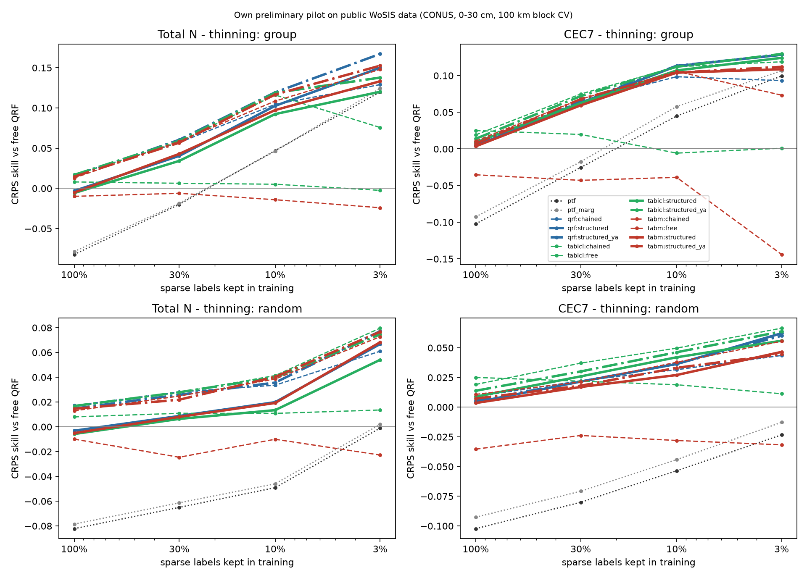
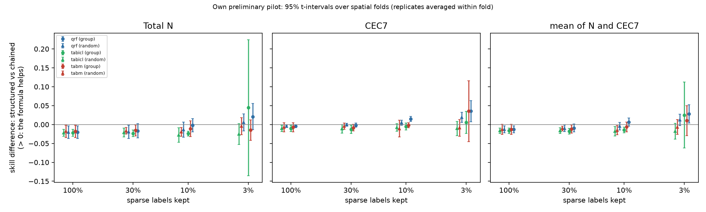
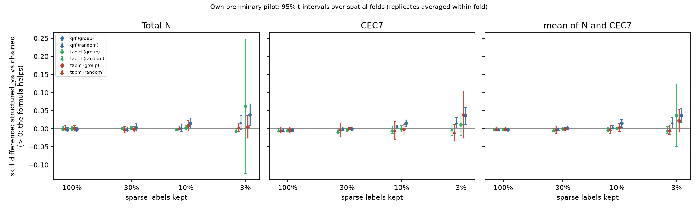
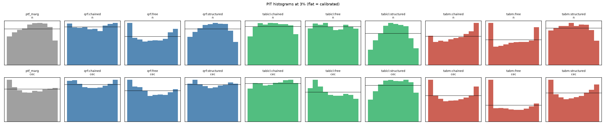

# Results: `gpu_quick`

Own preliminary pilot on public WoSIS data (conterminous USA, 0-30 cm). Skill = 1 - CRPS(arm) / CRPS(free QRF) on the same held-out sites. Differences are in skill units (> 0: first arm better). Intervals: approximate 95% t-intervals over spatial folds (the folds share training data, so they are somewhat optimistic), replicates averaged within fold.

- complete folds used: [0, 1, 2, 3, 4]; incomplete folds excluded: []
- sites scored: 20198; configurations: 50; learners: ['qrf', 'tabm', 'tabicl']
- observed envelope-violation rate in the data: N 0.011, CEC7 0.057

## 0. Key numbers (read this first; points = skill difference x 100)

- **qrf**: formula only (structured_ya vs chained) at 3% by region: mean +3.7 [+1.8, +5.6] (N +3.8 [+0.8, +6.8], CEC7 +3.5 [+1.2, +5.9]); at 3% at random +1.6 [+0.1, +3.1]; with all labels -0.3 [-0.5, -0.1]; chaining alone (chained vs free) at 3%: +11.1 [+7.7, +14.5]
- **tabm**: formula only (structured_ya vs chained) at 3% by region: mean +2.2 [-1.0, +5.3] (N +0.5 [-2.6, +3.6], CEC7 +3.9 [-2.6, +10.3]); at 3% at random -0.4 [-1.7, +1.0]; with all labels -0.1 [-0.6, +0.4]; chaining alone (chained vs free) at 3%: +19.5 [+13.3, +25.7]
- **tabicl**: formula only (structured_ya vs chained) at 3% by region: mean +3.6 [-5.1, +12.3] (N +6.2 [-12.3, +24.7], CEC7 +1.1 [-2.0, +4.1]); at 3% at random -0.4 [-1.4, +0.6]; with all labels -0.2 [-0.6, +0.1]; chaining alone (chained vs free) at 3%: +9.8 [-1.9, +21.5]
- CEC7-clay Spearman at held-out sites (qrf, 3%): observed 0.74; free 0.02; chained 0.50; structured_ya 0.66; ptf 0.86
- CEC7-clay Spearman at held-out sites (tabm, 3%): observed 0.74; free 0.00; chained 0.74; structured_ya 0.73; ptf 0.86
- CEC7-clay Spearman at held-out sites (tabicl, 3%): observed 0.74; free 0.01; chained 0.60; structured_ya 0.62; ptf 0.86
- joint variogram-score skill (qrf, 3%): structured_ya +0.240 vs chained +0.182
- joint variogram-score skill (tabm, 3%): structured_ya +0.236 vs chained +0.229
- joint variogram-score skill (tabicl, 3%): structured_ya +0.193 vs chained +0.174

## 1. Primary result (pre-specified in docs/DESIGN.md): 3% of sparse labels, group thinning, averaged over ['qrf', 'tabm', 'tabicl']

| contrast                 | cec                     | mean                    | n                       |
|:-------------------------|:------------------------|:------------------------|:------------------------|
| structured vs chained    | +0.025 [+0.000, +0.050] | +0.021 [-0.004, +0.046] | +0.017 [-0.033, +0.067] |
| structured_ya vs chained | +0.028 [+0.009, +0.047] | +0.032 [+0.007, +0.056] | +0.035 [-0.019, +0.089] |

Same on the log scale (CRPS of log N, log CEC7):

| contrast                 | cec                     | mean                    | n                       |
|:-------------------------|:------------------------|:------------------------|:------------------------|
| structured vs chained    | +0.022 [+0.003, +0.041] | +0.019 [+0.011, +0.027] | +0.017 [+0.002, +0.032] |
| structured_ya vs chained | +0.026 [+0.012, +0.041] | +0.027 [+0.017, +0.037] | +0.028 [+0.016, +0.040] |

## 2. Per learner at 3% (group thinning)

|                                        | cec                     | mean                    | n                       |
|:---------------------------------------|:------------------------|:------------------------|:------------------------|
| ('qrf', 'chained vs free')             | +0.093 [+0.069, +0.117] | +0.111 [+0.077, +0.145] | +0.129 [+0.082, +0.176] |
| ('qrf', 'structured vs chained')       | +0.035 [+0.007, +0.063] | +0.028 [+0.004, +0.052] | +0.021 [-0.014, +0.056] |
| ('qrf', 'structured vs clip')          | +0.056 [+0.032, +0.080] | +0.070 [+0.045, +0.096] | +0.085 [+0.056, +0.113] |
| ('qrf', 'structured vs free')          | +0.128 [+0.083, +0.174] | +0.139 [+0.101, +0.178] | +0.150 [+0.103, +0.197] |
| ('qrf', 'structured vs ptf')           | +0.029 [+0.008, +0.050] | +0.030 [+0.012, +0.047] | +0.030 [+0.002, +0.058] |
| ('qrf', 'structured vs ptf_marg')      | +0.022 [+0.008, +0.036] | +0.024 [+0.015, +0.032] | +0.026 [+0.004, +0.047] |
| ('qrf', 'structured_ya vs chained')    | +0.035 [+0.012, +0.059] | +0.037 [+0.018, +0.056] | +0.038 [+0.008, +0.068] |
| ('tabicl', 'chained vs free')          | +0.118 [+0.041, +0.195] | +0.098 [-0.019, +0.215] | +0.078 [-0.103, +0.259] |
| ('tabicl', 'structured vs chained')    | +0.005 [-0.024, +0.034] | +0.025 [-0.062, +0.112] | +0.044 [-0.135, +0.224] |
| ('tabicl', 'structured vs clip')       | +0.036 [+0.002, +0.070] | +0.035 [-0.018, +0.089] | +0.034 [-0.045, +0.114] |
| ('tabicl', 'structured vs free')       | +0.123 [+0.061, +0.186] | +0.123 [+0.070, +0.176] | +0.123 [+0.072, +0.173] |
| ('tabicl', 'structured vs ptf')        | +0.025 [-0.009, +0.059] | +0.012 [-0.022, +0.047] | +0.000 [-0.051, +0.051] |
| ('tabicl', 'structured vs ptf_marg')   | +0.018 [-0.008, +0.043] | +0.007 [-0.020, +0.033] | -0.004 [-0.049, +0.040] |
| ('tabicl', 'structured_ya vs chained') | +0.011 [-0.020, +0.041] | +0.036 [-0.051, +0.123] | +0.062 [-0.123, +0.247] |
| ('tabm', 'chained vs free')            | +0.217 [+0.101, +0.333] | +0.195 [+0.133, +0.257] | +0.172 [+0.105, +0.239] |
| ('tabm', 'structured vs chained')      | +0.035 [-0.045, +0.116] | +0.010 [-0.029, +0.050] | -0.015 [-0.042, +0.012] |
| ('tabm', 'structured vs clip')         | +0.083 [+0.022, +0.145] | +0.085 [+0.064, +0.107] | +0.087 [+0.029, +0.145] |
| ('tabm', 'structured vs free')         | +0.253 [+0.126, +0.379] | +0.205 [+0.144, +0.266] | +0.157 [+0.080, +0.235] |
| ('tabm', 'structured vs ptf')          | +0.009 [-0.009, +0.027] | +0.011 [-0.004, +0.026] | +0.013 [-0.007, +0.034] |
| ('tabm', 'structured vs ptf_marg')     | +0.002 [-0.016, +0.020] | +0.005 [-0.011, +0.021] | +0.009 [-0.018, +0.036] |
| ('tabm', 'structured_ya vs chained')   | +0.039 [-0.026, +0.103] | +0.022 [-0.010, +0.053] | +0.005 [-0.026, +0.036] |

## 3. Structured vs chained-free at every level (group and random thinning)

|                            | cec                     | mean                    | n                       |
|:---------------------------|:------------------------|:------------------------|:------------------------|
| ('all', 1.0, 'qrf')        | -0.005 [-0.008, -0.002] | -0.013 [-0.022, -0.003] | -0.020 [-0.037, -0.003] |
| ('all', 1.0, 'tabicl')     | -0.010 [-0.019, -0.002] | -0.016 [-0.023, -0.009] | -0.022 [-0.031, -0.013] |
| ('all', 1.0, 'tabm')       | -0.007 [-0.019, +0.005] | -0.013 [-0.026, +0.001] | -0.018 [-0.034, -0.002] |
| ('group', 0.03, 'qrf')     | +0.035 [+0.007, +0.063] | +0.028 [+0.004, +0.052] | +0.021 [-0.014, +0.056] |
| ('group', 0.03, 'tabicl')  | +0.005 [-0.024, +0.034] | +0.025 [-0.062, +0.112] | +0.044 [-0.135, +0.224] |
| ('group', 0.03, 'tabm')    | +0.035 [-0.045, +0.116] | +0.010 [-0.029, +0.050] | -0.015 [-0.042, +0.012] |
| ('group', 0.1, 'qrf')      | +0.014 [+0.008, +0.021] | +0.006 [-0.004, +0.017] | -0.002 [-0.019, +0.015] |
| ('group', 0.1, 'tabicl')   | -0.005 [-0.014, +0.004] | -0.014 [-0.022, -0.007] | -0.024 [-0.030, -0.018] |
| ('group', 0.1, 'tabm')     | -0.002 [-0.009, +0.005] | -0.006 [-0.019, +0.006] | -0.011 [-0.032, +0.010] |
| ('group', 0.3, 'qrf')      | -0.002 [-0.007, +0.004] | -0.009 [-0.020, +0.001] | -0.017 [-0.036, +0.002] |
| ('group', 0.3, 'tabicl')   | -0.012 [-0.023, -0.002] | -0.018 [-0.025, -0.011] | -0.023 [-0.032, -0.015] |
| ('group', 0.3, 'tabm')     | -0.008 [-0.017, +0.000] | -0.012 [-0.023, -0.001] | -0.016 [-0.030, -0.001] |
| ('random', 0.03, 'qrf')    | +0.019 [+0.005, +0.032] | +0.012 [-0.003, +0.027] | +0.006 [-0.017, +0.028] |
| ('random', 0.03, 'tabicl') | -0.011 [-0.029, +0.008] | -0.018 [-0.039, +0.003] | -0.026 [-0.053, +0.002] |
| ('random', 0.03, 'tabm')   | -0.009 [-0.031, +0.013] | -0.007 [-0.026, +0.013] | -0.004 [-0.027, +0.018] |
| ('random', 0.1, 'qrf')     | +0.005 [-0.002, +0.012] | -0.004 [-0.014, +0.006] | -0.014 [-0.034, +0.006] |
| ('random', 0.1, 'tabicl')  | -0.008 [-0.018, +0.002] | -0.018 [-0.030, -0.005] | -0.028 [-0.047, -0.009] |
| ('random', 0.1, 'tabm')    | -0.011 [-0.033, +0.011] | -0.015 [-0.027, -0.003] | -0.019 [-0.031, -0.007] |
| ('random', 0.3, 'qrf')     | -0.001 [-0.004, +0.003] | -0.010 [-0.019, -0.001] | -0.019 [-0.037, -0.002] |
| ('random', 0.3, 'tabicl')  | -0.011 [-0.022, +0.000] | -0.016 [-0.024, -0.009] | -0.021 [-0.033, -0.009] |
| ('random', 0.3, 'tabm')    | -0.004 [-0.013, +0.004] | -0.011 [-0.017, -0.004] | -0.017 [-0.026, -0.008] |

## 4. Formula only (theta from x AND abundant properties) vs chained-free

|                            | cec                     | mean                    | n                       |
|:---------------------------|:------------------------|:------------------------|:------------------------|
| ('all', 1.0, 'qrf')        | -0.003 [-0.008, +0.001] | -0.003 [-0.005, -0.001] | -0.002 [-0.009, +0.004] |
| ('all', 1.0, 'tabicl')     | -0.005 [-0.010, -0.000] | -0.002 [-0.006, +0.001] | +0.000 [-0.005, +0.006] |
| ('all', 1.0, 'tabm')       | -0.004 [-0.012, +0.005] | -0.001 [-0.006, +0.004] | +0.002 [-0.006, +0.009] |
| ('group', 0.03, 'qrf')     | +0.035 [+0.012, +0.059] | +0.037 [+0.018, +0.056] | +0.038 [+0.008, +0.068] |
| ('group', 0.03, 'tabicl')  | +0.011 [-0.020, +0.041] | +0.036 [-0.051, +0.123] | +0.062 [-0.123, +0.247] |
| ('group', 0.03, 'tabm')    | +0.039 [-0.026, +0.103] | +0.022 [-0.010, +0.053] | +0.005 [-0.026, +0.036] |
| ('group', 0.1, 'qrf')      | +0.015 [+0.006, +0.024] | +0.015 [+0.004, +0.026] | +0.015 [+0.001, +0.029] |
| ('group', 0.1, 'tabicl')   | -0.000 [-0.009, +0.009] | +0.001 [-0.002, +0.005] | +0.003 [-0.004, +0.009] |
| ('group', 0.1, 'tabm')     | -0.002 [-0.015, +0.012] | +0.003 [-0.008, +0.014] | +0.008 [-0.007, +0.023] |
| ('group', 0.3, 'qrf')      | -0.000 [-0.005, +0.005] | +0.002 [-0.004, +0.007] | +0.003 [-0.006, +0.013] |
| ('group', 0.3, 'tabicl')   | -0.003 [-0.008, +0.003] | -0.001 [-0.002, +0.001] | +0.002 [-0.002, +0.005] |
| ('group', 0.3, 'tabm')     | +0.000 [-0.004, +0.004] | -0.001 [-0.006, +0.004] | -0.002 [-0.009, +0.005] |
| ('random', 0.03, 'qrf')    | +0.017 [+0.002, +0.031] | +0.016 [+0.001, +0.031] | +0.016 [-0.003, +0.036] |
| ('random', 0.03, 'tabicl') | -0.003 [-0.018, +0.013] | -0.004 [-0.014, +0.006] | -0.005 [-0.010, +0.000] |
| ('random', 0.03, 'tabm')   | -0.011 [-0.034, +0.012] | -0.004 [-0.017, +0.010] | +0.004 [-0.008, +0.016] |
| ('random', 0.1, 'qrf')     | +0.005 [+0.000, +0.009] | +0.004 [-0.001, +0.008] | +0.002 [-0.008, +0.013] |
| ('random', 0.1, 'tabicl')  | -0.004 [-0.014, +0.007] | -0.002 [-0.008, +0.003] | -0.001 [-0.005, +0.002] |
| ('random', 0.1, 'tabm')    | -0.005 [-0.030, +0.020] | -0.001 [-0.013, +0.010] | +0.002 [-0.004, +0.007] |
| ('random', 0.3, 'qrf')     | -0.001 [-0.006, +0.004] | -0.001 [-0.005, +0.003] | -0.002 [-0.009, +0.005] |
| ('random', 0.3, 'tabicl')  | -0.007 [-0.014, -0.000] | -0.003 [-0.007, -0.000] | +0.000 [-0.003, +0.004] |
| ('random', 0.3, 'tabm')    | -0.003 [-0.023, +0.016] | -0.003 [-0.013, +0.007] | -0.003 [-0.013, +0.007] |

## 5. Extrapolation: structured vs chained-free on thinned vs retained regions, and group - random on thinned sites

|                                        | cec                     | mean                    | n                       |
|:---------------------------------------|:------------------------|:------------------------|:------------------------|
| ('group', 'retained', 0.03, 'qrf')     | +0.017 [-0.029, +0.064] | +0.016 [-0.047, +0.078] | +0.014 [-0.070, +0.098] |
| ('group', 'retained', 0.03, 'tabicl')  | +0.008 [-0.019, +0.036] | -0.012 [-0.048, +0.025] | -0.031 [-0.079, +0.016] |
| ('group', 'retained', 0.03, 'tabm')    | +0.007 [-0.030, +0.044] | -0.005 [-0.057, +0.047] | -0.017 [-0.091, +0.057] |
| ('group', 'retained', 0.1, 'qrf')      | +0.001 [-0.022, +0.023] | -0.007 [-0.029, +0.016] | -0.014 [-0.047, +0.019] |
| ('group', 'retained', 0.1, 'tabicl')   | -0.003 [-0.021, +0.015] | -0.015 [-0.031, -0.000] | -0.028 [-0.045, -0.011] |
| ('group', 'retained', 0.1, 'tabm')     | -0.006 [-0.036, +0.024] | -0.008 [-0.032, +0.016] | -0.011 [-0.036, +0.015] |
| ('group', 'retained', 0.3, 'qrf')      | -0.006 [-0.019, +0.007] | -0.012 [-0.029, +0.005] | -0.018 [-0.042, +0.005] |
| ('group', 'retained', 0.3, 'tabicl')   | -0.014 [-0.025, -0.002] | -0.019 [-0.028, -0.010] | -0.024 [-0.033, -0.015] |
| ('group', 'retained', 0.3, 'tabm')     | -0.008 [-0.027, +0.011] | -0.011 [-0.027, +0.005] | -0.014 [-0.036, +0.008] |
| ('group', 'thinned', 0.03, 'qrf')      | +0.036 [+0.008, +0.065] | +0.028 [+0.006, +0.051] | +0.021 [-0.013, +0.054] |
| ('group', 'thinned', 0.03, 'tabicl')   | +0.005 [-0.026, +0.036] | +0.026 [-0.065, +0.117] | +0.047 [-0.140, +0.234] |
| ('group', 'thinned', 0.03, 'tabm')     | +0.037 [-0.048, +0.122] | +0.011 [-0.030, +0.052] | -0.015 [-0.041, +0.011] |
| ('group', 'thinned', 0.1, 'qrf')       | +0.016 [+0.008, +0.024] | +0.008 [-0.002, +0.017] | -0.000 [-0.018, +0.017] |
| ('group', 'thinned', 0.1, 'tabicl')    | -0.005 [-0.015, +0.004] | -0.015 [-0.022, -0.007] | -0.024 [-0.030, -0.017] |
| ('group', 'thinned', 0.1, 'tabm')      | -0.001 [-0.007, +0.006] | -0.006 [-0.019, +0.006] | -0.012 [-0.036, +0.013] |
| ('group', 'thinned', 0.3, 'qrf')       | +0.002 [-0.008, +0.012] | -0.007 [-0.017, +0.002] | -0.017 [-0.039, +0.005] |
| ('group', 'thinned', 0.3, 'tabicl')    | -0.010 [-0.024, +0.003] | -0.017 [-0.026, -0.008] | -0.024 [-0.039, -0.009] |
| ('group', 'thinned', 0.3, 'tabm')      | -0.007 [-0.013, +0.000] | -0.013 [-0.026, +0.001] | -0.019 [-0.045, +0.008] |
| ('random', 'retained', 0.03, 'qrf')    | +0.015 [-0.061, +0.091] | +0.035 [-0.064, +0.134] | +0.055 [-0.078, +0.189] |
| ('random', 'retained', 0.03, 'tabicl') | -0.011 [-0.061, +0.039] | -0.017 [-0.058, +0.024] | -0.023 [-0.067, +0.021] |
| ('random', 'retained', 0.03, 'tabm')   | +0.002 [-0.054, +0.058] | +0.009 [-0.062, +0.079] | +0.015 [-0.078, +0.109] |
| ('random', 'retained', 0.1, 'qrf')     | +0.009 [-0.020, +0.038] | -0.007 [-0.028, +0.013] | -0.024 [-0.048, +0.001] |
| ('random', 'retained', 0.1, 'tabicl')  | +0.009 [-0.017, +0.036] | -0.014 [-0.030, +0.002] | -0.038 [-0.060, -0.015] |
| ('random', 'retained', 0.1, 'tabm')    | +0.008 [-0.024, +0.041] | -0.010 [-0.035, +0.015] | -0.028 [-0.048, -0.008] |
| ('random', 'retained', 0.3, 'qrf')     | -0.005 [-0.013, +0.003] | -0.007 [-0.022, +0.008] | -0.009 [-0.033, +0.015] |
| ('random', 'retained', 0.3, 'tabicl')  | -0.013 [-0.024, -0.001] | -0.014 [-0.025, -0.003] | -0.015 [-0.028, -0.003] |
| ('random', 'retained', 0.3, 'tabm')    | +0.002 [-0.011, +0.015] | -0.004 [-0.020, +0.012] | -0.011 [-0.032, +0.011] |
| ('random', 'thinned', 0.03, 'qrf')     | +0.018 [+0.007, +0.030] | +0.010 [-0.000, +0.020] | +0.001 [-0.014, +0.016] |
| ('random', 'thinned', 0.03, 'tabicl')  | -0.011 [-0.032, +0.010] | -0.019 [-0.041, +0.004] | -0.026 [-0.056, +0.003] |
| ('random', 'thinned', 0.03, 'tabm')    | -0.010 [-0.033, +0.013] | -0.008 [-0.028, +0.012] | -0.006 [-0.027, +0.015] |
| ('random', 'thinned', 0.1, 'qrf')      | +0.004 [-0.001, +0.010] | -0.004 [-0.013, +0.005] | -0.012 [-0.033, +0.009] |
| ('random', 'thinned', 0.1, 'tabicl')   | -0.010 [-0.019, -0.001] | -0.018 [-0.030, -0.006] | -0.026 [-0.045, -0.007] |
| ('random', 'thinned', 0.1, 'tabm')     | -0.012 [-0.034, +0.010] | -0.015 [-0.029, -0.002] | -0.019 [-0.035, -0.002] |
| ('random', 'thinned', 0.3, 'qrf')      | +0.001 [-0.006, +0.007] | -0.013 [-0.019, -0.006] | -0.027 [-0.044, -0.009] |
| ('random', 'thinned', 0.3, 'tabicl')   | -0.011 [-0.023, +0.002] | -0.018 [-0.025, -0.012] | -0.026 [-0.046, -0.005] |
| ('random', 'thinned', 0.3, 'tabm')     | -0.007 [-0.016, +0.001] | -0.015 [-0.020, -0.010] | -0.022 [-0.034, -0.011] |

Difference-in-differences on thinned sites ([arm - chained] group minus random, same sites):

|                                              | cec                     | n                       |
|:---------------------------------------------|:------------------------|:------------------------|
| ('structured vs chained', 0.03, 'qrf')       | +0.021 [-0.030, +0.072] | +0.022 [-0.021, +0.064] |
| ('structured vs chained', 0.03, 'tabicl')    | +0.002 [-0.047, +0.052] | -0.000 [-0.049, +0.049] |
| ('structured vs chained', 0.03, 'tabm')      | +0.077 [-0.088, +0.242] | -0.008 [-0.045, +0.028] |
| ('structured vs chained', 0.1, 'qrf')        | +0.011 [-0.001, +0.023] | +0.018 [+0.004, +0.033] |
| ('structured vs chained', 0.1, 'tabicl')     | +0.003 [-0.012, +0.019] | +0.007 [-0.005, +0.019] |
| ('structured vs chained', 0.1, 'tabm')       | +0.010 [-0.006, +0.026] | +0.003 [-0.021, +0.026] |
| ('structured vs chained', 0.3, 'qrf')        | -0.001 [-0.013, +0.011] | +0.005 [-0.017, +0.028] |
| ('structured vs chained', 0.3, 'tabicl')     | -0.002 [-0.017, +0.013] | +0.003 [-0.008, +0.013] |
| ('structured vs chained', 0.3, 'tabm')       | -0.002 [-0.019, +0.016] | -0.003 [-0.019, +0.013] |
| ('structured_ya vs chained', 0.03, 'qrf')    | +0.020 [-0.022, +0.062] | +0.024 [-0.021, +0.070] |
| ('structured_ya vs chained', 0.03, 'tabicl') | -0.003 [-0.048, +0.042] | -0.006 [-0.027, +0.015] |
| ('structured_ya vs chained', 0.03, 'tabm')   | +0.075 [-0.071, +0.222] | +0.002 [-0.022, +0.025] |
| ('structured_ya vs chained', 0.1, 'qrf')     | +0.013 [+0.002, +0.024] | +0.021 [+0.007, +0.034] |
| ('structured_ya vs chained', 0.1, 'tabicl')  | +0.009 [-0.006, +0.024] | +0.003 [-0.003, +0.009] |
| ('structured_ya vs chained', 0.1, 'tabm')    | +0.011 [-0.011, +0.033] | +0.002 [-0.013, +0.018] |
| ('structured_ya vs chained', 0.3, 'qrf')     | +0.003 [-0.010, +0.015] | +0.009 [-0.003, +0.020] |
| ('structured_ya vs chained', 0.3, 'tabicl')  | +0.006 [-0.001, +0.014] | +0.005 [-0.002, +0.011] |
| ('structured_ya vs chained', 0.3, 'tabm')    | +0.005 [-0.017, +0.027] | +0.000 [-0.009, +0.009] |

## 6. Joint scores (vector clay, OC, pH, N, CEC7): skill vs free QRF

|                        | ptf                     | ptf_marg                | qrf:chained             | qrf:clip                | qrf:free                | qrf:structured          | qrf:structured_ya       | tabicl:chained          | tabicl:clip             | tabicl:free             | tabicl:structured       | tabicl:structured_ya    | tabm:chained            | tabm:clip               | tabm:free               | tabm:structured         | tabm:structured_ya      |
|:-----------------------|:------------------------|:------------------------|:------------------------|:------------------------|:------------------------|:------------------------|:------------------------|:------------------------|:------------------------|:------------------------|:------------------------|:------------------------|:------------------------|:------------------------|:------------------------|:------------------------|:------------------------|
| ('es', 'all', 1.0)     | -0.029 [-0.043, -0.014] | -0.025 [-0.039, -0.011] | +0.027 [+0.024, +0.030] | +0.008 [+0.005, +0.012] | +0.000 [+0.000, +0.000] | +0.023 [+0.018, +0.028] | +0.026 [+0.023, +0.029] | +0.032 [+0.027, +0.038] | +0.015 [+0.011, +0.020] | +0.008 [+0.002, +0.014] | +0.025 [+0.019, +0.031] | +0.030 [+0.025, +0.036] | +0.027 [+0.022, +0.031] | +0.002 [-0.003, +0.007] | -0.011 [-0.018, -0.003] | +0.021 [+0.016, +0.026] | +0.027 [+0.023, +0.030] |
| ('es', 'group', 0.03)  | +0.082 [+0.063, +0.101] | +0.085 [+0.065, +0.105] | +0.072 [+0.054, +0.091] | +0.053 [+0.041, +0.064] | +0.000 [+0.000, +0.000] | +0.100 [+0.079, +0.121] | +0.103 [+0.083, +0.122] | +0.092 [+0.065, +0.118] | +0.066 [+0.050, +0.082] | +0.011 [+0.000, +0.022] | +0.094 [+0.075, +0.113] | +0.096 [+0.072, +0.120] | +0.082 [+0.064, +0.100] | +0.044 [+0.034, +0.054] | -0.023 [-0.043, -0.003] | +0.093 [+0.069, +0.117] | +0.095 [+0.071, +0.120] |
| ('es', 'group', 0.1)   | +0.044 [+0.021, +0.067] | +0.048 [+0.026, +0.069] | +0.071 [+0.054, +0.088] | +0.032 [+0.025, +0.040] | +0.000 [+0.000, +0.000] | +0.078 [+0.057, +0.098] | +0.080 [+0.059, +0.102] | +0.081 [+0.062, +0.100] | +0.036 [+0.025, +0.047] | +0.000 [-0.013, +0.013] | +0.078 [+0.058, +0.098] | +0.082 [+0.062, +0.103] | +0.078 [+0.055, +0.101] | +0.027 [+0.005, +0.050] | -0.008 [-0.028, +0.012] | +0.075 [+0.054, +0.095] | +0.079 [+0.057, +0.102] |
| ('es', 'group', 0.3)   | +0.004 [-0.020, +0.029] | +0.007 [-0.015, +0.029] | +0.048 [+0.038, +0.058] | +0.019 [+0.011, +0.026] | +0.000 [+0.000, +0.000] | +0.046 [+0.030, +0.062] | +0.050 [+0.037, +0.063] | +0.055 [+0.041, +0.068] | +0.025 [+0.017, +0.033] | +0.005 [-0.003, +0.013] | +0.046 [+0.030, +0.063] | +0.054 [+0.039, +0.069] | +0.049 [+0.038, +0.060] | +0.013 [+0.005, +0.021] | -0.016 [-0.026, -0.005] | +0.044 [+0.028, +0.061] | +0.049 [+0.038, +0.061] |
| ('es', 'random', 0.03) | +0.010 [-0.018, +0.037] | +0.014 [-0.011, +0.039] | +0.043 [+0.032, +0.054] | +0.021 [+0.014, +0.029] | +0.000 [+0.000, +0.000] | +0.051 [+0.035, +0.068] | +0.053 [+0.037, +0.069] | +0.058 [+0.043, +0.073] | +0.027 [+0.016, +0.038] | +0.008 [-0.001, +0.017] | +0.052 [+0.035, +0.068] | +0.056 [+0.041, +0.072] | +0.053 [+0.037, +0.068] | +0.013 [+0.002, +0.025] | -0.012 [-0.026, +0.002] | +0.048 [+0.030, +0.065] | +0.050 [+0.032, +0.068] |
| ('es', 'random', 0.1)  | -0.007 [-0.026, +0.013] | -0.003 [-0.021, +0.015] | +0.036 [+0.028, +0.044] | +0.014 [+0.010, +0.019] | +0.000 [+0.000, +0.000] | +0.037 [+0.029, +0.046] | +0.039 [+0.032, +0.046] | +0.048 [+0.041, +0.054] | +0.021 [+0.016, +0.025] | +0.007 [+0.000, +0.014] | +0.040 [+0.030, +0.050] | +0.045 [+0.037, +0.052] | +0.039 [+0.031, +0.047] | +0.010 [-0.001, +0.020] | -0.009 [-0.015, -0.002] | +0.034 [+0.024, +0.045] | +0.041 [+0.034, +0.048] |
| ('es', 'random', 0.3)  | -0.016 [-0.036, +0.004] | -0.013 [-0.031, +0.006] | +0.035 [+0.027, +0.042] | +0.011 [+0.006, +0.016] | +0.000 [+0.000, +0.000] | +0.033 [+0.022, +0.044] | +0.035 [+0.026, +0.044] | +0.042 [+0.033, +0.052] | +0.021 [+0.016, +0.026] | +0.011 [+0.008, +0.014] | +0.035 [+0.024, +0.046] | +0.040 [+0.030, +0.051] | +0.035 [+0.025, +0.044] | +0.005 [-0.009, +0.019] | -0.012 [-0.022, -0.001] | +0.030 [+0.021, +0.039] | +0.034 [+0.027, +0.040] |
| ('vs', 'all', 1.0)     | +0.068 [+0.049, +0.086] | +0.103 [+0.092, +0.115] | +0.174 [+0.166, +0.183] | +0.084 [+0.075, +0.094] | +0.000 [+0.000, +0.000] | +0.171 [+0.163, +0.179] | +0.177 [+0.167, +0.187] | +0.187 [+0.177, +0.197] | +0.091 [+0.083, +0.100] | +0.004 [-0.002, +0.010] | +0.169 [+0.159, +0.179] | +0.183 [+0.172, +0.195] | +0.181 [+0.173, +0.189] | +0.087 [+0.079, +0.096] | +0.012 [+0.003, +0.021] | +0.170 [+0.162, +0.179] | +0.179 [+0.168, +0.191] |
| ('vs', 'group', 0.03)  | +0.196 [+0.168, +0.225] | +0.223 [+0.203, +0.242] | +0.182 [+0.162, +0.203] | +0.132 [+0.120, +0.143] | +0.000 [+0.000, +0.000] | +0.234 [+0.214, +0.254] | +0.240 [+0.223, +0.257] | +0.174 [+0.095, +0.252] | +0.121 [+0.105, +0.137] | -0.050 [-0.082, -0.018] | +0.190 [+0.169, +0.211] | +0.193 [+0.169, +0.217] | +0.229 [+0.204, +0.254] | +0.149 [+0.119, +0.179] | +0.021 [-0.051, +0.093] | +0.231 [+0.209, +0.252] | +0.236 [+0.211, +0.260] |
| ('vs', 'group', 0.1)   | +0.155 [+0.103, +0.207] | +0.185 [+0.151, +0.218] | +0.206 [+0.178, +0.233] | +0.112 [+0.096, +0.129] | +0.000 [+0.000, +0.000] | +0.224 [+0.188, +0.260] | +0.231 [+0.193, +0.268] | +0.222 [+0.176, +0.268] | +0.108 [+0.082, +0.134] | -0.019 [-0.052, +0.013] | +0.208 [+0.171, +0.245] | +0.224 [+0.184, +0.264] | +0.228 [+0.190, +0.266] | +0.122 [+0.098, +0.146] | +0.035 [+0.027, +0.044] | +0.224 [+0.188, +0.259] | +0.231 [+0.189, +0.273] |
| ('vs', 'group', 0.3)   | +0.104 [+0.074, +0.133] | +0.138 [+0.120, +0.156] | +0.189 [+0.184, +0.194] | +0.095 [+0.085, +0.106] | +0.000 [+0.000, +0.000] | +0.191 [+0.182, +0.200] | +0.199 [+0.190, +0.208] | +0.204 [+0.196, +0.212] | +0.097 [+0.086, +0.109] | -0.005 [-0.014, +0.005] | +0.183 [+0.174, +0.192] | +0.201 [+0.191, +0.211] | +0.201 [+0.197, +0.205] | +0.094 [+0.081, +0.108] | +0.001 [-0.017, +0.018] | +0.189 [+0.179, +0.200] | +0.201 [+0.193, +0.209] |
| ('vs', 'random', 0.03) | +0.126 [+0.086, +0.165] | +0.159 [+0.132, +0.185] | +0.168 [+0.149, +0.187] | +0.096 [+0.078, +0.114] | +0.000 [+0.000, +0.000] | +0.202 [+0.178, +0.225] | +0.206 [+0.181, +0.230] | +0.217 [+0.194, +0.240] | +0.109 [+0.091, +0.128] | +0.012 [+0.004, +0.021] | +0.199 [+0.170, +0.228] | +0.214 [+0.188, +0.239] | +0.209 [+0.191, +0.228] | +0.101 [+0.086, +0.116] | +0.015 [+0.005, +0.025] | +0.200 [+0.176, +0.224] | +0.209 [+0.180, +0.238] |
| ('vs', 'random', 0.1)  | +0.094 [+0.062, +0.126] | +0.129 [+0.111, +0.148] | +0.172 [+0.160, +0.184] | +0.089 [+0.078, +0.100] | +0.000 [+0.000, +0.000] | +0.185 [+0.170, +0.201] | +0.189 [+0.171, +0.207] | +0.203 [+0.187, +0.219] | +0.101 [+0.093, +0.109] | +0.014 [+0.002, +0.027] | +0.185 [+0.168, +0.203] | +0.199 [+0.182, +0.216] | +0.191 [+0.176, +0.206] | +0.092 [+0.074, +0.111] | +0.015 [-0.003, +0.032] | +0.183 [+0.164, +0.202] | +0.193 [+0.174, +0.211] |
| ('vs', 'random', 0.3)  | +0.082 [+0.052, +0.112] | +0.119 [+0.099, +0.140] | +0.179 [+0.168, +0.189] | +0.086 [+0.078, +0.094] | +0.000 [+0.000, +0.000] | +0.182 [+0.165, +0.199] | +0.187 [+0.174, +0.201] | +0.199 [+0.184, +0.213] | +0.097 [+0.089, +0.105] | +0.010 [+0.005, +0.016] | +0.182 [+0.165, +0.200] | +0.195 [+0.179, +0.211] | +0.187 [+0.173, +0.200] | +0.087 [+0.072, +0.102] | +0.010 [-0.004, +0.023] | +0.179 [+0.165, +0.193] | +0.186 [+0.172, +0.200] |

## 7. CRPS skill of every arm vs free QRF

|                         | ptf                     | ptf_marg                | qrf:chained             | qrf:clip                | qrf:free                | qrf:oracle_ya           | qrf:structured          | qrf:structured_og       | qrf:structured_ya       | tabicl:chained          | tabicl:clip             | tabicl:free             | tabicl:oracle_ya        | tabicl:structured       | tabicl:structured_og    | tabicl:structured_ya    | tabm:chained            | tabm:clip               | tabm:free               | tabm:oracle_ya          | tabm:structured         | tabm:structured_og      | tabm:structured_ya      |
|:------------------------|:------------------------|:------------------------|:------------------------|:------------------------|:------------------------|:------------------------|:------------------------|:------------------------|:------------------------|:------------------------|:------------------------|:------------------------|:------------------------|:------------------------|:------------------------|:------------------------|:------------------------|:------------------------|:------------------------|:------------------------|:------------------------|:------------------------|:------------------------|
| ('all', 1.0, 'cec')     | -0.102 [-0.165, -0.040] | -0.093 [-0.148, -0.037] | +0.009 [-0.005, +0.022] | -0.010 [-0.025, +0.005] | +0.000 [+0.000, +0.000] | +0.548 [+0.499, +0.597] | +0.004 [-0.012, +0.020] | +0.004 [-0.012, +0.020] | +0.005 [-0.012, +0.023] | +0.019 [+0.006, +0.032] | +0.010 [-0.004, +0.025] | +0.025 [+0.015, +0.035] | +0.550 [+0.495, +0.605] | +0.009 [-0.012, +0.030] | +0.008 [-0.014, +0.029] | +0.014 [-0.003, +0.031] | +0.011 [+0.000, +0.021] | -0.030 [-0.042, -0.018] | -0.035 [-0.055, -0.016] | +0.539 [+0.490, +0.588] | +0.004 [-0.008, +0.015] | +0.003 [-0.007, +0.014] | +0.007 [-0.001, +0.016] |
| ('all', 1.0, 'n')       | -0.082 [-0.101, -0.063] | -0.078 [-0.096, -0.061] | +0.017 [+0.000, +0.034] | +0.001 [-0.013, +0.015] | +0.000 [+0.000, +0.000] | +0.465 [+0.424, +0.507] | -0.003 [-0.021, +0.015] |                         | +0.015 [-0.004, +0.034] | +0.016 [-0.001, +0.033] | +0.010 [-0.015, +0.035] | +0.008 [-0.010, +0.026] | +0.471 [+0.430, +0.511] | -0.006 [-0.025, +0.013] |                         | +0.017 [-0.005, +0.039] | +0.013 [-0.008, +0.034] | -0.005 [-0.028, +0.018] | -0.010 [-0.020, +0.000] | +0.460 [+0.408, +0.511] | -0.005 [-0.026, +0.016] |                         | +0.015 [-0.009, +0.038] |
| ('group', 0.03, 'cec')  | +0.100 [+0.057, +0.142] | +0.107 [+0.061, +0.152] | +0.093 [+0.069, +0.117] | +0.072 [+0.047, +0.098] | +0.000 [+0.000, +0.000] | +0.477 [+0.410, +0.543] | +0.128 [+0.083, +0.174] | +0.125 [+0.086, +0.165] | +0.129 [+0.088, +0.169] | +0.119 [+0.065, +0.173] | +0.088 [+0.052, +0.124] | +0.001 [-0.046, +0.048] | +0.445 [+0.387, +0.502] | +0.124 [+0.094, +0.154] | +0.115 [+0.083, +0.148] | +0.130 [+0.098, +0.161] | +0.073 [+0.021, +0.126] | +0.025 [-0.022, +0.072] | -0.144 [-0.261, -0.027] | +0.430 [+0.352, +0.507] | +0.109 [+0.070, +0.147] | +0.109 [+0.069, +0.150] | +0.112 [+0.082, +0.142] |
| ('group', 0.03, 'n')    | +0.120 [+0.084, +0.156] | +0.124 [+0.088, +0.161] | +0.129 [+0.082, +0.176] | +0.065 [+0.018, +0.113] | +0.000 [+0.000, +0.000] | +0.452 [+0.374, +0.531] | +0.150 [+0.103, +0.197] |                         | +0.167 [+0.127, +0.207] | +0.076 [-0.141, +0.292] | +0.086 [+0.014, +0.157] | -0.002 [-0.046, +0.041] | +0.402 [+0.263, +0.542] | +0.120 [+0.061, +0.179] |                         | +0.138 [+0.082, +0.193] | +0.148 [+0.088, +0.208] | +0.046 [-0.042, +0.135] | -0.024 [-0.133, +0.085] | +0.399 [+0.315, +0.484] | +0.133 [+0.089, +0.177] |                         | +0.153 [+0.103, +0.202] |
| ('group', 0.1, 'cec')   | +0.045 [+0.003, +0.087] | +0.058 [+0.025, +0.091] | +0.098 [+0.077, +0.120] | +0.052 [+0.044, +0.060] | +0.000 [+0.000, +0.000] | +0.533 [+0.489, +0.578] | +0.113 [+0.087, +0.139] | +0.108 [+0.075, +0.141] | +0.113 [+0.085, +0.142] | +0.112 [+0.082, +0.142] | +0.055 [+0.036, +0.074] | -0.006 [-0.028, +0.017] | +0.516 [+0.453, +0.580] | +0.107 [+0.081, +0.133] | +0.103 [+0.073, +0.133] | +0.112 [+0.084, +0.140] | +0.106 [+0.085, +0.126] | +0.031 [+0.014, +0.048] | -0.039 [-0.061, -0.017] | +0.509 [+0.457, +0.561] | +0.104 [+0.084, +0.124] | +0.100 [+0.076, +0.125] | +0.104 [+0.084, +0.124] |
| ('group', 0.1, 'n')     | +0.047 [+0.007, +0.087] | +0.046 [+0.012, +0.081] | +0.104 [+0.069, +0.140] | +0.021 [+0.005, +0.037] | +0.000 [+0.000, +0.000] | +0.472 [+0.407, +0.537] | +0.103 [+0.067, +0.138] |                         | +0.119 [+0.076, +0.162] | +0.116 [+0.077, +0.155] | +0.032 [+0.005, +0.059] | +0.005 [-0.019, +0.029] | +0.465 [+0.401, +0.528] | +0.092 [+0.055, +0.130] |                         | +0.119 [+0.078, +0.160] | +0.109 [+0.066, +0.151] | +0.009 [-0.048, +0.066] | -0.014 [-0.066, +0.038] | +0.444 [+0.370, +0.517] | +0.097 [+0.064, +0.131] |                         | +0.117 [+0.070, +0.164] |
| ('group', 0.3, 'cec')   | -0.025 [-0.103, +0.052] | -0.017 [-0.087, +0.052] | +0.065 [+0.044, +0.085] | +0.018 [+0.003, +0.032] | +0.000 [+0.000, +0.000] | +0.536 [+0.506, +0.566] | +0.063 [+0.039, +0.087] | +0.062 [+0.039, +0.084] | +0.065 [+0.040, +0.089] | +0.075 [+0.057, +0.093] | +0.036 [+0.020, +0.051] | +0.020 [-0.006, +0.045] | +0.532 [+0.496, +0.568] | +0.062 [+0.042, +0.083] | +0.061 [+0.040, +0.082] | +0.072 [+0.052, +0.092] | +0.068 [+0.048, +0.088] | -0.004 [-0.035, +0.028] | -0.043 [-0.084, -0.002] | +0.518 [+0.481, +0.555] | +0.059 [+0.034, +0.085] | +0.059 [+0.035, +0.083] | +0.068 [+0.046, +0.090] |
| ('group', 0.3, 'n')     | -0.020 [-0.052, +0.012] | -0.018 [-0.049, +0.012] | +0.057 [+0.039, +0.075] | +0.013 [-0.008, +0.034] | +0.000 [+0.000, +0.000] | +0.463 [+0.414, +0.512] | +0.040 [+0.006, +0.075] |                         | +0.060 [+0.034, +0.086] | +0.058 [+0.028, +0.087] | +0.022 [+0.002, +0.042] | +0.006 [-0.002, +0.015] | +0.465 [+0.417, +0.513] | +0.034 [-0.000, +0.069] |                         | +0.059 [+0.029, +0.089] | +0.058 [+0.033, +0.084] | +0.013 [-0.014, +0.039] | -0.006 [-0.030, +0.018] | +0.466 [+0.410, +0.522] | +0.043 [+0.009, +0.077] |                         | +0.057 [+0.033, +0.081] |
| ('random', 0.03, 'cec') | -0.023 [-0.078, +0.031] | -0.013 [-0.060, +0.035] | +0.044 [+0.022, +0.066] | +0.021 [+0.010, +0.032] | +0.000 [+0.000, +0.000] | +0.525 [+0.471, +0.579] | +0.062 [+0.033, +0.091] | +0.059 [+0.031, +0.087] | +0.060 [+0.028, +0.092] | +0.067 [+0.038, +0.095] | +0.032 [+0.019, +0.045] | +0.011 [+0.001, +0.022] | +0.524 [+0.468, +0.580] | +0.056 [+0.041, +0.071] | +0.054 [+0.041, +0.066] | +0.064 [+0.049, +0.079] | +0.056 [+0.016, +0.095] | +0.008 [-0.020, +0.037] | -0.032 [-0.068, +0.005] | +0.503 [+0.459, +0.546] | +0.047 [+0.018, +0.075] | +0.043 [+0.012, +0.073] | +0.045 [+0.018, +0.071] |
| ('random', 0.03, 'n')   | -0.001 [-0.045, +0.043] | +0.002 [-0.041, +0.045] | +0.061 [+0.037, +0.085] | +0.015 [+0.001, +0.030] | +0.000 [+0.000, +0.000] | +0.466 [+0.400, +0.532] | +0.067 [+0.030, +0.104] |                         | +0.077 [+0.038, +0.116] | +0.080 [+0.034, +0.125] | +0.025 [+0.001, +0.049] | +0.014 [-0.005, +0.032] | +0.464 [+0.406, +0.523] | +0.054 [+0.019, +0.089] |                         | +0.075 [+0.033, +0.116] | +0.073 [+0.027, +0.118] | -0.006 [-0.035, +0.023] | -0.023 [-0.060, +0.014] | +0.465 [+0.405, +0.525] | +0.068 [+0.023, +0.113] |                         | +0.077 [+0.032, +0.121] |
| ('random', 0.1, 'cec')  | -0.054 [-0.116, +0.009] | -0.044 [-0.096, +0.007] | +0.032 [+0.018, +0.045] | +0.009 [-0.003, +0.021] | +0.000 [+0.000, +0.000] | +0.536 [+0.487, +0.584] | +0.036 [+0.018, +0.055] | +0.036 [+0.018, +0.054] | +0.036 [+0.019, +0.054] | +0.050 [+0.032, +0.067] | +0.025 [+0.013, +0.036] | +0.019 [+0.011, +0.027] | +0.539 [+0.488, +0.590] | +0.042 [+0.023, +0.061] | +0.041 [+0.024, +0.058] | +0.046 [+0.027, +0.066] | +0.038 [+0.017, +0.058] | -0.009 [-0.028, +0.010] | -0.028 [-0.045, -0.011] | +0.518 [+0.474, +0.563] | +0.027 [+0.009, +0.045] | +0.028 [+0.009, +0.047] | +0.033 [+0.021, +0.045] |
| ('random', 0.1, 'n')    | -0.049 [-0.072, -0.026] | -0.046 [-0.064, -0.028] | +0.034 [+0.018, +0.049] | +0.006 [-0.012, +0.023] | +0.000 [+0.000, +0.000] | +0.466 [+0.403, +0.528] | +0.020 [-0.001, +0.041] |                         | +0.036 [+0.017, +0.054] | +0.041 [+0.024, +0.059] | +0.016 [-0.002, +0.033] | +0.011 [-0.002, +0.024] | +0.469 [+0.414, +0.524] | +0.013 [-0.015, +0.042] |                         | +0.040 [+0.022, +0.058] | +0.039 [+0.020, +0.057] | +0.003 [-0.017, +0.023] | -0.010 [-0.023, +0.003] | +0.454 [+0.405, +0.504] | +0.019 [-0.003, +0.042] |                         | +0.040 [+0.023, +0.057] |
| ('random', 0.3, 'cec')  | -0.080 [-0.152, -0.008] | -0.071 [-0.134, -0.008] | +0.022 [+0.002, +0.042] | -0.002 [-0.016, +0.013] | +0.000 [+0.000, +0.000] | +0.544 [+0.495, +0.593] | +0.022 [-0.001, +0.044] | +0.022 [-0.000, +0.044] | +0.022 [-0.002, +0.045] | +0.037 [+0.021, +0.053] | +0.016 [+0.000, +0.031] | +0.022 [+0.007, +0.037] | +0.551 [+0.500, +0.602] | +0.026 [+0.003, +0.049] | +0.026 [+0.002, +0.049] | +0.030 [+0.009, +0.051] | +0.021 [-0.001, +0.044] | -0.013 [-0.036, +0.010] | -0.024 [-0.037, -0.011] | +0.524 [+0.470, +0.578] | +0.017 [-0.005, +0.039] | +0.018 [-0.006, +0.042] | +0.018 [-0.006, +0.042] |
| ('random', 0.3, 'n')    | -0.065 [-0.079, -0.051] | -0.061 [-0.072, -0.051] | +0.028 [+0.015, +0.042] | +0.003 [-0.009, +0.015] | +0.000 [+0.000, +0.000] | +0.471 [+0.422, +0.520] | +0.009 [-0.010, +0.028] |                         | +0.026 [+0.009, +0.043] | +0.028 [+0.012, +0.044] | +0.015 [+0.000, +0.029] | +0.011 [+0.006, +0.016] | +0.473 [+0.430, +0.516] | +0.006 [-0.010, +0.023] |                         | +0.028 [+0.013, +0.043] | +0.025 [+0.004, +0.045] | -0.015 [-0.040, +0.010] | -0.025 [-0.044, -0.005] | +0.456 [+0.411, +0.501] | +0.008 [-0.012, +0.028] |                         | +0.022 [+0.001, +0.043] |

## 8. 90% interval coverage

|                         |   ptf |   ptf_marg |   qrf:chained |   qrf:clip |   qrf:free |   qrf:oracle_ya |   qrf:structured |   qrf:structured_og |   qrf:structured_ya |   tabicl:chained |   tabicl:clip |   tabicl:free |   tabicl:oracle_ya |   tabicl:structured |   tabicl:structured_og |   tabicl:structured_ya |   tabm:chained |   tabm:clip |   tabm:free |   tabm:oracle_ya |   tabm:structured |   tabm:structured_og |   tabm:structured_ya |
|:------------------------|------:|-----------:|--------------:|-----------:|-----------:|----------------:|-----------------:|--------------------:|--------------------:|-----------------:|--------------:|--------------:|-------------------:|--------------------:|-----------------------:|-----------------------:|---------------:|------------:|------------:|-----------------:|------------------:|---------------------:|---------------------:|
| (0.03, 'group', 'cec')  | 0.81  |      0.885 |         0.891 |      0.864 |      0.875 |           0.845 |            0.905 |               0.897 |               0.9   |            0.918 |         0.896 |         0.914 |              0.913 |               0.94  |                  0.934 |                  0.935 |          0.831 |       0.788 |       0.735 |            0.672 |             0.848 |                0.851 |                0.866 |
| (0.03, 'group', 'n')    | 0.888 |      0.934 |         0.887 |      0.84  |      0.846 |           0.84  |            0.936 |             nan     |               0.928 |            0.934 |         0.891 |         0.914 |              0.95  |               0.959 |                nan     |                  0.945 |          0.856 |       0.792 |       0.786 |            0.77  |             0.924 |              nan     |                0.905 |
| (0.03, 'random', 'cec') | 0.813 |      0.907 |         0.901 |      0.854 |      0.876 |           0.884 |            0.907 |               0.906 |               0.91  |            0.895 |         0.871 |         0.902 |              0.89  |               0.916 |                  0.915 |                  0.909 |          0.889 |       0.853 |       0.866 |            0.865 |             0.902 |                0.899 |                0.9   |
| (0.03, 'random', 'n')   | 0.891 |      0.944 |         0.903 |      0.859 |      0.882 |           0.903 |            0.943 |             nan     |               0.935 |            0.91  |         0.862 |         0.889 |              0.921 |               0.947 |                nan     |                  0.916 |          0.903 |       0.824 |       0.841 |            0.88  |             0.94  |              nan     |                0.913 |
| (0.1, 'group', 'cec')   | 0.819 |      0.907 |         0.899 |      0.868 |      0.887 |           0.878 |            0.909 |               0.906 |               0.91  |            0.907 |         0.885 |         0.91  |              0.923 |               0.932 |                  0.929 |                  0.918 |          0.873 |       0.836 |       0.825 |            0.795 |             0.886 |                0.884 |                0.886 |
| (0.1, 'group', 'n')     | 0.888 |      0.943 |         0.9   |      0.839 |      0.864 |           0.888 |            0.945 |             nan     |               0.931 |            0.921 |         0.866 |         0.894 |              0.944 |               0.953 |                nan     |                  0.921 |          0.886 |       0.803 |       0.819 |            0.841 |             0.934 |              nan     |                0.909 |
| (0.1, 'random', 'cec')  | 0.815 |      0.904 |         0.902 |      0.85  |      0.876 |           0.879 |            0.904 |               0.903 |               0.908 |            0.896 |         0.863 |         0.894 |              0.893 |               0.913 |                  0.91  |                  0.905 |          0.896 |       0.854 |       0.863 |            0.814 |             0.886 |                0.884 |                0.895 |
| (0.1, 'random', 'n')    | 0.889 |      0.945 |         0.913 |      0.871 |      0.895 |           0.897 |            0.943 |             nan     |               0.929 |            0.909 |         0.871 |         0.901 |              0.915 |               0.945 |                nan     |                  0.911 |          0.903 |       0.841 |       0.863 |            0.871 |             0.934 |              nan     |                0.916 |
| (0.3, 'group', 'cec')   | 0.814 |      0.902 |         0.905 |      0.861 |      0.887 |           0.88  |            0.906 |               0.904 |               0.91  |            0.907 |         0.878 |         0.91  |              0.914 |               0.923 |                  0.921 |                  0.913 |          0.891 |       0.857 |       0.868 |            0.826 |             0.892 |                0.891 |                0.899 |
| (0.3, 'group', 'n')     | 0.888 |      0.947 |         0.909 |      0.861 |      0.884 |           0.897 |            0.941 |             nan     |               0.927 |            0.914 |         0.873 |         0.901 |              0.92  |               0.943 |                nan     |                  0.917 |          0.901 |       0.85  |       0.869 |            0.883 |             0.937 |              nan     |                0.909 |
| (0.3, 'random', 'cec')  | 0.813 |      0.904 |         0.903 |      0.851 |      0.88  |           0.879 |            0.903 |               0.902 |               0.907 |            0.897 |         0.866 |         0.897 |              0.883 |               0.906 |                  0.904 |                  0.902 |          0.897 |       0.858 |       0.876 |            0.842 |             0.892 |                0.891 |                0.898 |
| (0.3, 'random', 'n')    | 0.891 |      0.944 |         0.91  |      0.867 |      0.894 |           0.903 |            0.939 |             nan     |               0.927 |            0.912 |         0.872 |         0.903 |              0.914 |               0.944 |                nan     |                  0.914 |          0.912 |       0.844 |       0.868 |            0.867 |             0.936 |              nan     |                0.909 |
| (1.0, 'all', 'cec')     | 0.814 |      0.902 |         0.902 |      0.858 |      0.885 |           0.882 |            0.902 |               0.902 |               0.909 |            0.899 |         0.872 |         0.904 |              0.894 |               0.909 |                  0.908 |                  0.902 |          0.892 |       0.853 |       0.874 |            0.846 |             0.893 |                0.892 |                0.895 |
| (1.0, 'all', 'n')       | 0.89  |      0.944 |         0.912 |      0.864 |      0.89  |           0.9   |            0.942 |             nan     |               0.925 |            0.91  |         0.867 |         0.896 |              0.912 |               0.942 |                nan     |                  0.913 |          0.907 |       0.861 |       0.884 |            0.882 |             0.937 |              nan     |                0.911 |

## 9. Binding: share of paired chained draws outside the envelope, and of free draws vs observed clay/OC

|                  |   n:binding_obs[qrf:free] |   n:binding[qrf:chained] |   n:binding[qrf:structured_ya] |   n:binding_obs[tabm:free] |   n:binding[tabm:chained] |   n:binding[tabm:structured_ya] |   n:binding_obs[tabicl:free] |   n:binding[tabicl:chained] |   n:binding[tabicl:structured_ya] |   cec:binding_obs[qrf:free] |   cec:binding[qrf:chained] |   cec:binding[qrf:structured_ya] |   cec:binding_obs[tabm:free] |   cec:binding[tabm:chained] |   cec:binding[tabm:structured_ya] |   cec:binding_obs[tabicl:free] |   cec:binding[tabicl:chained] |   cec:binding[tabicl:structured_ya] |
|:-----------------|--------------------------:|-------------------------:|-------------------------------:|---------------------------:|--------------------------:|--------------------------------:|-----------------------------:|----------------------------:|----------------------------------:|----------------------------:|---------------------------:|---------------------------------:|-----------------------------:|----------------------------:|----------------------------------:|-------------------------------:|------------------------------:|------------------------------------:|
| (0.03, 'group')  |                     0.221 |                    0.109 |                          0.001 |                      0.202 |                     0.016 |                           0.001 |                        0.256 |                       0.08  |                             0.001 |                       0.324 |                      0.17  |                            0.015 |                        0.326 |                       0.072 |                             0.015 |                          0.342 |                         0.133 |                               0.018 |
| (0.03, 'random') |                     0.176 |                    0.075 |                          0.003 |                      0.163 |                     0.013 |                           0.003 |                        0.172 |                       0.013 |                             0.003 |                       0.282 |                      0.142 |                            0.01  |                        0.276 |                       0.063 |                             0.009 |                          0.281 |                         0.065 |                               0.012 |
| (0.1, 'group')   |                     0.186 |                    0.062 |                          0.003 |                      0.157 |                     0.007 |                           0.003 |                        0.2   |                       0.029 |                             0.003 |                       0.307 |                      0.128 |                            0.01  |                        0.277 |                       0.055 |                             0.011 |                          0.314 |                         0.088 |                               0.013 |
| (0.1, 'random')  |                     0.167 |                    0.051 |                          0.002 |                      0.156 |                     0.011 |                           0.002 |                        0.162 |                       0.01  |                             0.002 |                       0.266 |                      0.112 |                            0.012 |                        0.253 |                       0.054 |                             0.014 |                          0.262 |                         0.063 |                               0.015 |
| (0.3, 'group')   |                     0.171 |                    0.045 |                          0.002 |                      0.162 |                     0.007 |                           0.002 |                        0.178 |                       0.018 |                             0.003 |                       0.281 |                      0.104 |                            0.015 |                        0.272 |                       0.054 |                             0.017 |                          0.284 |                         0.073 |                               0.017 |
| (0.3, 'random')  |                     0.162 |                    0.035 |                          0.002 |                      0.156 |                     0.007 |                           0.002 |                        0.161 |                       0.011 |                             0.002 |                       0.257 |                      0.097 |                            0.014 |                        0.251 |                       0.055 |                             0.015 |                          0.256 |                         0.063 |                               0.016 |
| (1.0, 'all')     |                     0.159 |                    0.03  |                          0.002 |                      0.152 |                     0.008 |                           0.002 |                        0.157 |                       0.013 |                             0.003 |                       0.257 |                      0.086 |                            0.013 |                        0.247 |                       0.056 |                             0.015 |                          0.254 |                         0.065 |                               0.015 |

## 10. Mixed model (exploratory: fold-x-replicate-x-target means, fold random intercept, replicates within fold; the primary inference is section 1)

```
{
 "qrf": {
  "per_target": {
   "cec": 0.035283446695634844,
   "n": 0.020962654883339683
  },
  "n_sites": 20198,
  "n_units": 20,
  "note": "exploratory; the primary inference is the fold-level t-interval (section 1)",
  "estimate_equal_weight": 0.02812305078948726,
  "se": 0.01006569997725559,
  "df": 4,
  "p_t": 0.04911370257967052,
  "converged": false,
  "boundary": true,
  "warnings": [
   "Gradient optimization failed, |grad| = 0",
   "Maximum Likelihood optimization failed to converge",
   "MixedLM optimization failed, trying a different optimizer may help",
   "Retrying MixedLM optimization with cg",
   "Retrying MixedLM optimization with lbfgs",
   "The MLE may be on the boundary of the parameter space"
  ]
 },
 "tabm": {
  "per_target": {
   "cec": 0.03535027631077615,
   "n": -0.014687915450483119
  },
  "n_sites": 20198,
  "n_units": 20,
  "note": "exploratory; the primary inference is the fold-level t-interval (section 1)",
  "estimate_equal_weight": 0.010331180430146513,
  "se": 0.018879932200476596,
  "df": 4,
  "p_t": 0.61333555893756,
  "converged": false,
  "boundary": true,
  "warnings": [
   "Gradient optimization failed, |grad| = 1",
   "Maximum Likelihood optimization failed to converge",
   "MixedLM optimization failed, trying a different optimizer may help",
   "Retrying MixedLM optimization with cg",
   "Retrying MixedLM optimization with lbfgs",
   "The MLE may be on the boundary of the parameter space"
  ]
 },
 "tabicl": {
  "per_target": {
   "cec": 0.005392440453082239,
   "n": 0.04442975726557135
  },
  "n_sites": 20198,
  "n_units": 20,
  "note": "exploratory; the primary inference is the fold-level t-interval (section 1)",
  "estimate_equal_weight": 0.0249110988593268,
  "se": 0.040908269391749824,
  "df": 4,
  "p_t": 0.5754462295152406,
  "converged": false,
  "boundary": true,
  "warnings": [
   "Gradient optimization failed, |grad| = 1",
   "Maximum Likelihood optimization failed to converge",
   "MixedLM optimization failed, trying a different optimizer may help",
   "Retrying MixedLM optimization with cg",
   "Retrying MixedLM optimization with lbfgs",
   "The MLE may be on the boundary of the parameter space"
  ]
 }
}
```

## 11. Runtime and learner diagnostics (mean per configuration; seconds cover the 4 models of a learner)

labels_kept = realised share of the target's training labels (the level is a share of profiles with any sparse label; N is missing by region, so its share varies more).

|                         |   configs |   seconds |   n_train |   labels_kept_mean |   labels_kept_min |   labels_kept_max |   epochs |      ess |
|:------------------------|----------:|----------:|----------:|-------------------:|------------------:|------------------:|---------:|---------:|
| ('n', 'qrf', 0.03)      |        15 |     1.507 |   274.667 |              0.045 |             0.024 |             0.064 |  nan     |  nan     |
| ('n', 'qrf', 0.1)       |        15 |     1.633 |   846.333 |              0.14  |             0.089 |             0.16  |  nan     |  nan     |
| ('n', 'qrf', 0.3)       |        15 |     1.92  |  2384.4   |              0.394 |             0.1   |             0.518 |  nan     |  nan     |
| ('n', 'qrf', 1.0)       |         5 |     3.16  |  6044.8   |              1     |             1     |             1     |  nan     |  nan     |
| ('n', 'tabm', 0.03)     |        15 |     4.513 |   274.667 |              0.045 |             0.024 |             0.064 |   36.4   |  nan     |
| ('n', 'tabm', 0.1)      |        15 |     9.047 |   846.333 |              0.14  |             0.089 |             0.16  |   40.8   |  nan     |
| ('n', 'tabm', 0.3)      |        15 |    11.413 |  2384.4   |              0.394 |             0.1   |             0.518 |   42.8   |  nan     |
| ('n', 'tabm', 1.0)      |         5 |    23.32  |  6044.8   |              1     |             1     |             1     |   61.4   |  nan     |
| ('n', 'tabicl', 0.03)   |        15 |    14.987 |   274.667 |              0.045 |             0.024 |             0.064 |  nan     |  274.667 |
| ('n', 'tabicl', 0.1)    |        15 |    16.667 |   846.333 |              0.14  |             0.089 |             0.16  |  nan     |  846.333 |
| ('n', 'tabicl', 0.3)    |        15 |    10.76  |  2384.4   |              0.394 |             0.1   |             0.518 |  nan     | 2384.4   |
| ('n', 'tabicl', 1.0)    |         5 |    13.66  |  6044.8   |              1     |             1     |             1     |  nan     | 6044.8   |
| ('cec', 'qrf', 0.03)    |        15 |     2.413 |   485.4   |              0.032 |             0.028 |             0.035 |  nan     |  nan     |
| ('cec', 'qrf', 0.1)     |        15 |     2.58  |  1587.33  |              0.103 |             0.093 |             0.126 |  nan     |  nan     |
| ('cec', 'qrf', 0.3)     |        15 |     3.3   |  4549.2   |              0.297 |             0.288 |             0.315 |  nan     |  nan     |
| ('cec', 'qrf', 1.0)     |         5 |     6.98  | 15373.6   |              1     |             1     |             1     |  nan     |  nan     |
| ('cec', 'tabm', 0.03)   |        15 |     7.667 |   485.4   |              0.032 |             0.028 |             0.035 |   43.533 |  nan     |
| ('cec', 'tabm', 0.1)    |        15 |    11.433 |  1587.33  |              0.103 |             0.093 |             0.126 |   51.8   |  nan     |
| ('cec', 'tabm', 0.3)    |        15 |    21.127 |  4549.2   |              0.297 |             0.288 |             0.315 |   74.267 |  nan     |
| ('cec', 'tabm', 1.0)    |         5 |    47.78  | 15373.6   |              1     |             1     |             1     |   53.8   |  nan     |
| ('cec', 'tabicl', 0.03) |        15 |    61.053 |   485.4   |              0.032 |             0.028 |             0.035 |  nan     |  286.045 |
| ('cec', 'tabicl', 0.1)  |        15 |    30.813 |  1587.33  |              0.103 |             0.093 |             0.126 |  nan     |  945.996 |
| ('cec', 'tabicl', 0.3)  |        15 |    34.1   |  4549.2   |              0.297 |             0.288 |             0.315 |  nan     | 2726.89  |
| ('cec', 'tabicl', 1.0)  |         5 |    53.3   | 15373.6   |              1     |             1     |             1     |  nan     | 9646.14  |

## 12. Figure-1 check: rank correlation with the abundant driver at held-out sites

Spearman of (clay, CEC7) and (OC, N) pooled over sites and draws, each sparse draw paired with the y_A draw it was made with; in brackets the per-site median 'map'. A coherent joint predictive reproduces the observed correlation; independent draws (free) attenuate it. rank_correlation.csv has the gaps to the observed value with fold-level 95% intervals.

**CEC7 vs clay**: Spearman on joint draws (median map in brackets)

|                  | observed   | ptf           | ptf_marg      | qrf:chained   | qrf:clip      | qrf:free      | qrf:structured   | qrf:structured_og   | qrf:structured_ya   | tabicl:chained   | tabicl:clip   | tabicl:free   | tabicl:structured   | tabicl:structured_og   | tabicl:structured_ya   | tabm:chained   | tabm:clip     | tabm:free     | tabm:structured   | tabm:structured_og   | tabm:structured_ya   |
|:-----------------|:-----------|:--------------|:--------------|:--------------|:--------------|:--------------|:-----------------|:--------------------|:--------------------|:-----------------|:--------------|:--------------|:--------------------|:-----------------------|:-----------------------|:---------------|:--------------|:--------------|:------------------|:---------------------|:---------------------|
| ('all', 1.0)     | +0.74      | +0.87 (+0.83) | +0.73 (+0.79) | +0.70 (+0.66) | +0.40 (+0.64) | +0.14 (+0.56) | +0.73 (+0.69)    | +0.73 (+0.69)       | +0.74 (+0.69)       | +0.73 (+0.64)    | +0.40 (+0.60) | +0.14 (+0.51) | +0.72 (+0.66)       | +0.72 (+0.66)          | +0.74 (+0.67)          | +0.76 (+0.66)  | +0.40 (+0.59) | +0.12 (+0.49) | +0.75 (+0.68)     | +0.75 (+0.68)        | +0.76 (+0.67)        |
| ('group', 0.03)  | +0.74      | +0.86 (+0.81) | +0.73 (+0.77) | +0.50 (+0.63) | +0.34 (+0.47) | +0.02 (+0.16) | +0.65 (+0.68)    | +0.67 (+0.67)       | +0.66 (+0.70)       | +0.60 (+0.62)    | +0.37 (+0.50) | +0.01 (+0.14) | +0.59 (+0.63)       | +0.60 (+0.60)          | +0.62 (+0.67)          | +0.74 (+0.68)  | +0.42 (+0.46) | +0.00 (+0.06) | +0.73 (+0.68)     | +0.73 (+0.66)        | +0.73 (+0.69)        |
| ('group', 0.1)   | +0.74      | +0.88 (+0.84) | +0.75 (+0.81) | +0.60 (+0.66) | +0.34 (+0.49) | +0.05 (+0.28) | +0.70 (+0.69)    | +0.71 (+0.69)       | +0.71 (+0.71)       | +0.70 (+0.64)    | +0.37 (+0.52) | +0.05 (+0.29) | +0.67 (+0.66)       | +0.67 (+0.65)          | +0.70 (+0.68)          | +0.75 (+0.68)  | +0.37 (+0.48) | +0.05 (+0.25) | +0.75 (+0.69)     | +0.75 (+0.69)        | +0.77 (+0.71)        |
| ('group', 0.3)   | +0.74      | +0.87 (+0.83) | +0.73 (+0.79) | +0.64 (+0.63) | +0.35 (+0.50) | +0.08 (+0.34) | +0.71 (+0.65)    | +0.71 (+0.65)       | +0.72 (+0.66)       | +0.70 (+0.61)    | +0.37 (+0.51) | +0.08 (+0.34) | +0.68 (+0.63)       | +0.68 (+0.63)          | +0.71 (+0.65)          | +0.75 (+0.66)  | +0.36 (+0.45) | +0.06 (+0.28) | +0.74 (+0.67)     | +0.74 (+0.66)        | +0.75 (+0.66)        |
| ('random', 0.03) | +0.74      | +0.87 (+0.83) | +0.73 (+0.79) | +0.57 (+0.66) | +0.34 (+0.58) | +0.06 (+0.39) | +0.71 (+0.70)    | +0.71 (+0.70)       | +0.71 (+0.71)       | +0.75 (+0.66)    | +0.38 (+0.59) | +0.07 (+0.40) | +0.72 (+0.68)       | +0.72 (+0.68)          | +0.74 (+0.69)          | +0.73 (+0.66)  | +0.34 (+0.48) | +0.03 (+0.18) | +0.73 (+0.69)     | +0.73 (+0.69)        | +0.75 (+0.71)        |
| ('random', 0.1)  | +0.74      | +0.87 (+0.84) | +0.73 (+0.80) | +0.65 (+0.67) | +0.37 (+0.59) | +0.09 (+0.45) | +0.73 (+0.70)    | +0.73 (+0.70)       | +0.74 (+0.71)       | +0.75 (+0.65)    | +0.39 (+0.59) | +0.11 (+0.46) | +0.73 (+0.67)       | +0.73 (+0.67)          | +0.75 (+0.68)          | +0.75 (+0.67)  | +0.35 (+0.49) | +0.06 (+0.34) | +0.75 (+0.68)     | +0.75 (+0.68)        | +0.76 (+0.67)        |
| ('random', 0.3)  | +0.74      | +0.87 (+0.83) | +0.73 (+0.79) | +0.67 (+0.66) | +0.39 (+0.61) | +0.12 (+0.50) | +0.73 (+0.69)    | +0.73 (+0.69)       | +0.73 (+0.69)       | +0.74 (+0.64)    | +0.40 (+0.58) | +0.12 (+0.47) | +0.73 (+0.67)       | +0.73 (+0.67)          | +0.75 (+0.67)          | +0.75 (+0.68)  | +0.39 (+0.55) | +0.11 (+0.44) | +0.75 (+0.68)     | +0.75 (+0.68)        | +0.75 (+0.67)        |

**N vs OC**: Spearman on joint draws (median map in brackets)

|                  | observed   | ptf           | ptf_marg      | qrf:chained   | qrf:clip      | qrf:free      | qrf:structured   | qrf:structured_ya   | tabicl:chained   | tabicl:clip   | tabicl:free   | tabicl:structured   | tabicl:structured_ya   | tabm:chained   | tabm:clip     | tabm:free     | tabm:structured   | tabm:structured_ya   |
|:-----------------|:-----------|:--------------|:--------------|:--------------|:--------------|:--------------|:-----------------|:--------------------|:-----------------|:--------------|:--------------|:--------------------|:-----------------------|:---------------|:--------------|:--------------|:------------------|:---------------------|
| ('all', 1.0)     | +0.86      | +1.00 (+1.00) | +0.88 (+0.99) | +0.81 (+0.86) | +0.47 (+0.82) | +0.32 (+0.78) | +0.86 (+0.85)    | +0.86 (+0.86)       | +0.85 (+0.82)    | +0.48 (+0.81) | +0.33 (+0.77) | +0.85 (+0.82)       | +0.84 (+0.83)          | +0.87 (+0.84)  | +0.48 (+0.82) | +0.33 (+0.78) | +0.88 (+0.85)     | +0.87 (+0.85)        |
| ('group', 0.03)  | +0.86      | +1.00 (+1.00) | +0.91 (+0.99) | +0.57 (+0.84) | +0.37 (+0.61) | +0.13 (+0.41) | +0.90 (+0.94)    | +0.89 (+0.95)       | +0.72 (+0.87)    | +0.36 (+0.66) | +0.11 (+0.42) | +0.80 (+0.90)       | +0.76 (+0.86)          | +0.86 (+0.86)  | +0.36 (+0.65) | +0.13 (+0.37) | +0.92 (+0.95)     | +0.92 (+0.93)        |
| ('group', 0.1)   | +0.86      | +1.00 (+1.00) | +0.88 (+0.99) | +0.69 (+0.86) | +0.40 (+0.68) | +0.22 (+0.59) | +0.87 (+0.89)    | +0.86 (+0.90)       | +0.80 (+0.84)    | +0.40 (+0.69) | +0.22 (+0.60) | +0.82 (+0.85)       | +0.79 (+0.83)          | +0.86 (+0.87)  | +0.43 (+0.73) | +0.27 (+0.66) | +0.89 (+0.90)     | +0.88 (+0.89)        |
| ('group', 0.3)   | +0.86      | +1.00 (+1.00) | +0.88 (+0.99) | +0.75 (+0.85) | +0.44 (+0.77) | +0.28 (+0.72) | +0.86 (+0.85)    | +0.85 (+0.86)       | +0.83 (+0.82)    | +0.45 (+0.77) | +0.28 (+0.71) | +0.83 (+0.81)       | +0.82 (+0.82)          | +0.86 (+0.85)  | +0.46 (+0.80) | +0.30 (+0.75) | +0.87 (+0.86)     | +0.87 (+0.86)        |
| ('random', 0.03) | +0.86      | +1.00 (+1.00) | +0.88 (+0.99) | +0.67 (+0.88) | +0.43 (+0.80) | +0.25 (+0.74) | +0.87 (+0.89)    | +0.87 (+0.91)       | +0.87 (+0.87)    | +0.44 (+0.80) | +0.27 (+0.75) | +0.84 (+0.84)       | +0.84 (+0.85)          | +0.85 (+0.89)  | +0.43 (+0.81) | +0.27 (+0.75) | +0.88 (+0.89)     | +0.87 (+0.87)        |
| ('random', 0.1)  | +0.86      | +1.00 (+1.00) | +0.88 (+0.99) | +0.74 (+0.88) | +0.46 (+0.83) | +0.30 (+0.79) | +0.87 (+0.87)    | +0.86 (+0.89)       | +0.86 (+0.85)    | +0.47 (+0.84) | +0.31 (+0.80) | +0.86 (+0.85)       | +0.85 (+0.85)          | +0.84 (+0.85)  | +0.48 (+0.85) | +0.33 (+0.80) | +0.87 (+0.85)     | +0.87 (+0.85)        |
| ('random', 0.3)  | +0.86      | +1.00 (+1.00) | +0.88 (+0.99) | +0.79 (+0.87) | +0.47 (+0.82) | +0.31 (+0.78) | +0.87 (+0.86)    | +0.86 (+0.87)       | +0.86 (+0.84)    | +0.47 (+0.83) | +0.32 (+0.79) | +0.86 (+0.83)       | +0.85 (+0.83)          | +0.86 (+0.86)  | +0.47 (+0.82) | +0.31 (+0.77) | +0.88 (+0.87)     | +0.88 (+0.86)        |









