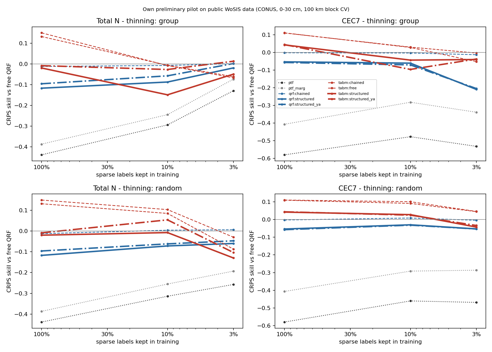
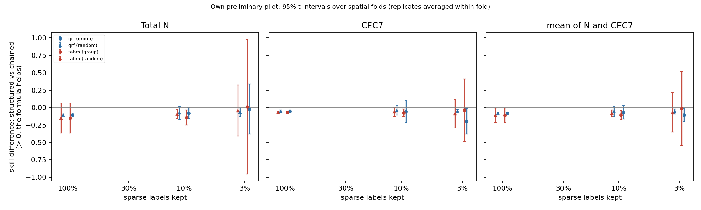
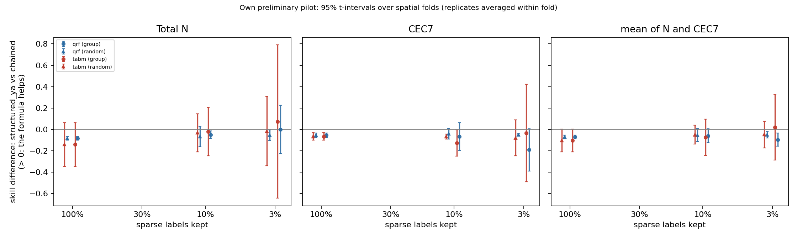
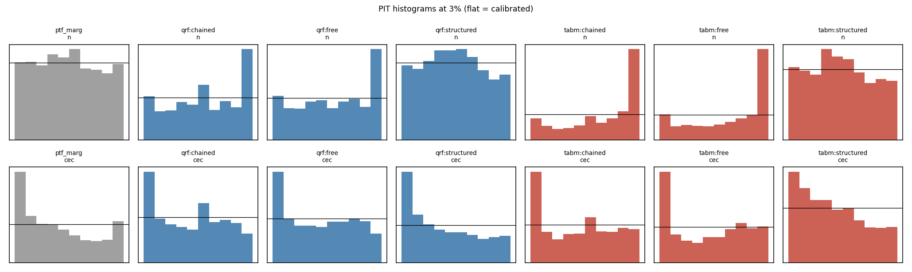

# Results: `synthetic_independent`

Own preliminary pilot on public WoSIS data (conterminous USA, 0-30 cm). Skill = 1 - CRPS(arm) / CRPS(free QRF) on the same held-out sites. Differences are in skill units (> 0: first arm better). Intervals: approximate 95% t-intervals over spatial folds (the folds share training data, so they are somewhat optimistic), replicates averaged within fold.

- complete folds used: [0, 1, 2]; incomplete folds excluded: []
- sites scored: 2753; configurations: 15; learners: ['qrf', 'tabm']
- observed envelope-violation rate in the data: N 0.234, CEC7 0.280

## 0. Key numbers (read this first; points = skill difference x 100)

- **qrf**: formula only (structured_ya vs chained) at 3% by region: mean -9.5 [-15.7, -3.4] (N +0.1 [-22.5, +22.6], CEC7 -19.1 [-38.8, +0.5]); at 3% at random -5.1 [-8.1, -2.2]; with all labels -6.9 [-8.6, -5.3]; chaining alone (chained vs free) at 3%: -0.6 [-2.3, +1.1]
- **tabm**: formula only (structured_ya vs chained) at 3% by region: mean +2.0 [-28.5, +32.5] (N +7.4 [-64.3, +79.1], CEC7 -3.4 [-49.1, +42.3]); at 3% at random -4.7 [-17.3, +7.8]; with all labels -10.3 [-20.9, +0.3]; chaining alone (chained vs free) at 3%: +2.7 [-4.6, +10.1]
- CEC7-clay Spearman at held-out sites (qrf, 3%): observed -0.00; free -0.00; chained -0.01; structured_ya 0.36; ptf 0.85
- CEC7-clay Spearman at held-out sites (tabm, 3%): observed -0.00; free 0.04; chained -0.00; structured_ya 0.21; ptf 0.85
- joint variogram-score skill (qrf, 3%): structured_ya -0.031 vs chained -0.004
- joint variogram-score skill (tabm, 3%): structured_ya -0.007 vs chained -0.033

## 1. Primary result (pre-specified in docs/DESIGN.md): 3% of sparse labels, group thinning, averaged over ['qrf', 'tabm']

| contrast                 | cec                     | mean                    | n                       |
|:-------------------------|:------------------------|:------------------------|:------------------------|
| structured vs chained    | -0.117 [-0.327, +0.094] | -0.060 [-0.368, +0.247] | -0.004 [-0.665, +0.656] |
| structured_ya vs chained | -0.113 [-0.349, +0.124] | -0.038 [-0.192, +0.116] | +0.037 [-0.433, +0.508] |

Same on the log scale (CRPS of log N, log CEC7):

| contrast                 | cec                     | mean                    | n                       |
|:-------------------------|:------------------------|:------------------------|:------------------------|
| structured vs chained    | -0.068 [-0.291, +0.155] | -0.021 [-0.335, +0.294] | +0.027 [-0.633, +0.686] |
| structured_ya vs chained | -0.070 [-0.293, +0.153] | -0.008 [-0.221, +0.206] | +0.055 [-0.478, +0.588] |

## 2. Per learner at 3% (group thinning)

|                                      | cec                     | mean                    | n                       |
|:-------------------------------------|:------------------------|:------------------------|:------------------------|
| ('qrf', 'chained vs free')           | -0.013 [-0.042, +0.016] | -0.006 [-0.023, +0.011] | +0.001 [-0.024, +0.026] |
| ('qrf', 'structured vs chained')     | -0.196 [-0.380, -0.012] | -0.108 [-0.199, -0.018] | -0.021 [-0.378, +0.337] |
| ('qrf', 'structured vs clip')        | -0.225 [-0.550, +0.099] | -0.118 [-0.238, +0.001] | -0.012 [-0.392, +0.369] |
| ('qrf', 'structured vs free')        | -0.209 [-0.397, -0.021] | -0.114 [-0.198, -0.031] | -0.020 [-0.353, +0.313] |
| ('qrf', 'structured vs ptf')         | +0.323 [+0.153, +0.492] | +0.216 [+0.036, +0.397] | +0.110 [-0.082, +0.302] |
| ('qrf', 'structured vs ptf_marg')    | +0.129 [+0.052, +0.206] | +0.092 [+0.072, +0.112] | +0.054 [-0.062, +0.171] |
| ('qrf', 'structured_ya vs chained')  | -0.191 [-0.388, +0.005] | -0.095 [-0.157, -0.034] | +0.001 [-0.225, +0.226] |
| ('tabm', 'chained vs free')          | +0.048 [-0.139, +0.236] | +0.027 [-0.046, +0.101] | +0.006 [-0.035, +0.047] |
| ('tabm', 'structured vs chained')    | -0.037 [-0.485, +0.411] | -0.013 [-0.545, +0.519] | +0.012 [-0.955, +0.979] |
| ('tabm', 'structured vs clip')       | -0.022 [-0.185, +0.140] | +0.010 [-0.466, +0.486] | +0.043 [-0.827, +0.912] |
| ('tabm', 'structured vs free')       | +0.012 [-0.285, +0.308] | +0.015 [-0.524, +0.553] | +0.018 [-0.925, +0.960] |
| ('tabm', 'structured vs ptf')        | +0.492 [-0.152, +1.135] | +0.286 [-0.216, +0.788] | +0.080 [-0.287, +0.447] |
| ('tabm', 'structured vs ptf_marg')   | +0.298 [-0.120, +0.717] | +0.161 [-0.178, +0.501] | +0.024 [-0.236, +0.285] |
| ('tabm', 'structured_ya vs chained') | -0.034 [-0.491, +0.423] | +0.020 [-0.285, +0.325] | +0.074 [-0.643, +0.791] |

## 3. Structured vs chained-free at every level (group and random thinning)

|                          | cec                     | mean                    | n                       |
|:-------------------------|:------------------------|:------------------------|:------------------------|
| ('all', 1.0, 'qrf')      | -0.051 [-0.069, -0.034] | -0.078 [-0.092, -0.064] | -0.105 [-0.116, -0.094] |
| ('all', 1.0, 'tabm')     | -0.067 [-0.084, -0.051] | -0.109 [-0.210, -0.009] | -0.152 [-0.366, +0.063] |
| ('group', 0.03, 'qrf')   | -0.196 [-0.380, -0.012] | -0.108 [-0.199, -0.018] | -0.021 [-0.378, +0.337] |
| ('group', 0.03, 'tabm')  | -0.037 [-0.485, +0.411] | -0.013 [-0.545, +0.519] | +0.012 [-0.955, +0.979] |
| ('group', 0.1, 'qrf')    | -0.057 [-0.216, +0.101] | -0.069 [-0.167, +0.029] | -0.080 [-0.161, +0.001] |
| ('group', 0.1, 'tabm')   | -0.073 [-0.126, -0.021] | -0.108 [-0.175, -0.041] | -0.142 [-0.252, -0.033] |
| ('random', 0.03, 'qrf')  | -0.049 [-0.074, -0.024] | -0.058 [-0.095, -0.020] | -0.066 [-0.127, -0.005] |
| ('random', 0.03, 'tabm') | -0.087 [-0.290, +0.115] | -0.065 [-0.347, +0.217] | -0.043 [-0.408, +0.322] |
| ('random', 0.1, 'qrf')   | -0.038 [-0.107, +0.030] | -0.057 [-0.127, +0.013] | -0.076 [-0.172, +0.020] |
| ('random', 0.1, 'tabm')  | -0.064 [-0.127, -0.001] | -0.078 [-0.123, -0.033] | -0.092 [-0.159, -0.026] |

## 4. Formula only (theta from x AND abundant properties) vs chained-free

|                          | cec                     | mean                    | n                       |
|:-------------------------|:------------------------|:------------------------|:------------------------|
| ('all', 1.0, 'qrf')      | -0.055 [-0.076, -0.034] | -0.069 [-0.086, -0.053] | -0.083 [-0.101, -0.066] |
| ('all', 1.0, 'tabm')     | -0.066 [-0.099, -0.032] | -0.103 [-0.209, +0.003] | -0.140 [-0.345, +0.064] |
| ('group', 0.03, 'qrf')   | -0.191 [-0.388, +0.005] | -0.095 [-0.157, -0.034] | +0.001 [-0.225, +0.226] |
| ('group', 0.03, 'tabm')  | -0.034 [-0.491, +0.423] | +0.020 [-0.285, +0.325] | +0.074 [-0.643, +0.791] |
| ('group', 0.1, 'qrf')    | -0.067 [-0.198, +0.063] | -0.059 [-0.124, +0.006] | -0.050 [-0.085, -0.015] |
| ('group', 0.1, 'tabm')   | -0.126 [-0.250, -0.002] | -0.073 [-0.243, +0.097] | -0.020 [-0.247, +0.206] |
| ('random', 0.03, 'qrf')  | -0.049 [-0.057, -0.041] | -0.051 [-0.081, -0.022] | -0.053 [-0.104, -0.002] |
| ('random', 0.03, 'tabm') | -0.079 [-0.247, +0.090] | -0.047 [-0.173, +0.078] | -0.016 [-0.341, +0.308] |
| ('random', 0.1, 'qrf')   | -0.040 [-0.089, +0.008] | -0.053 [-0.115, +0.008] | -0.066 [-0.159, +0.027] |
| ('random', 0.1, 'tabm')  | -0.066 [-0.091, -0.042] | -0.049 [-0.137, +0.039] | -0.031 [-0.210, +0.147] |

## 5. Extrapolation: structured vs chained-free on thinned vs retained regions, and group - random on thinned sites

|                                      | cec                     | mean                    | n                       |
|:-------------------------------------|:------------------------|:------------------------|:------------------------|
| ('group', 'retained', 0.03, 'qrf')   | -0.040 [-0.079, -0.001] | -0.074 [-0.237, +0.089] | -0.109 [-0.395, +0.178] |
| ('group', 'retained', 0.03, 'tabm')  | +0.008 [-1.883, +1.899] | +0.115 [-2.165, +2.396] | +0.222 [-6.229, +6.674] |
| ('group', 'retained', 0.1, 'qrf')    | -0.008 [-0.097, +0.082] | -0.087 [-0.221, +0.047] | -0.166 [-0.376, +0.043] |
| ('group', 'retained', 0.1, 'tabm')   | -0.006 [-0.233, +0.221] | -0.049 [-0.137, +0.039] | -0.091 [-0.193, +0.011] |
| ('group', 'thinned', 0.03, 'qrf')    | -0.198 [-0.385, -0.012] | -0.109 [-0.199, -0.020] | -0.021 [-0.383, +0.341] |
| ('group', 'thinned', 0.03, 'tabm')   | -0.038 [-0.489, +0.412] | -0.014 [-0.551, +0.523] | +0.010 [-0.959, +0.978] |
| ('group', 'thinned', 0.1, 'qrf')     | -0.060 [-0.225, +0.105] | -0.067 [-0.167, +0.032] | -0.075 [-0.166, +0.016] |
| ('group', 'thinned', 0.1, 'tabm')    | -0.077 [-0.150, -0.003] | -0.111 [-0.180, -0.042] | -0.144 [-0.255, -0.034] |
| ('random', 'retained', 0.03, 'qrf')  | -0.020 [-1.036, +0.996] | +0.038 [-0.396, +0.472] | +0.096 [-1.788, +1.979] |
| ('random', 'retained', 0.03, 'tabm') | -0.230 [-1.600, +1.139] | -0.115 [-0.829, +0.599] | -0.000 [-0.058, +0.058] |
| ('random', 'retained', 0.1, 'qrf')   | -0.070 [-0.190, +0.049] | -0.071 [-0.325, +0.183] | -0.072 [-0.481, +0.338] |
| ('random', 'retained', 0.1, 'tabm')  | -0.107 [-0.223, +0.009] | -0.115 [-0.338, +0.109] | -0.122 [-0.459, +0.214] |
| ('random', 'thinned', 0.03, 'qrf')   | -0.049 [-0.079, -0.020] | -0.059 [-0.098, -0.019] | -0.068 [-0.126, -0.010] |
| ('random', 'thinned', 0.03, 'tabm')  | -0.086 [-0.283, +0.112] | -0.066 [-0.350, +0.219] | -0.046 [-0.420, +0.329] |
| ('random', 'thinned', 0.1, 'qrf')    | -0.036 [-0.103, +0.032] | -0.054 [-0.113, +0.005] | -0.073 [-0.153, +0.007] |
| ('random', 'thinned', 0.1, 'tabm')   | -0.061 [-0.123, +0.002] | -0.079 [-0.127, -0.030] | -0.096 [-0.182, -0.011] |

Difference-in-differences on thinned sites ([structured - chained] group minus random, same sites):

|                | cec                     | n                       |
|:---------------|:------------------------|:------------------------|
| (0.03, 'qrf')  | -0.149 [-0.363, +0.065] | +0.047 [-0.262, +0.356] |
| (0.03, 'tabm') | +0.047 [-0.269, +0.363] | +0.055 [-0.818, +0.929] |
| (0.1, 'qrf')   | -0.024 [-0.131, +0.082] | -0.002 [-0.173, +0.170] |
| (0.1, 'tabm')  | -0.016 [-0.118, +0.086] | -0.048 [-0.210, +0.114] |

## 6. Joint scores (vector clay, OC, pH, N, CEC7): skill vs free QRF

|                        | ptf                     | ptf_marg                | qrf:chained             | qrf:clip                | qrf:free                | qrf:structured          | qrf:structured_ya       | tabm:chained            | tabm:clip               | tabm:free               | tabm:structured         | tabm:structured_ya      |
|:-----------------------|:------------------------|:------------------------|:------------------------|:------------------------|:------------------------|:------------------------|:------------------------|:------------------------|:------------------------|:------------------------|:------------------------|:------------------------|
| ('es', 'all', 1.0)     | -0.325 [-0.420, -0.230] | -0.269 [-0.352, -0.186] | -0.006 [-0.023, +0.011] | -0.038 [-0.066, -0.010] | +0.000 [+0.000, +0.000] | -0.057 [-0.086, -0.027] | -0.044 [-0.075, -0.014] | +0.056 [+0.045, +0.068] | +0.021 [-0.004, +0.045] | +0.062 [+0.060, +0.065] | -0.000 [-0.040, +0.040] | +0.011 [-0.037, +0.060] |
| ('es', 'group', 0.03)  | -0.184 [-0.294, -0.073] | -0.109 [-0.218, -0.001] | -0.007 [-0.024, +0.010] | +0.004 [-0.020, +0.028] | +0.000 [+0.000, +0.000] | -0.060 [-0.139, +0.018] | -0.053 [-0.103, -0.003] | -0.028 [-0.225, +0.168] | -0.039 [-0.206, +0.127] | -0.047 [-0.228, +0.134] | -0.017 [-0.226, +0.192] | -0.005 [-0.133, +0.123] |
| ('es', 'group', 0.1)   | -0.272 [-0.382, -0.163] | -0.201 [-0.321, -0.082] | -0.005 [-0.024, +0.015] | -0.020 [-0.055, +0.015] | +0.000 [+0.000, +0.000] | -0.046 [-0.099, +0.007] | -0.043 [-0.086, -0.000] | +0.013 [-0.035, +0.061] | +0.007 [-0.033, +0.046] | +0.013 [-0.027, +0.053] | -0.035 [-0.042, -0.028] | -0.020 [-0.126, +0.087] |
| ('es', 'random', 0.03) | -0.262 [-0.310, -0.214] | -0.191 [-0.244, -0.137] | -0.001 [-0.004, +0.003] | -0.020 [-0.029, -0.010] | +0.000 [+0.000, +0.000] | -0.049 [-0.063, -0.036] | -0.044 [-0.064, -0.025] | -0.025 [-0.118, +0.068] | -0.019 [-0.112, +0.075] | -0.004 [-0.128, +0.119] | -0.055 [-0.161, +0.051] | -0.050 [-0.154, +0.054] |
| ('es', 'random', 0.1)  | -0.268 [-0.393, -0.143] | -0.208 [-0.306, -0.111] | -0.001 [-0.008, +0.007] | -0.025 [-0.051, +0.000] | +0.000 [+0.000, +0.000] | -0.043 [-0.067, -0.018] | -0.041 [-0.076, -0.006] | +0.043 [+0.028, +0.057] | +0.023 [-0.014, +0.059] | +0.051 [+0.040, +0.063] | -0.002 [-0.029, +0.024] | +0.020 [-0.011, +0.051] |
| ('vs', 'all', 1.0)     | -0.444 [-0.565, -0.323] | -0.174 [-0.206, -0.141] | -0.007 [-0.034, +0.019] | -0.047 [-0.078, -0.016] | +0.000 [+0.000, +0.000] | -0.055 [-0.075, -0.036] | -0.041 [-0.054, -0.028] | +0.055 [+0.028, +0.082] | +0.011 [-0.026, +0.048] | +0.071 [+0.061, +0.080] | +0.001 [-0.025, +0.028] | -0.004 [-0.033, +0.025] |
| ('vs', 'group', 0.03)  | -0.261 [-0.355, -0.166] | -0.069 [-0.104, -0.034] | -0.004 [-0.027, +0.018] | -0.003 [-0.029, +0.023] | +0.000 [+0.000, +0.000] | -0.043 [-0.064, -0.021] | -0.031 [-0.060, -0.002] | -0.033 [-0.194, +0.129] | -0.045 [-0.162, +0.072] | -0.042 [-0.176, +0.092] | -0.014 [-0.093, +0.064] | -0.007 [-0.104, +0.090] |
| ('vs', 'group', 0.1)   | -0.342 [-0.488, -0.196] | -0.125 [-0.169, -0.082] | -0.005 [-0.039, +0.028] | -0.020 [-0.030, -0.010] | +0.000 [+0.000, +0.000] | -0.035 [-0.047, -0.023] | -0.027 [-0.057, +0.002] | +0.021 [-0.025, +0.068] | +0.003 [-0.050, +0.056] | +0.024 [-0.030, +0.077] | -0.037 [-0.047, -0.026] | -0.019 [-0.087, +0.049] |
| ('vs', 'random', 0.03) | -0.320 [-0.408, -0.231] | -0.108 [-0.147, -0.070] | -0.002 [-0.017, +0.014] | -0.020 [-0.032, -0.008] | +0.000 [+0.000, +0.000] | -0.043 [-0.076, -0.011] | -0.034 [-0.049, -0.018] | -0.011 [-0.088, +0.065] | -0.029 [-0.119, +0.061] | +0.006 [-0.093, +0.104] | -0.045 [-0.121, +0.031] | -0.041 [-0.159, +0.076] |
| ('vs', 'random', 0.1)  | -0.377 [-0.545, -0.209] | -0.128 [-0.194, -0.062] | +0.002 [-0.014, +0.018] | -0.029 [-0.055, -0.002] | +0.000 [+0.000, +0.000] | -0.037 [-0.062, -0.013] | -0.032 [-0.051, -0.014] | +0.039 [+0.021, +0.057] | +0.008 [-0.035, +0.051] | +0.050 [+0.035, +0.065] | -0.009 [-0.042, +0.023] | +0.005 [-0.043, +0.053] |

## 7. CRPS skill of every arm vs free QRF

|                         | ptf                     | ptf_marg                | qrf:chained             | qrf:clip                | qrf:free                | qrf:oracle_ya           | qrf:structured          | qrf:structured_og       | qrf:structured_ya       | tabm:chained            | tabm:clip               | tabm:free               | tabm:oracle_ya          | tabm:structured         | tabm:structured_og      | tabm:structured_ya      |
|:------------------------|:------------------------|:------------------------|:------------------------|:------------------------|:------------------------|:------------------------|:------------------------|:------------------------|:------------------------|:------------------------|:------------------------|:------------------------|:------------------------|:------------------------|:------------------------|:------------------------|
| ('all', 1.0, 'cec')     | -0.580 [-0.704, -0.456] | -0.407 [-0.505, -0.309] | -0.002 [-0.018, +0.014] | -0.087 [-0.156, -0.018] | +0.000 [+0.000, +0.000] | -0.135 [-0.194, -0.075] | -0.053 [-0.084, -0.023] | -0.063 [-0.098, -0.028] | -0.057 [-0.090, -0.024] | +0.110 [+0.078, +0.142] | +0.017 [-0.061, +0.094] | +0.111 [+0.081, +0.141] | -0.056 [-0.120, +0.008] | +0.042 [+0.011, +0.073] | +0.022 [-0.014, +0.058] | +0.044 [-0.014, +0.103] |
| ('all', 1.0, 'n')       | -0.439 [-0.628, -0.249] | -0.387 [-0.552, -0.222] | -0.012 [-0.042, +0.017] | -0.089 [-0.112, -0.065] | +0.000 [+0.000, +0.000] | -0.352 [-0.511, -0.194] | -0.117 [-0.157, -0.077] |                         | -0.096 [-0.140, -0.052] | +0.132 [+0.028, +0.235] | +0.028 [+0.002, +0.055] | +0.150 [+0.089, +0.210] | -0.194 [-0.497, +0.110] | -0.020 [-0.130, +0.091] |                         | -0.009 [-0.110, +0.092] |
| ('group', 0.03, 'cec')  | -0.532 [-0.866, -0.198] | -0.339 [-0.508, -0.169] | -0.013 [-0.042, +0.016] | +0.016 [-0.159, +0.191] | +0.000 [+0.000, +0.000] | -0.444 [-0.850, -0.038] | -0.209 [-0.397, -0.021] | -0.318 [-0.602, -0.033] | -0.205 [-0.408, -0.001] | -0.004 [-0.173, +0.166] | -0.018 [-0.180, +0.144] | -0.052 [-0.079, -0.025] | -0.184 [-0.739, +0.370] | -0.040 [-0.363, +0.283] | -0.086 [-0.558, +0.386] | -0.038 [-0.335, +0.260] |
| ('group', 0.03, 'n')    | -0.130 [-0.407, +0.147] | -0.074 [-0.422, +0.274] | +0.001 [-0.024, +0.026] | -0.008 [-0.068, +0.052] | +0.000 [+0.000, +0.000] | -0.256 [-0.813, +0.301] | -0.020 [-0.353, +0.313] |                         | +0.002 [-0.199, +0.202] | -0.061 [-0.552, +0.429] | -0.092 [-0.475, +0.291] | -0.068 [-0.525, +0.390] | -0.305 [-1.149, +0.539] | -0.050 [-0.574, +0.475] |                         | +0.013 [-0.219, +0.244] |
| ('group', 0.1, 'cec')   | -0.477 [-0.712, -0.243] | -0.282 [-0.534, -0.031] | -0.003 [-0.049, +0.042] | -0.042 [-0.151, +0.067] | +0.000 [+0.000, +0.000] | -0.144 [-0.327, +0.039] | -0.061 [-0.177, +0.055] | -0.073 [-0.219, +0.072] | -0.071 [-0.163, +0.022] | +0.030 [-0.284, +0.343] | +0.009 [-0.042, +0.060] | +0.028 [-0.063, +0.119] | -0.155 [-0.336, +0.026] | -0.044 [-0.308, +0.221] | -0.065 [-0.299, +0.169] | -0.096 [-0.522, +0.329] |
| ('group', 0.1, 'n')     | -0.294 [-0.497, -0.091] | -0.245 [-0.479, -0.010] | -0.008 [-0.070, +0.054] | -0.039 [-0.060, -0.018] | +0.000 [+0.000, +0.000] | -0.314 [-0.508, -0.119] | -0.088 [-0.167, -0.008] |                         | -0.058 [-0.107, -0.009] | -0.007 [-0.246, +0.232] | -0.023 [-0.206, +0.161] | -0.008 [-0.231, +0.215] | -0.439 [-0.787, -0.091] | -0.149 [-0.485, +0.187] |                         | -0.027 [-0.174, +0.119] |
| ('random', 0.03, 'cec') | -0.469 [-0.681, -0.257] | -0.287 [-0.408, -0.165] | -0.004 [-0.016, +0.008] | -0.059 [-0.108, -0.011] | +0.000 [+0.000, +0.000] | -0.127 [-0.191, -0.063] | -0.053 [-0.077, -0.029] | -0.063 [-0.084, -0.042] | -0.053 [-0.072, -0.034] | +0.045 [-0.037, +0.128] | -0.016 [-0.099, +0.067] | +0.046 [-0.021, +0.114] | -0.151 [-0.464, +0.163] | -0.042 [-0.294, +0.210] | -0.071 [-0.353, +0.211] | -0.033 [-0.153, +0.086] |
| ('random', 0.03, 'n')   | -0.257 [-0.485, -0.030] | -0.193 [-0.419, +0.033] | +0.006 [-0.005, +0.017] | -0.015 [-0.050, +0.021] | +0.000 [+0.000, +0.000] | -0.313 [-0.445, -0.181] | -0.060 [-0.127, +0.008] |                         | -0.047 [-0.106, +0.012] | -0.087 [-0.412, +0.239] | -0.043 [-0.363, +0.278] | -0.029 [-0.420, +0.361] | -0.441 [-0.960, +0.077] | -0.130 [-0.378, +0.119] |                         | -0.103 [-0.415, +0.209] |
| ('random', 0.1, 'cec')  | -0.461 [-0.569, -0.352] | -0.292 [-0.410, -0.173] | +0.009 [+0.006, +0.012] | -0.050 [-0.126, +0.026] | +0.000 [+0.000, +0.000] | -0.115 [-0.243, +0.012] | -0.030 [-0.096, +0.037] | -0.043 [-0.122, +0.037] | -0.032 [-0.079, +0.016] | +0.092 [+0.004, +0.180] | +0.037 [-0.049, +0.123] | +0.101 [+0.052, +0.151] | -0.087 [-0.186, +0.011] | +0.028 [-0.015, +0.071] | -0.002 [-0.072, +0.068] | +0.025 [-0.070, +0.120] |
| ('random', 0.1, 'n')    | -0.314 [-0.580, -0.048] | -0.255 [-0.487, -0.024] | +0.004 [-0.014, +0.022] | -0.038 [-0.126, +0.050] | +0.000 [+0.000, +0.000] | -0.304 [-0.549, -0.059] | -0.072 [-0.153, +0.009] |                         | -0.062 [-0.138, +0.015] | +0.085 [-0.027, +0.197] | +0.031 [-0.010, +0.071] | +0.104 [-0.006, +0.213] | -0.247 [-0.348, -0.147] | -0.007 [-0.121, +0.106] |                         | +0.054 [-0.029, +0.137] |

## 8. 90% interval coverage

|                         |   ptf |   ptf_marg |   qrf:chained |   qrf:clip |   qrf:free |   qrf:oracle_ya |   qrf:structured |   qrf:structured_og |   qrf:structured_ya |   tabm:chained |   tabm:clip |   tabm:free |   tabm:oracle_ya |   tabm:structured |   tabm:structured_og |   tabm:structured_ya |
|:------------------------|------:|-----------:|--------------:|-----------:|-----------:|----------------:|-----------------:|--------------------:|--------------------:|---------------:|------------:|------------:|-----------------:|------------------:|---------------------:|---------------------:|
| (0.03, 'group', 'cec')  | 0.437 |      0.771 |         0.839 |      0.774 |      0.826 |           0.674 |            0.806 |               0.75  |               0.821 |          0.762 |       0.722 |       0.742 |            0.746 |             0.865 |                0.828 |                0.872 |
| (0.03, 'group', 'n')    | 0.632 |      0.895 |         0.765 |      0.736 |      0.775 |           0.745 |            0.901 |             nan     |               0.888 |          0.666 |       0.611 |       0.636 |            0.718 |             0.891 |              nan     |                0.88  |
| (0.03, 'random', 'cec') | 0.482 |      0.842 |         0.917 |      0.831 |      0.924 |           0.829 |            0.908 |               0.9   |               0.902 |          0.896 |       0.817 |       0.893 |            0.838 |             0.92  |                0.903 |                0.917 |
| (0.03, 'random', 'n')   | 0.647 |      0.93  |         0.891 |      0.849 |      0.907 |           0.801 |            0.942 |             nan     |               0.922 |          0.828 |       0.75  |       0.807 |            0.799 |             0.931 |              nan     |                0.909 |
| (0.1, 'group', 'cec')   | 0.494 |      0.866 |         0.896 |      0.825 |      0.904 |           0.82  |            0.918 |               0.904 |               0.906 |          0.851 |       0.787 |       0.83  |            0.809 |             0.91  |                0.893 |                0.863 |
| (0.1, 'group', 'n')     | 0.673 |      0.933 |         0.906 |      0.841 |      0.909 |           0.853 |            0.949 |             nan     |               0.931 |          0.856 |       0.782 |       0.837 |            0.812 |             0.944 |              nan     |                0.917 |
| (0.1, 'random', 'cec')  | 0.51  |      0.87  |         0.917 |      0.841 |      0.912 |           0.853 |            0.925 |               0.916 |               0.922 |          0.892 |       0.814 |       0.875 |            0.844 |             0.93  |                0.915 |                0.91  |
| (0.1, 'random', 'n')    | 0.679 |      0.949 |         0.915 |      0.858 |      0.922 |           0.853 |            0.964 |             nan     |               0.932 |          0.918 |       0.821 |       0.882 |            0.863 |             0.965 |              nan     |                0.934 |
| (1.0, 'all', 'cec')     | 0.53  |      0.887 |         0.936 |      0.852 |      0.931 |           0.866 |            0.938 |               0.936 |               0.924 |          0.914 |       0.841 |       0.9   |            0.875 |             0.948 |                0.938 |                0.919 |
| (1.0, 'all', 'n')       | 0.682 |      0.95  |         0.928 |      0.851 |      0.925 |           0.862 |            0.966 |             nan     |               0.925 |          0.915 |       0.837 |       0.904 |            0.881 |             0.973 |              nan     |                0.931 |

## 9. Binding: share of paired chained draws outside the envelope, and of free draws vs observed clay/OC

|                  |   n:binding_obs[qrf:free] |   n:binding[qrf:chained] |   n:binding[qrf:structured_ya] |   n:binding_obs[tabm:free] |   n:binding[tabm:chained] |   n:binding[tabm:structured_ya] |   cec:binding_obs[qrf:free] |   cec:binding[qrf:chained] |   cec:binding[qrf:structured_ya] |   cec:binding_obs[tabm:free] |   cec:binding[tabm:chained] |   cec:binding[tabm:structured_ya] |
|:-----------------|--------------------------:|-------------------------:|-------------------------------:|---------------------------:|--------------------------:|--------------------------------:|----------------------------:|---------------------------:|---------------------------------:|-----------------------------:|----------------------------:|----------------------------------:|
| (0.03, 'group')  |                     0.194 |                    0.189 |                          0.08  |                      0.146 |                     0.134 |                           0.08  |                       0.347 |                      0.371 |                            0.214 |                        0.308 |                       0.351 |                             0.178 |
| (0.03, 'random') |                     0.248 |                    0.25  |                          0.123 |                      0.224 |                     0.239 |                           0.143 |                       0.258 |                      0.272 |                            0.113 |                        0.249 |                       0.246 |                             0.127 |
| (0.1, 'group')   |                     0.226 |                    0.232 |                          0.11  |                      0.244 |                     0.244 |                           0.142 |                       0.282 |                      0.296 |                            0.127 |                        0.272 |                       0.306 |                             0.149 |
| (0.1, 'random')  |                     0.24  |                    0.244 |                          0.105 |                      0.213 |                     0.215 |                           0.124 |                       0.274 |                      0.29  |                            0.124 |                        0.258 |                       0.275 |                             0.139 |
| (1.0, 'all')     |                     0.214 |                    0.221 |                          0.113 |                      0.211 |                     0.216 |                           0.13  |                       0.272 |                      0.284 |                            0.13  |                        0.269 |                       0.281 |                             0.144 |

## 10. Mixed model (equal weight over targets, replicates nested in folds)

```
{
 "qrf": {
  "per_target": {
   "cec": -0.19955329460602156,
   "n": -0.015446357489583637
  },
  "n_sites": 3603,
  "estimate_equal_weight": -0.10753458559794193,
  "se": 0.010723189694375532,
  "df": 2,
  "p_t": 0.009797880990517122,
  "converged": false
 },
 "tabm": {
  "per_target": {
   "cec": -0.040768732009691645,
   "n": 0.027675128629009157
  },
  "n_sites": 3603,
  "estimate_equal_weight": -0.010384444219896932,
  "se": 0.10438986208657093,
  "df": 2,
  "p_t": 0.9298321506996785,
  "converged": true
 }
}
```

## 11. Runtime and learner diagnostics (mean per configuration; seconds cover the 4 models of a learner)

labels_kept = realised share of the target's training labels (the level is a share of profiles with any sparse label; N is missing by region, so its share varies more).

|                       |   configs |   seconds |   n_train |   labels_kept_mean |   labels_kept_min |   labels_kept_max |   epochs |
|:----------------------|----------:|----------:|----------:|-------------------:|------------------:|------------------:|---------:|
| ('n', 'qrf', 0.03)    |         6 |     2.717 |    61.667 |              0.035 |             0.021 |             0.054 |  nan     |
| ('n', 'qrf', 0.1)     |         6 |     2.733 |   167.333 |              0.095 |             0.056 |             0.125 |  nan     |
| ('n', 'qrf', 1.0)     |         3 |     3.467 |  1763.67  |              1     |             1     |             1     |  nan     |
| ('n', 'tabm', 0.03)   |         6 |     4.4   |    61.667 |              0.035 |             0.021 |             0.054 |   32.167 |
| ('n', 'tabm', 0.1)    |         6 |     9.683 |   167.333 |              0.095 |             0.056 |             0.125 |   45     |
| ('n', 'tabm', 1.0)    |         3 |    50.833 |  1763.67  |              1     |             1     |             1     |   55.333 |
| ('cec', 'qrf', 0.03)  |         6 |     4     |   110.333 |              0.035 |             0.026 |             0.041 |  nan     |
| ('cec', 'qrf', 0.1)   |         6 |     3.2   |   320     |              0.102 |             0.091 |             0.111 |  nan     |
| ('cec', 'qrf', 1.0)   |         3 |     3.933 |  3128.33  |              1     |             1     |             1     |  nan     |
| ('cec', 'tabm', 0.03) |         6 |     8.3   |   110.333 |              0.035 |             0.026 |             0.041 |   45.333 |
| ('cec', 'tabm', 0.1)  |         6 |    21.05  |   320     |              0.102 |             0.091 |             0.111 |   46.667 |
| ('cec', 'tabm', 1.0)  |         3 |    78.267 |  3128.33  |              1     |             1     |             1     |   54.667 |

## 12. Figure-1 check: rank correlation with the abundant driver at held-out sites

Spearman of (clay, CEC7) and (OC, N) pooled over sites and draws, each sparse draw paired with the y_A draw it was made with; in brackets the per-site median 'map'. A coherent joint predictive reproduces the observed correlation; independent draws (free) attenuate it. rank_correlation.csv has the gaps to the observed value with fold-level 95% intervals.

**CEC7 vs clay**: Spearman on joint draws (median map in brackets)

|                  | observed   | ptf           | ptf_marg      | qrf:chained   | qrf:clip      | qrf:free      | qrf:structured   | qrf:structured_og   | qrf:structured_ya   | tabm:chained   | tabm:clip     | tabm:free     | tabm:structured   | tabm:structured_og   | tabm:structured_ya   |
|:-----------------|:-----------|:--------------|:--------------|:--------------|:--------------|:--------------|:-----------------|:--------------------|:--------------------|:---------------|:--------------|:--------------|:------------------|:---------------------|:---------------------|
| ('all', 1.0)     | -0.00      | +0.68 (+0.93) | +0.35 (+0.87) | -0.00 (-0.08) | +0.17 (+0.28) | -0.01 (-0.08) | +0.12 (+0.02)    | +0.12 (+0.03)       | +0.09 (+0.04)       | -0.01 (-0.07)  | +0.17 (+0.21) | -0.02 (-0.06) | +0.07 (-0.04)     | +0.07 (-0.04)        | +0.03 (+0.01)        |
| ('group', 0.03)  | -0.00      | +0.85 (+0.97) | +0.55 (+0.94) | -0.01 (-0.04) | +0.21 (+0.43) | -0.00 (-0.01) | +0.37 (+0.78)    | +0.44 (+0.72)       | +0.36 (+0.77)       | -0.00 (+0.08)  | +0.23 (+0.47) | +0.04 (+0.11) | +0.22 (+0.32)     | +0.24 (+0.29)        | +0.21 (+0.31)        |
| ('group', 0.1)   | -0.00      | +0.61 (+0.87) | +0.32 (+0.76) | +0.00 (-0.06) | +0.17 (+0.33) | +0.01 (-0.02) | +0.20 (+0.27)    | +0.20 (+0.26)       | +0.17 (+0.23)       | -0.05 (-0.14)  | +0.18 (+0.29) | +0.02 (+0.03) | +0.09 (-0.03)     | +0.09 (-0.03)        | +0.10 (+0.06)        |
| ('random', 0.03) | -0.00      | +0.69 (+0.92) | +0.38 (+0.88) | +0.05 (+0.11) | +0.19 (+0.45) | +0.04 (+0.09) | +0.21 (+0.41)    | +0.22 (+0.41)       | +0.19 (+0.37)       | +0.07 (+0.13)  | +0.19 (+0.36) | +0.03 (+0.04) | +0.17 (+0.28)     | +0.17 (+0.27)        | +0.13 (+0.17)        |
| ('random', 0.1)  | -0.00      | +0.68 (+0.93) | +0.34 (+0.85) | -0.02 (-0.11) | +0.16 (+0.26) | -0.02 (-0.09) | +0.14 (+0.12)    | +0.14 (+0.12)       | +0.12 (+0.14)       | -0.00 (-0.06)  | +0.19 (+0.28) | +0.00 (-0.03) | +0.07 (-0.06)     | +0.07 (-0.06)        | +0.01 (-0.09)        |

**N vs OC**: Spearman on joint draws (median map in brackets)

|                  | observed   | ptf           | ptf_marg      | qrf:chained   | qrf:clip      | qrf:free      | qrf:structured   | qrf:structured_ya   | tabm:chained   | tabm:clip     | tabm:free     | tabm:structured   | tabm:structured_ya   |
|:-----------------|:-----------|:--------------|:--------------|:--------------|:--------------|:--------------|:-----------------|:--------------------|:---------------|:--------------|:--------------|:------------------|:---------------------|
| ('all', 1.0)     | -0.00      | +0.84 (+0.97) | +0.48 (+0.86) | +0.07 (+0.34) | +0.27 (+0.48) | +0.10 (+0.37) | +0.41 (+0.37)    | +0.12 (+0.31)       | +0.03 (+0.27)  | +0.27 (+0.41) | +0.12 (+0.31) | +0.35 (+0.08)     | -0.02 (+0.23)        |
| ('group', 0.03)  | -0.00      | +0.95 (+0.99) | +0.57 (+0.88) | -0.01 (+0.02) | +0.16 (+0.32) | -0.01 (+0.02) | +0.55 (+0.72)    | +0.43 (+0.69)       | +0.02 (+0.01)  | +0.10 (+0.09) | -0.04 (-0.08) | +0.53 (+0.68)     | +0.42 (+0.63)        |
| ('group', 0.1)   | -0.00      | +0.86 (+0.97) | +0.50 (+0.86) | +0.04 (+0.21) | +0.24 (+0.45) | +0.06 (+0.26) | +0.47 (+0.64)    | +0.28 (+0.51)       | +0.04 (+0.17)  | +0.27 (+0.47) | +0.07 (+0.18) | +0.47 (+0.45)     | +0.09 (+0.07)        |
| ('random', 0.03) | -0.00      | +0.89 (+0.98) | +0.49 (+0.85) | +0.05 (+0.21) | +0.26 (+0.48) | +0.05 (+0.23) | +0.46 (+0.54)    | +0.34 (+0.46)       | +0.00 (+0.04)  | +0.23 (+0.49) | +0.02 (+0.06) | +0.49 (+0.55)     | +0.27 (+0.36)        |
| ('random', 0.1)  | -0.00      | +0.83 (+0.97) | +0.46 (+0.85) | +0.06 (+0.26) | +0.26 (+0.48) | +0.08 (+0.32) | +0.42 (+0.43)    | +0.24 (+0.36)       | +0.05 (+0.25)  | +0.27 (+0.43) | +0.11 (+0.31) | +0.37 (+0.15)     | +0.02 (+0.18)        |









