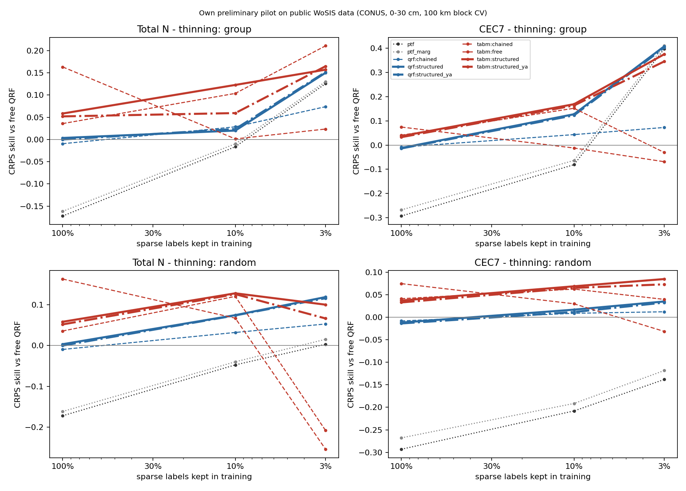
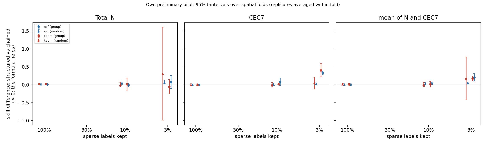
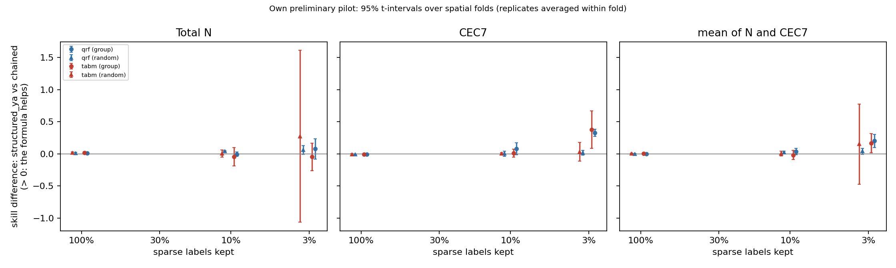
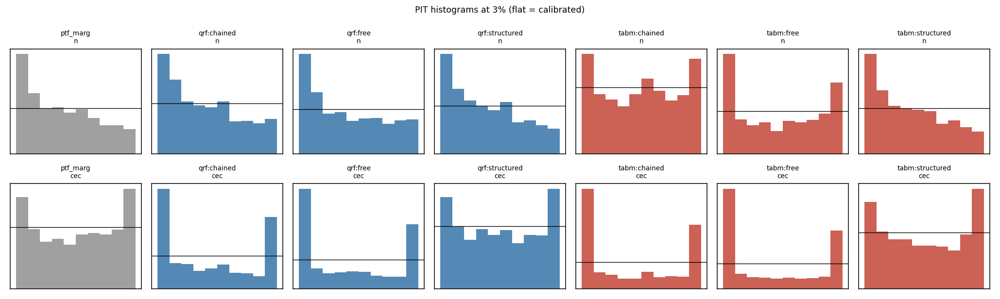

# Results: `synthetic_relation`

Own preliminary pilot on public WoSIS data (conterminous USA, 0-30 cm). Skill = 1 - CRPS(arm) / CRPS(free QRF) on the same held-out sites. Differences are in skill units (> 0: first arm better). Intervals: approximate 95% t-intervals over spatial folds (the folds share training data, so they are somewhat optimistic), replicates averaged within fold.

- complete folds used: [0, 1, 2]; incomplete folds excluded: []
- sites scored: 2776; configurations: 15; learners: ['qrf', 'tabm']
- observed envelope-violation rate in the data: N 0.000, CEC7 0.000

## 0. Key numbers (read this first; points = skill difference x 100)

- **qrf**: formula only (structured_ya vs chained) at 3% by region: mean +20.4 [+10.2, +30.6] (N +7.8 [-8.2, +23.8], CEC7 +33.0 [+27.6, +38.4]); at 3% at random +4.2 [-0.6, +9.0]; with all labels +0.2 [-0.2, +0.6]; chaining alone (chained vs free) at 3%: +7.3 [-7.8, +22.5]
- **tabm**: formula only (structured_ya vs chained) at 3% by region: mean +16.5 [+1.7, +31.4] (N -4.6 [-26.1, +16.9], CEC7 +37.6 [+8.5, +66.8]); at 3% at random +15.4 [-47.0, +77.9]; with all labels +0.4 [-0.2, +0.9]; chaining alone (chained vs free) at 3%: +11.3 [+0.9, +21.7]
- CEC7-clay Spearman at held-out sites (qrf, 3%): observed 0.72; free 0.06; chained 0.20; structured_ya 0.61; ptf 0.88
- CEC7-clay Spearman at held-out sites (tabm, 3%): observed 0.72; free 0.07; chained 0.19; structured_ya 0.60; ptf 0.88
- joint variogram-score skill (qrf, 3%): structured_ya +0.238 vs chained +0.095
- joint variogram-score skill (tabm, 3%): structured_ya +0.215 vs chained +0.127

## 1. Primary result (pre-specified in docs/DESIGN.md): 3% of sparse labels, group thinning, averaged over ['qrf', 'tabm']

| contrast                 | cec                     | mean                    | n                       |
|:-------------------------|:------------------------|:------------------------|:------------------------|
| structured vs chained    | +0.371 [+0.304, +0.438] | +0.191 [+0.164, +0.218] | +0.011 [-0.103, +0.126] |
| structured_ya vs chained | +0.353 [+0.230, +0.477] | +0.185 [+0.154, +0.215] | +0.016 [-0.052, +0.084] |

Same on the log scale (CRPS of log N, log CEC7):

| contrast                 | cec                     | mean                    | n                       |
|:-------------------------|:------------------------|:------------------------|:------------------------|
| structured vs chained    | +0.414 [+0.386, +0.443] | +0.213 [+0.170, +0.256] | +0.013 [-0.088, +0.113] |
| structured_ya vs chained | +0.396 [+0.314, +0.478] | +0.206 [+0.186, +0.225] | +0.016 [-0.027, +0.059] |

## 2. Per learner at 3% (group thinning)

|                                      | cec                     | mean                    | n                       |
|:-------------------------------------|:------------------------|:------------------------|:------------------------|
| ('qrf', 'chained vs free')           | +0.073 [-0.109, +0.255] | +0.073 [-0.078, +0.225] | +0.074 [-0.053, +0.200] |
| ('qrf', 'structured vs chained')     | +0.335 [+0.284, +0.386] | +0.206 [+0.100, +0.312] | +0.076 [-0.105, +0.258] |
| ('qrf', 'structured vs clip')        | +0.247 [+0.079, +0.416] | +0.163 [+0.012, +0.314] | +0.079 [-0.100, +0.258] |
| ('qrf', 'structured vs free')        | +0.408 [+0.198, +0.618] | +0.279 [+0.022, +0.536] | +0.150 [-0.154, +0.455] |
| ('qrf', 'structured vs ptf')         | +0.010 [-0.120, +0.140] | +0.017 [-0.068, +0.102] | +0.025 [-0.017, +0.066] |
| ('qrf', 'structured vs ptf_marg')    | -0.002 [-0.145, +0.141] | +0.009 [-0.078, +0.096] | +0.020 [-0.011, +0.051] |
| ('qrf', 'structured_ya vs chained')  | +0.330 [+0.276, +0.384] | +0.204 [+0.102, +0.306] | +0.078 [-0.082, +0.238] |
| ('tabm', 'chained vs free')          | +0.038 [-0.092, +0.168] | +0.113 [+0.009, +0.217] | +0.187 [+0.057, +0.318] |
| ('tabm', 'structured vs chained')    | +0.406 [+0.223, +0.590] | +0.176 [+0.116, +0.236] | -0.054 [-0.257, +0.149] |
| ('tabm', 'structured vs clip')       | +0.267 [+0.189, +0.344] | +0.184 [+0.003, +0.364] | +0.101 [-0.190, +0.391] |
| ('tabm', 'structured vs free')       | +0.444 [+0.233, +0.656] | +0.289 [+0.224, +0.354] | +0.134 [-0.175, +0.443] |
| ('tabm', 'structured vs ptf')        | -0.023 [-0.183, +0.138] | +0.004 [-0.109, +0.117] | +0.032 [-0.063, +0.126] |
| ('tabm', 'structured vs ptf_marg')   | -0.035 [-0.214, +0.144] | -0.004 [-0.130, +0.123] | +0.027 [-0.063, +0.117] |
| ('tabm', 'structured_ya vs chained') | +0.376 [+0.085, +0.668] | +0.165 [+0.017, +0.314] | -0.046 [-0.261, +0.169] |

## 3. Structured vs chained-free at every level (group and random thinning)

|                          | cec                     | mean                    | n                       |
|:-------------------------|:------------------------|:------------------------|:------------------------|
| ('all', 1.0, 'qrf')      | -0.004 [-0.029, +0.022] | +0.005 [-0.017, +0.027] | +0.013 [-0.005, +0.031] |
| ('all', 1.0, 'tabm')     | -0.004 [-0.039, +0.031] | +0.009 [-0.014, +0.033] | +0.023 [+0.009, +0.037] |
| ('group', 0.03, 'qrf')   | +0.335 [+0.284, +0.386] | +0.206 [+0.100, +0.312] | +0.076 [-0.105, +0.258] |
| ('group', 0.03, 'tabm')  | +0.406 [+0.223, +0.590] | +0.176 [+0.116, +0.236] | -0.054 [-0.257, +0.149] |
| ('group', 0.1, 'qrf')    | +0.084 [-0.017, +0.185] | +0.038 [+0.007, +0.069] | -0.008 [-0.051, +0.034] |
| ('group', 0.1, 'tabm')   | +0.017 [-0.004, +0.038] | +0.018 [-0.060, +0.096] | +0.019 [-0.149, +0.187] |
| ('random', 0.03, 'qrf')  | +0.023 [-0.009, +0.055] | +0.045 [+0.014, +0.075] | +0.066 [+0.014, +0.118] |
| ('random', 0.03, 'tabm') | +0.045 [-0.122, +0.212] | +0.177 [-0.423, +0.777] | +0.309 [-0.991, +1.609] |
| ('random', 0.1, 'qrf')   | +0.008 [-0.033, +0.049] | +0.025 [-0.009, +0.059] | +0.043 [+0.012, +0.073] |
| ('random', 0.1, 'tabm')  | +0.006 [-0.054, +0.067] | +0.007 [-0.051, +0.064] | +0.008 [-0.049, +0.064] |

## 4. Formula only (theta from x AND abundant properties) vs chained-free

|                          | cec                     | mean                    | n                       |
|:-------------------------|:------------------------|:------------------------|:------------------------|
| ('all', 1.0, 'qrf')      | -0.006 [-0.013, +0.002] | +0.002 [-0.002, +0.006] | +0.010 [-0.004, +0.023] |
| ('all', 1.0, 'tabm')     | -0.008 [-0.022, +0.005] | +0.004 [-0.002, +0.009] | +0.016 [+0.004, +0.029] |
| ('group', 0.03, 'qrf')   | +0.330 [+0.276, +0.384] | +0.204 [+0.102, +0.306] | +0.078 [-0.082, +0.238] |
| ('group', 0.03, 'tabm')  | +0.376 [+0.085, +0.668] | +0.165 [+0.017, +0.314] | -0.046 [-0.261, +0.169] |
| ('group', 0.1, 'qrf')    | +0.080 [-0.014, +0.174] | +0.037 [-0.012, +0.086] | -0.005 [-0.040, +0.030] |
| ('group', 0.1, 'tabm')   | +0.012 [-0.053, +0.076] | -0.016 [-0.090, +0.057] | -0.044 [-0.189, +0.100] |
| ('random', 0.03, 'qrf')  | +0.020 [-0.017, +0.057] | +0.042 [-0.006, +0.090] | +0.063 [-0.006, +0.132] |
| ('random', 0.03, 'tabm') | +0.033 [-0.110, +0.177] | +0.154 [-0.470, +0.779] | +0.275 [-1.064, +1.614] |
| ('random', 0.1, 'qrf')   | +0.003 [-0.036, +0.042] | +0.022 [+0.003, +0.042] | +0.042 [+0.036, +0.048] |
| ('random', 0.1, 'tabm')  | +0.003 [-0.016, +0.021] | +0.004 [-0.032, +0.040] | +0.006 [-0.049, +0.060] |

## 5. Extrapolation: structured vs chained-free on thinned vs retained regions, and group - random on thinned sites

|                                      | cec                     | mean                    | n                       |
|:-------------------------------------|:------------------------|:------------------------|:------------------------|
| ('group', 'retained', 0.03, 'qrf')   | +0.003 [-0.715, +0.722] | +0.030 [-0.611, +0.670] | +0.056 [-0.506, +0.618] |
| ('group', 'retained', 0.03, 'tabm')  | +0.221 [-0.961, +1.403] | +0.110 [-0.381, +0.601] | -0.001 [-0.201, +0.199] |
| ('group', 'retained', 0.1, 'qrf')    | +0.002 [-0.007, +0.010] | +0.015 [-0.005, +0.035] | +0.028 [-0.010, +0.066] |
| ('group', 'retained', 0.1, 'tabm')   | -0.009 [-0.078, +0.060] | -0.001 [-0.005, +0.003] | +0.008 [-0.053, +0.069] |
| ('group', 'thinned', 0.03, 'qrf')    | +0.339 [+0.291, +0.388] | +0.208 [+0.095, +0.321] | +0.077 [-0.114, +0.269] |
| ('group', 'thinned', 0.03, 'tabm')   | +0.409 [+0.222, +0.596] | +0.176 [+0.117, +0.236] | -0.056 [-0.264, +0.152] |
| ('group', 'thinned', 0.1, 'qrf')     | +0.091 [-0.022, +0.204] | +0.040 [+0.007, +0.073] | -0.012 [-0.062, +0.038] |
| ('group', 'thinned', 0.1, 'tabm')    | +0.019 [+0.003, +0.035] | +0.021 [-0.066, +0.108] | +0.022 [-0.162, +0.206] |
| ('random', 'retained', 0.03, 'qrf')  | -0.017 [-0.259, +0.225] | +0.021 [-0.400, +0.442] | +0.059 [-1.025, +1.143] |
| ('random', 'retained', 0.03, 'tabm') | +0.075 [-0.060, +0.210] | +0.049 [-0.018, +0.117] | +0.024 [+0.023, +0.025] |
| ('random', 'retained', 0.1, 'qrf')   | -0.019 [-0.074, +0.036] | +0.013 [-0.023, +0.048] | +0.044 [-0.026, +0.115] |
| ('random', 'retained', 0.1, 'tabm')  | +0.007 [-0.180, +0.194] | -0.005 [-0.197, +0.187] | -0.016 [-0.214, +0.181] |
| ('random', 'thinned', 0.03, 'qrf')   | +0.024 [-0.010, +0.057] | +0.045 [+0.017, +0.073] | +0.067 [+0.011, +0.122] |
| ('random', 'thinned', 0.03, 'tabm')  | +0.045 [-0.127, +0.216] | +0.177 [-0.425, +0.778] | +0.308 [-0.993, +1.609] |
| ('random', 'thinned', 0.1, 'qrf')    | +0.011 [-0.029, +0.050] | +0.027 [-0.009, +0.062] | +0.042 [+0.010, +0.075] |
| ('random', 'thinned', 0.1, 'tabm')   | +0.005 [-0.043, +0.053] | +0.007 [-0.039, +0.053] | +0.009 [-0.037, +0.055] |

Difference-in-differences on thinned sites ([structured - chained] group minus random, same sites):

|                | cec                     | n                       |
|:---------------|:------------------------|:------------------------|
| (0.03, 'qrf')  | +0.316 [+0.238, +0.393] | +0.011 [-0.182, +0.203] |
| (0.03, 'tabm') | +0.364 [+0.328, +0.400] | -0.364 [-1.459, +0.730] |
| (0.1, 'qrf')   | +0.080 [-0.053, +0.214] | -0.054 [-0.118, +0.009] |
| (0.1, 'tabm')  | +0.014 [-0.050, +0.078] | +0.013 [-0.158, +0.184] |

## 6. Joint scores (vector clay, OC, pH, N, CEC7): skill vs free QRF

|                        | ptf                     | ptf_marg                | qrf:chained             | qrf:clip                | qrf:free                | qrf:structured          | qrf:structured_ya       | tabm:chained            | tabm:clip               | tabm:free               | tabm:structured         | tabm:structured_ya      |
|:-----------------------|:------------------------|:------------------------|:------------------------|:------------------------|:------------------------|:------------------------|:------------------------|:------------------------|:------------------------|:------------------------|:------------------------|:------------------------|
| ('es', 'all', 1.0)     | -0.108 [-0.122, -0.094] | -0.101 [-0.128, -0.073] | +0.014 [+0.006, +0.022] | +0.002 [-0.002, +0.006] | +0.000 [+0.000, +0.000] | +0.021 [+0.011, +0.032] | +0.021 [+0.009, +0.033] | +0.043 [+0.032, +0.054] | +0.058 [+0.038, +0.078] | +0.058 [+0.034, +0.081] | +0.048 [+0.035, +0.062] | +0.045 [+0.034, +0.057] |
| ('es', 'group', 0.03)  | +0.198 [+0.024, +0.372] | +0.203 [+0.040, +0.366] | +0.048 [-0.017, +0.114] | +0.072 [-0.009, +0.153] | +0.000 [+0.000, +0.000] | +0.200 [+0.053, +0.347] | +0.200 [+0.061, +0.339] | +0.057 [-0.116, +0.231] | +0.056 [-0.089, +0.201] | -0.012 [-0.127, +0.102] | +0.194 [-0.005, +0.393] | +0.185 [+0.026, +0.344] |
| ('es', 'group', 0.1)   | -0.024 [-0.056, +0.008] | -0.016 [-0.088, +0.057] | +0.028 [-0.025, +0.081] | +0.019 [+0.011, +0.026] | +0.000 [+0.000, +0.000] | +0.047 [-0.019, +0.114] | +0.048 [-0.025, +0.121] | +0.091 [+0.014, +0.167] | +0.030 [+0.021, +0.040] | +0.012 [-0.001, +0.026] | +0.099 [+0.055, +0.143] | +0.076 [-0.050, +0.202] |
| ('es', 'random', 0.03) | -0.028 [-0.058, +0.003] | -0.019 [-0.061, +0.022] | +0.027 [+0.024, +0.030] | +0.013 [+0.010, +0.017] | +0.000 [+0.000, +0.000] | +0.058 [+0.028, +0.088] | +0.059 [+0.024, +0.093] | -0.040 [-0.530, +0.450] | -0.058 [-0.259, +0.143] | -0.093 [-0.362, +0.176] | +0.066 [-0.027, +0.159] | +0.049 [-0.041, +0.139] |
| ('es', 'random', 0.1)  | -0.058 [-0.087, -0.029] | -0.053 [-0.097, -0.009] | +0.022 [-0.001, +0.045] | +0.007 [+0.001, +0.013] | +0.000 [+0.000, +0.000] | +0.044 [+0.022, +0.065] | +0.043 [+0.027, +0.059] | +0.075 [+0.043, +0.107] | +0.042 [+0.016, +0.068] | +0.033 [+0.001, +0.065] | +0.076 [+0.060, +0.093] | +0.076 [+0.055, +0.097] |
| ('vs', 'all', 1.0)     | -0.102 [-0.137, -0.066] | -0.000 [-0.009, +0.008] | +0.098 [+0.093, +0.104] | +0.014 [+0.010, +0.018] | +0.000 [+0.000, +0.000] | +0.114 [+0.105, +0.122] | +0.116 [+0.104, +0.128] | +0.153 [+0.127, +0.179] | +0.092 [+0.064, +0.121] | +0.082 [+0.046, +0.119] | +0.159 [+0.135, +0.184] | +0.158 [+0.132, +0.183] |
| ('vs', 'group', 0.03)  | +0.225 [+0.066, +0.385] | +0.237 [+0.089, +0.384] | +0.095 [+0.026, +0.164] | +0.082 [-0.008, +0.171] | +0.000 [+0.000, +0.000] | +0.237 [+0.110, +0.364] | +0.238 [+0.117, +0.360] | +0.127 [-0.067, +0.321] | +0.066 [-0.139, +0.271] | -0.003 [-0.181, +0.176] | +0.228 [+0.071, +0.385] | +0.215 [+0.074, +0.356] |
| ('vs', 'group', 0.1)   | +0.059 [-0.012, +0.130] | +0.078 [+0.008, +0.148] | +0.091 [+0.040, +0.143] | +0.037 [+0.017, +0.058] | +0.000 [+0.000, +0.000] | +0.134 [+0.076, +0.192] | +0.133 [+0.068, +0.197] | +0.180 [+0.123, +0.237] | +0.063 [-0.004, +0.129] | +0.031 [-0.006, +0.068] | +0.186 [+0.150, +0.222] | +0.168 [+0.072, +0.264] |
| ('vs', 'random', 0.03) | +0.020 [-0.068, +0.109] | +0.080 [+0.061, +0.100] | +0.081 [+0.064, +0.098] | +0.025 [-0.000, +0.050] | +0.000 [+0.000, +0.000] | +0.147 [+0.103, +0.192] | +0.147 [+0.119, +0.176] | +0.036 [-0.507, +0.580] | -0.025 [-0.191, +0.141] | -0.072 [-0.274, +0.131] | +0.159 [+0.023, +0.296] | +0.142 [+0.009, +0.275] |
| ('vs', 'random', 0.1)  | -0.059 [-0.071, -0.047] | +0.047 [+0.037, +0.058] | +0.087 [+0.073, +0.101] | +0.022 [+0.011, +0.033] | +0.000 [+0.000, +0.000] | +0.132 [+0.116, +0.149] | +0.133 [+0.120, +0.146] | +0.168 [+0.136, +0.199] | +0.068 [+0.022, +0.114] | +0.049 [-0.007, +0.104] | +0.176 [+0.174, +0.177] | +0.177 [+0.163, +0.190] |

## 7. CRPS skill of every arm vs free QRF

|                         | ptf                     | ptf_marg                | qrf:chained             | qrf:clip                | qrf:free                | qrf:oracle_ya           | qrf:structured          | qrf:structured_og       | qrf:structured_ya       | tabm:chained            | tabm:clip               | tabm:free               | tabm:oracle_ya          | tabm:structured         | tabm:structured_og      | tabm:structured_ya      |
|:------------------------|:------------------------|:------------------------|:------------------------|:------------------------|:------------------------|:------------------------|:------------------------|:------------------------|:------------------------|:------------------------|:------------------------|:------------------------|:------------------------|:------------------------|:------------------------|:------------------------|
| ('all', 1.0, 'cec')     | -0.293 [-0.325, -0.261] | -0.268 [-0.283, -0.252] | -0.008 [-0.042, +0.025] | -0.000 [-0.002, +0.001] | +0.000 [+0.000, +0.000] | +0.342 [+0.271, +0.414] | -0.012 [-0.050, +0.026] | +0.022 [-0.006, +0.050] | -0.014 [-0.055, +0.028] | +0.041 [-0.031, +0.113] | +0.071 [+0.022, +0.119] | +0.075 [+0.021, +0.129] | +0.454 [+0.405, +0.503] | +0.037 [-0.023, +0.098] | +0.077 [+0.031, +0.123] | +0.033 [-0.042, +0.108] |
| ('all', 1.0, 'n')       | -0.172 [-0.214, -0.131] | -0.162 [-0.208, -0.116] | -0.010 [-0.025, +0.006] | -0.004 [-0.015, +0.007] | +0.000 [+0.000, +0.000] | +0.632 [+0.587, +0.677] | +0.003 [-0.003, +0.009] |                         | -0.000 [-0.022, +0.022] | +0.036 [+0.015, +0.056] | +0.155 [+0.100, +0.211] | +0.163 [+0.075, +0.251] | +0.780 [+0.750, +0.811] | +0.058 [+0.024, +0.093] |                         | +0.052 [+0.022, +0.082] |
| ('group', 0.03, 'cec')  | +0.398 [+0.125, +0.671] | +0.410 [+0.140, +0.681] | +0.073 [-0.109, +0.255] | +0.161 [-0.082, +0.404] | +0.000 [+0.000, +0.000] | +0.483 [+0.165, +0.802] | +0.408 [+0.198, +0.618] | +0.415 [+0.142, +0.688] | +0.403 [+0.182, +0.624] | -0.030 [-0.516, +0.455] | +0.109 [-0.213, +0.431] | -0.069 [-0.469, +0.332] | +0.421 [-0.107, +0.948] | +0.376 [+0.011, +0.740] | +0.371 [-0.068, +0.810] | +0.346 [-0.012, +0.704] |
| ('group', 0.03, 'n')    | +0.126 [-0.201, +0.453] | +0.130 [-0.174, +0.434] | +0.074 [-0.053, +0.200] | +0.071 [-0.081, +0.224] | +0.000 [+0.000, +0.000] | +0.410 [+0.341, +0.478] | +0.150 [-0.154, +0.455] |                         | +0.152 [-0.133, +0.437] | +0.211 [-0.223, +0.644] | +0.057 [-0.389, +0.502] | +0.023 [-0.432, +0.479] | +0.382 [+0.288, +0.476] | +0.157 [-0.162, +0.477] |                         | +0.165 [-0.054, +0.383] |
| ('group', 0.1, 'cec')   | -0.081 [-0.273, +0.111] | -0.063 [-0.259, +0.133] | +0.043 [+0.013, +0.074] | +0.057 [+0.042, +0.073] | +0.000 [+0.000, +0.000] | +0.356 [+0.299, +0.413] | +0.128 [+0.049, +0.206] | +0.152 [+0.066, +0.238] | +0.123 [+0.051, +0.195] | +0.152 [+0.058, +0.247] | +0.062 [-0.040, +0.164] | -0.012 [-0.217, +0.193] | +0.449 [+0.290, +0.608] | +0.169 [+0.072, +0.266] | +0.201 [+0.085, +0.317] | +0.164 [+0.044, +0.283] |
| ('group', 0.1, 'n')     | -0.016 [-0.216, +0.184] | -0.010 [-0.234, +0.215] | +0.028 [-0.124, +0.181] | +0.017 [+0.003, +0.030] | +0.000 [+0.000, +0.000] | +0.392 [+0.142, +0.642] | +0.020 [-0.155, +0.195] |                         | +0.024 [-0.164, +0.211] | +0.104 [-0.118, +0.325] | +0.021 [-0.042, +0.083] | +0.001 [-0.077, +0.080] | +0.577 [+0.386, +0.769] | +0.123 [+0.069, +0.177] |                         | +0.059 [-0.273, +0.392] |
| ('random', 0.03, 'cec') | -0.138 [-0.196, -0.081] | -0.118 [-0.148, -0.088] | +0.012 [+0.009, +0.015] | +0.013 [-0.016, +0.041] | +0.000 [+0.000, +0.000] | +0.293 [+0.272, +0.313] | +0.035 [+0.005, +0.066] | +0.066 [+0.016, +0.116] | +0.033 [-0.004, +0.069] | +0.040 [-0.109, +0.188] | -0.002 [-0.038, +0.035] | -0.031 [-0.121, +0.058] | +0.386 [+0.280, +0.492] | +0.085 [+0.036, +0.134] | +0.113 [+0.074, +0.153] | +0.073 [+0.035, +0.111] |
| ('random', 0.03, 'n')   | +0.003 [-0.050, +0.056] | +0.015 [-0.038, +0.069] | +0.053 [+0.016, +0.090] | +0.033 [-0.024, +0.089] | +0.000 [+0.000, +0.000] | +0.585 [+0.583, +0.588] | +0.119 [+0.050, +0.188] |                         | +0.116 [+0.041, +0.191] | -0.209 [-1.726, +1.309] | -0.148 [-0.724, +0.428] | -0.255 [-1.089, +0.580] | +0.563 [+0.054, +1.071] | +0.100 [-0.122, +0.323] |                         | +0.067 [-0.160, +0.293] |
| ('random', 0.1, 'cec')  | -0.208 [-0.227, -0.189] | -0.191 [-0.199, -0.184] | +0.009 [-0.000, +0.018] | +0.011 [+0.003, +0.019] | +0.000 [+0.000, +0.000] | +0.314 [+0.238, +0.390] | +0.017 [-0.030, +0.064] | +0.046 [+0.013, +0.078] | +0.012 [-0.034, +0.057] | +0.063 [-0.021, +0.146] | +0.050 [-0.073, +0.172] | +0.030 [-0.142, +0.202] | +0.413 [+0.344, +0.481] | +0.069 [+0.007, +0.130] | +0.100 [+0.062, +0.138] | +0.065 [-0.002, +0.132] |
| ('random', 0.1, 'n')    | -0.047 [-0.102, +0.007] | -0.040 [-0.103, +0.024] | +0.032 [+0.002, +0.062] | +0.009 [-0.003, +0.021] | +0.000 [+0.000, +0.000] | +0.595 [+0.539, +0.652] | +0.075 [+0.071, +0.078] |                         | +0.074 [+0.046, +0.102] | +0.121 [+0.083, +0.159] | +0.076 [+0.053, +0.100] | +0.067 [+0.010, +0.125] | +0.701 [+0.600, +0.803] | +0.128 [+0.109, +0.147] |                         | +0.126 [+0.101, +0.152] |

## 8. 90% interval coverage

|                         |   ptf |   ptf_marg |   qrf:chained |   qrf:clip |   qrf:free |   qrf:oracle_ya |   qrf:structured |   qrf:structured_og |   qrf:structured_ya |   tabm:chained |   tabm:clip |   tabm:free |   tabm:oracle_ya |   tabm:structured |   tabm:structured_og |   tabm:structured_ya |
|:------------------------|------:|-----------:|--------------:|-----------:|-----------:|----------------:|-----------------:|--------------------:|--------------------:|---------------:|------------:|------------:|-----------------:|------------------:|---------------------:|---------------------:|
| (0.03, 'group', 'cec')  | 0.711 |      0.805 |         0.555 |      0.567 |      0.508 |           0.653 |            0.809 |               0.784 |               0.822 |          0.456 |       0.496 |       0.429 |            0.518 |             0.773 |                0.738 |                0.761 |
| (0.03, 'group', 'n')    | 0.815 |      0.842 |         0.848 |      0.807 |      0.823 |           0.577 |            0.854 |             nan     |               0.862 |          0.804 |       0.7   |       0.714 |            0.496 |             0.857 |              nan     |                0.873 |
| (0.03, 'random', 'cec') | 0.771 |      0.903 |         0.922 |      0.905 |      0.922 |           0.909 |            0.923 |               0.936 |               0.922 |          0.894 |       0.932 |       0.953 |            0.858 |             0.892 |                0.895 |                0.91  |
| (0.03, 'random', 'n')   | 0.843 |      0.913 |         0.903 |      0.875 |      0.895 |           0.889 |            0.926 |             nan     |               0.936 |          0.813 |       0.757 |       0.772 |            0.824 |             0.896 |              nan     |                0.908 |
| (0.1, 'group', 'cec')   | 0.778 |      0.927 |         0.928 |      0.916 |      0.923 |           0.925 |            0.936 |               0.936 |               0.937 |          0.861 |       0.829 |       0.792 |            0.79  |             0.884 |                0.891 |                0.883 |
| (0.1, 'group', 'n')     | 0.832 |      0.878 |         0.869 |      0.834 |      0.859 |           0.736 |            0.887 |             nan     |               0.896 |          0.87  |       0.765 |       0.779 |            0.721 |             0.903 |              nan     |                0.897 |
| (0.1, 'random', 'cec')  | 0.757 |      0.908 |         0.933 |      0.917 |      0.936 |           0.926 |            0.932 |               0.936 |               0.93  |          0.899 |       0.883 |       0.887 |            0.833 |             0.889 |                0.897 |                0.904 |
| (0.1, 'random', 'n')    | 0.84  |      0.908 |         0.911 |      0.877 |      0.897 |           0.914 |            0.927 |             nan     |               0.92  |          0.914 |       0.832 |       0.854 |            0.895 |             0.917 |              nan     |                0.935 |
| (1.0, 'all', 'cec')     | 0.753 |      0.907 |         0.932 |      0.913 |      0.93  |           0.922 |            0.922 |               0.93  |               0.917 |          0.918 |       0.894 |       0.894 |            0.872 |             0.895 |                0.91  |                0.902 |
| (1.0, 'all', 'n')       | 0.84  |      0.913 |         0.922 |      0.906 |      0.936 |           0.947 |            0.922 |             nan     |               0.931 |          0.925 |       0.886 |       0.908 |            0.923 |             0.927 |              nan     |                0.932 |

## 9. Binding: share of paired chained draws outside the envelope, and of free draws vs observed clay/OC

|                  |   n:binding_obs[qrf:free] |   n:binding[qrf:chained] |   n:binding[qrf:structured_ya] |   n:binding_obs[tabm:free] |   n:binding[tabm:chained] |   n:binding[tabm:structured_ya] |   cec:binding_obs[qrf:free] |   cec:binding[qrf:chained] |   cec:binding[qrf:structured_ya] |   cec:binding_obs[tabm:free] |   cec:binding[tabm:chained] |   cec:binding[tabm:structured_ya] |
|:-----------------|--------------------------:|-------------------------:|-------------------------------:|---------------------------:|--------------------------:|--------------------------------:|----------------------------:|---------------------------:|---------------------------------:|-----------------------------:|----------------------------:|----------------------------------:|
| (0.03, 'group')  |                     0.168 |                    0.099 |                              0 |                      0.124 |                     0.003 |                               0 |                       0.268 |                      0.228 |                                0 |                        0.262 |                       0.224 |                                 0 |
| (0.03, 'random') |                     0.137 |                    0.069 |                              0 |                      0.18  |                     0.104 |                               0 |                       0.129 |                      0.121 |                                0 |                        0.142 |                       0.08  |                                 0 |
| (0.1, 'group')   |                     0.11  |                    0.044 |                              0 |                      0.088 |                     0.001 |                               0 |                       0.186 |                      0.151 |                                0 |                        0.123 |                       0.042 |                                 0 |
| (0.1, 'random')  |                     0.113 |                    0.043 |                              0 |                      0.084 |                     0.002 |                               0 |                       0.129 |                      0.109 |                                0 |                        0.108 |                       0.036 |                                 0 |
| (1.0, 'all')     |                     0.1   |                    0.015 |                              0 |                      0.049 |                     0     |                               0 |                       0.111 |                      0.063 |                                0 |                        0.09  |                       0.025 |                                 0 |

## 10. Mixed model (equal weight over targets, replicates nested in folds)

```
{
 "qrf": {
  "per_target": {
   "cec": 0.33576595168125295,
   "n": 0.07697030593516142
  },
  "n_sites": 3662,
  "estimate_equal_weight": 0.2054333519714979,
  "se": 0.020306717737700476,
  "df": 2,
  "p_t": 0.009630052531505614,
  "converged": true
 },
 "tabm": {
  "per_target": {
   "cec": 0.4060613812741201,
   "n": -0.055161647054675786
  },
  "n_sites": 3662,
  "estimate_equal_weight": 0.17587132015578788,
  "se": 0.015807163316981482,
  "df": 2,
  "p_t": 0.007981672263693064,
  "converged": true
 }
}
```

## 11. Runtime and learner diagnostics (mean per configuration; seconds cover the 4 models of a learner)

labels_kept = realised share of the target's training labels (the level is a share of profiles with any sparse label; N is missing by region, so its share varies more).

|                       |   configs |   seconds |   n_train |   labels_kept_mean |   labels_kept_min |   labels_kept_max |   epochs |
|:----------------------|----------:|----------:|----------:|-------------------:|------------------:|------------------:|---------:|
| ('n', 'qrf', 0.03)    |         6 |     2.417 |    79     |              0.042 |             0.03  |             0.05  |  nan     |
| ('n', 'qrf', 0.1)     |         6 |     2.55  |   172.667 |              0.091 |             0.071 |             0.121 |  nan     |
| ('n', 'qrf', 1.0)     |         3 |     4.967 |  1891     |              1     |             1     |             1     |  nan     |
| ('n', 'tabm', 0.03)   |         6 |     5     |    79     |              0.042 |             0.03  |             0.05  |   38.833 |
| ('n', 'tabm', 0.1)    |         6 |    10.45  |   172.667 |              0.091 |             0.071 |             0.121 |   56     |
| ('n', 'tabm', 1.0)    |         3 |    74.3   |  1891     |              1     |             1     |             1     |   51.333 |
| ('cec', 'qrf', 0.03)  |         6 |     3.283 |   103.333 |              0.033 |             0.027 |             0.038 |  nan     |
| ('cec', 'qrf', 0.1)   |         6 |     3.05  |   317.333 |              0.103 |             0.096 |             0.11  |  nan     |
| ('cec', 'qrf', 1.0)   |         3 |     4.6   |  3091.33  |              1     |             1     |             1     |  nan     |
| ('cec', 'tabm', 0.03) |         6 |     8.967 |   103.333 |              0.033 |             0.027 |             0.038 |   47.833 |
| ('cec', 'tabm', 0.1)  |         6 |    24.033 |   317.333 |              0.103 |             0.096 |             0.11  |   56.833 |
| ('cec', 'tabm', 1.0)  |         3 |    94.867 |  3091.33  |              1     |             1     |             1     |   57.667 |

## 12. Figure-1 check: rank correlation with the abundant driver at held-out sites

Spearman of (clay, CEC7) and (OC, N) pooled over sites and draws, each sparse draw paired with the y_A draw it was made with; in brackets the per-site median 'map'. A coherent joint predictive reproduces the observed correlation; independent draws (free) attenuate it. rank_correlation.csv has the gaps to the observed value with fold-level 95% intervals.

**CEC7 vs clay**: Spearman on joint draws (median map in brackets)

|                  | observed   | ptf           | ptf_marg      | qrf:chained   | qrf:clip      | qrf:free      | qrf:structured   | qrf:structured_og   | qrf:structured_ya   | tabm:chained   | tabm:clip     | tabm:free     | tabm:structured   | tabm:structured_og   | tabm:structured_ya   |
|:-----------------|:-----------|:--------------|:--------------|:--------------|:--------------|:--------------|:-----------------|:--------------------|:--------------------|:---------------|:--------------|:--------------|:------------------|:---------------------|:---------------------|
| ('all', 1.0)     | +0.72      | +0.89 (+0.96) | +0.74 (+0.95) | +0.67 (+0.82) | +0.60 (+0.81) | +0.54 (+0.80) | +0.74 (+0.80)    | +0.74 (+0.79)       | +0.74 (+0.81)       | +0.72 (+0.78)  | +0.62 (+0.77) | +0.56 (+0.76) | +0.75 (+0.77)     | +0.75 (+0.77)        | +0.75 (+0.78)        |
| ('group', 0.03)  | +0.72      | +0.88 (+0.96) | +0.80 (+0.95) | +0.20 (+0.61) | +0.31 (+0.68) | +0.06 (+0.31) | +0.61 (+0.89)    | +0.69 (+0.81)       | +0.61 (+0.89)       | +0.19 (+0.49)  | +0.32 (+0.67) | +0.07 (+0.31) | +0.60 (+0.84)     | +0.68 (+0.73)        | +0.60 (+0.85)        |
| ('group', 0.1)   | +0.72      | +0.88 (+0.96) | +0.70 (+0.95) | +0.51 (+0.80) | +0.50 (+0.79) | +0.39 (+0.73) | +0.69 (+0.86)    | +0.70 (+0.84)       | +0.69 (+0.86)       | +0.70 (+0.81)  | +0.58 (+0.77) | +0.50 (+0.72) | +0.74 (+0.80)     | +0.74 (+0.78)        | +0.74 (+0.80)        |
| ('random', 0.03) | +0.72      | +0.87 (+0.96) | +0.74 (+0.95) | +0.56 (+0.84) | +0.55 (+0.84) | +0.49 (+0.83) | +0.73 (+0.85)    | +0.72 (+0.84)       | +0.73 (+0.86)       | +0.64 (+0.84)  | +0.56 (+0.87) | +0.48 (+0.86) | +0.75 (+0.83)     | +0.74 (+0.82)        | +0.74 (+0.84)        |
| ('random', 0.1)  | +0.72      | +0.89 (+0.96) | +0.74 (+0.96) | +0.60 (+0.84) | +0.57 (+0.83) | +0.50 (+0.81) | +0.72 (+0.82)    | +0.72 (+0.81)       | +0.72 (+0.83)       | +0.72 (+0.79)  | +0.61 (+0.80) | +0.54 (+0.78) | +0.74 (+0.77)     | +0.74 (+0.77)        | +0.75 (+0.79)        |

**N vs OC**: Spearman on joint draws (median map in brackets)

|                  | observed   | ptf           | ptf_marg      | qrf:chained   | qrf:clip      | qrf:free      | qrf:structured   | qrf:structured_ya   | tabm:chained   | tabm:clip     | tabm:free     | tabm:structured   | tabm:structured_ya   |
|:-----------------|:-----------|:--------------|:--------------|:--------------|:--------------|:--------------|:-----------------|:--------------------|:---------------|:--------------|:--------------|:------------------|:---------------------|
| ('all', 1.0)     | +0.85      | +1.00 (+1.00) | +0.86 (+0.96) | +0.75 (+0.73) | +0.27 (+0.59) | +0.19 (+0.56) | +0.85 (+0.66)    | +0.85 (+0.70)       | +0.84 (+0.63)  | +0.32 (+0.63) | +0.26 (+0.60) | +0.85 (+0.59)     | +0.85 (+0.64)        |
| ('group', 0.03)  | +0.85      | +1.00 (+1.00) | +0.95 (+0.98) | +0.46 (+0.77) | +0.21 (+0.50) | +0.05 (+0.27) | +0.94 (+0.95)    | +0.94 (+0.96)       | +0.87 (+0.80)  | +0.19 (+0.41) | +0.05 (+0.23) | +0.95 (+0.92)     | +0.95 (+0.92)        |
| ('group', 0.1)   | +0.85      | +1.00 (+1.00) | +0.90 (+0.97) | +0.60 (+0.85) | +0.20 (+0.54) | +0.10 (+0.45) | +0.91 (+0.85)    | +0.90 (+0.87)       | +0.88 (+0.80)  | +0.25 (+0.50) | +0.16 (+0.40) | +0.90 (+0.71)     | +0.91 (+0.81)        |
| ('random', 0.03) | +0.85      | +1.00 (+1.00) | +0.86 (+0.96) | +0.47 (+0.67) | +0.19 (+0.39) | +0.08 (+0.29) | +0.85 (+0.75)    | +0.85 (+0.79)       | +0.55 (+0.50)  | +0.22 (+0.49) | +0.03 (+0.14) | +0.88 (+0.74)     | +0.89 (+0.84)        |
| ('random', 0.1)  | +0.85      | +1.00 (+1.00) | +0.86 (+0.96) | +0.59 (+0.74) | +0.23 (+0.53) | +0.14 (+0.48) | +0.86 (+0.74)    | +0.86 (+0.77)       | +0.81 (+0.69)  | +0.28 (+0.56) | +0.20 (+0.52) | +0.86 (+0.63)     | +0.86 (+0.67)        |









