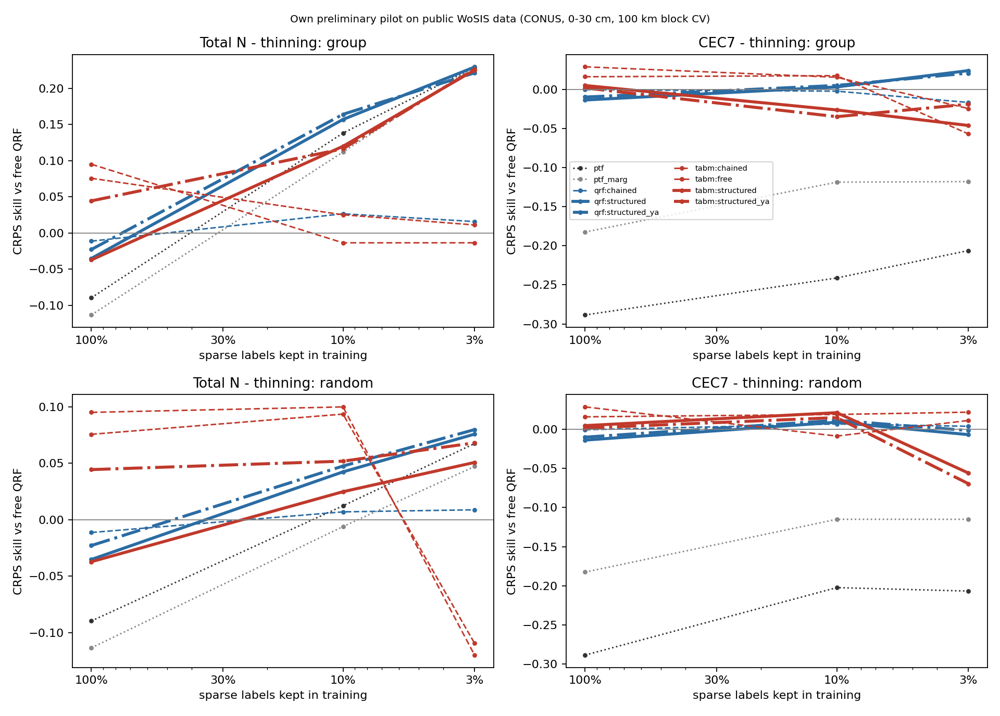
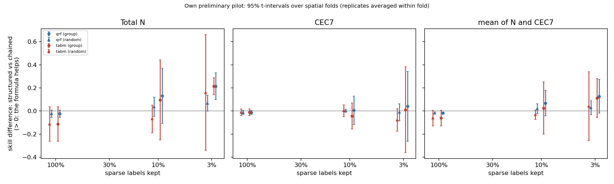
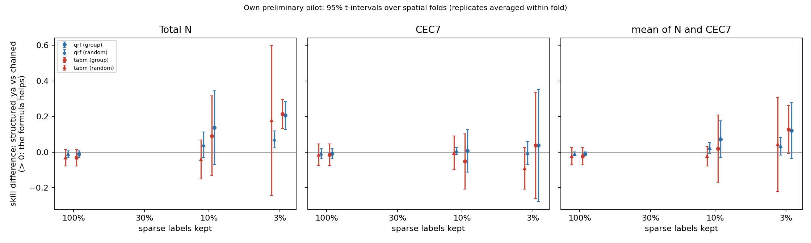
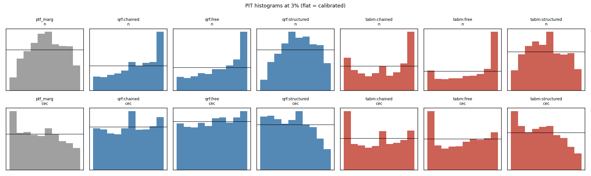

# Results: `synthetic_shared`

Own preliminary pilot on public WoSIS data (conterminous USA, 0-30 cm). Skill = 1 - CRPS(arm) / CRPS(free QRF) on the same held-out sites. Differences are in skill units (> 0: first arm better). Intervals: approximate 95% t-intervals over spatial folds (the folds share training data, so they are somewhat optimistic), replicates averaged within fold.

- complete folds used: [0, 1, 2]; incomplete folds excluded: []
- sites scored: 2753; configurations: 15; learners: ['qrf', 'tabm']
- observed envelope-violation rate in the data: N 0.113, CEC7 0.161

## 0. Key numbers (read this first; points = skill difference x 100)

- **qrf**: formula only (structured_ya vs chained) at 3% by region: mean +12.2 [-3.5, +27.8] (N +20.6 [+12.7, +28.4], CEC7 +3.7 [-27.8, +35.3]); at 3% at random +3.3 [-1.7, +8.3]; with all labels -1.0 [-2.2, +0.1]; chaining alone (chained vs free) at 3%: -0.1 [-3.1, +2.9]
- **tabm**: formula only (structured_ya vs chained) at 3% by region: mean +12.7 [-0.7, +26.1] (N +21.6 [+13.4, +29.7], CEC7 +3.8 [-26.1, +33.7]); at 3% at random +4.3 [-22.3, +30.9]; with all labels -2.3 [-7.1, +2.6]; chaining alone (chained vs free) at 3%: -0.4 [-4.6, +3.9]
- CEC7-clay Spearman at held-out sites (qrf, 3%): observed 0.52; free 0.07; chained 0.11; structured_ya 0.45; ptf 0.91
- CEC7-clay Spearman at held-out sites (tabm, 3%): observed 0.52; free 0.11; chained 0.08; structured_ya 0.40; ptf 0.91
- joint variogram-score skill (qrf, 3%): structured_ya +0.065 vs chained +0.004
- joint variogram-score skill (tabm, 3%): structured_ya +0.050 vs chained -0.003

## 1. Primary result (pre-specified in docs/DESIGN.md): 3% of sparse labels, group thinning, averaged over ['qrf', 'tabm']

| contrast                 | cec                     | mean                    | n                       |
|:-------------------------|:------------------------|:------------------------|:------------------------|
| structured vs chained    | +0.026 [-0.307, +0.358] | +0.120 [-0.036, +0.275] | +0.214 [+0.181, +0.247] |
| structured_ya vs chained | +0.038 [-0.260, +0.335] | +0.124 [-0.021, +0.270] | +0.211 [+0.204, +0.217] |

Same on the log scale (CRPS of log N, log CEC7):

| contrast                 | cec                     | mean                    | n                       |
|:-------------------------|:------------------------|:------------------------|:------------------------|
| structured vs chained    | +0.065 [-0.188, +0.318] | +0.133 [+0.018, +0.247] | +0.200 [+0.175, +0.225] |
| structured_ya vs chained | +0.067 [-0.164, +0.298] | +0.131 [+0.021, +0.242] | +0.196 [+0.170, +0.221] |

## 2. Per learner at 3% (group thinning)

|                                      | cec                     | mean                    | n                       |
|:-------------------------------------|:------------------------|:------------------------|:------------------------|
| ('qrf', 'chained vs free')           | -0.017 [-0.045, +0.011] | -0.001 [-0.031, +0.029] | +0.016 [-0.027, +0.059] |
| ('qrf', 'structured vs chained')     | +0.041 [-0.261, +0.343] | +0.127 [-0.018, +0.272] | +0.214 [+0.098, +0.330] |
| ('qrf', 'structured vs clip')        | -0.017 [-0.387, +0.353] | +0.105 [-0.074, +0.283] | +0.227 [+0.159, +0.294] |
| ('qrf', 'structured vs free')        | +0.024 [-0.306, +0.353] | +0.127 [-0.031, +0.284] | +0.229 [+0.156, +0.303] |
| ('qrf', 'structured vs ptf')         | +0.230 [-0.217, +0.677] | +0.115 [-0.111, +0.341] | +0.000 [-0.018, +0.018] |
| ('qrf', 'structured vs ptf_marg')    | +0.142 [-0.152, +0.435] | +0.071 [-0.080, +0.222] | -0.000 [-0.010, +0.009] |
| ('qrf', 'structured_ya vs chained')  | +0.037 [-0.278, +0.353] | +0.122 [-0.035, +0.278] | +0.206 [+0.127, +0.284] |
| ('tabm', 'chained vs free')          | -0.032 [-0.103, +0.038] | -0.004 [-0.046, +0.039] | +0.025 [-0.070, +0.119] |
| ('tabm', 'structured vs chained')    | +0.011 [-0.360, +0.382] | +0.112 [-0.056, +0.281] | +0.214 [+0.141, +0.288] |
| ('tabm', 'structured vs clip')       | -0.056 [-0.468, +0.355] | +0.091 [-0.068, +0.250] | +0.238 [+0.141, +0.336] |
| ('tabm', 'structured vs free')       | -0.022 [-0.373, +0.329] | +0.109 [-0.018, +0.235] | +0.239 [+0.140, +0.338] |
| ('tabm', 'structured vs ptf')        | +0.160 [-0.277, +0.596] | +0.078 [-0.145, +0.301] | -0.004 [-0.035, +0.027] |
| ('tabm', 'structured vs ptf_marg')   | +0.072 [-0.185, +0.328] | +0.034 [-0.105, +0.172] | -0.004 [-0.054, +0.045] |
| ('tabm', 'structured_ya vs chained') | +0.038 [-0.261, +0.337] | +0.127 [-0.007, +0.261] | +0.216 [+0.134, +0.297] |

## 3. Structured vs chained-free at every level (group and random thinning)

|                          | cec                     | mean                    | n                       |
|:-------------------------|:------------------------|:------------------------|:------------------------|
| ('all', 1.0, 'qrf')      | -0.013 [-0.031, +0.004] | -0.019 [-0.028, -0.009] | -0.024 [-0.056, +0.008] |
| ('all', 1.0, 'tabm')     | -0.011 [-0.039, +0.016] | -0.062 [-0.130, +0.006] | -0.113 [-0.261, +0.036] |
| ('group', 0.03, 'qrf')   | +0.041 [-0.261, +0.343] | +0.127 [-0.018, +0.272] | +0.214 [+0.098, +0.330] |
| ('group', 0.03, 'tabm')  | +0.011 [-0.360, +0.382] | +0.112 [-0.056, +0.281] | +0.214 [+0.141, +0.288] |
| ('group', 0.1, 'qrf')    | +0.005 [-0.117, +0.128] | +0.068 [-0.042, +0.178] | +0.130 [-0.109, +0.370] |
| ('group', 0.1, 'tabm')   | -0.044 [-0.157, +0.069] | +0.025 [-0.201, +0.252] | +0.095 [-0.251, +0.440] |
| ('random', 0.03, 'qrf')  | -0.011 [-0.084, +0.062] | +0.028 [-0.033, +0.090] | +0.067 [-0.001, +0.135] |
| ('random', 0.03, 'tabm') | -0.078 [-0.175, +0.020] | +0.041 [-0.257, +0.339] | +0.160 [-0.342, +0.662] |
| ('random', 0.1, 'qrf')   | +0.002 [-0.011, +0.016] | +0.019 [-0.025, +0.063] | +0.035 [-0.048, +0.119] |
| ('random', 0.1, 'tabm')  | +0.002 [-0.048, +0.053] | -0.033 [-0.074, +0.007] | -0.069 [-0.188, +0.051] |

## 4. Formula only (theta from x AND abundant properties) vs chained-free

|                          | cec                     | mean                    | n                       |
|:-------------------------|:------------------------|:------------------------|:------------------------|
| ('all', 1.0, 'qrf')      | -0.009 [-0.038, +0.019] | -0.010 [-0.022, +0.001] | -0.012 [-0.029, +0.006] |
| ('all', 1.0, 'tabm')     | -0.014 [-0.076, +0.047] | -0.023 [-0.071, +0.026] | -0.031 [-0.079, +0.016] |
| ('group', 0.03, 'qrf')   | +0.037 [-0.278, +0.353] | +0.122 [-0.035, +0.278] | +0.206 [+0.127, +0.284] |
| ('group', 0.03, 'tabm')  | +0.038 [-0.261, +0.337] | +0.127 [-0.007, +0.261] | +0.216 [+0.134, +0.297] |
| ('group', 0.1, 'qrf')    | +0.007 [-0.114, +0.128] | +0.072 [-0.032, +0.177] | +0.138 [-0.070, +0.345] |
| ('group', 0.1, 'tabm')   | -0.052 [-0.208, +0.103] | +0.019 [-0.170, +0.209] | +0.091 [-0.133, +0.316] |
| ('random', 0.03, 'qrf')  | -0.005 [-0.071, +0.060] | +0.033 [-0.017, +0.083] | +0.071 [+0.024, +0.118] |
| ('random', 0.03, 'tabm') | -0.091 [-0.208, +0.025] | +0.043 [-0.223, +0.309] | +0.177 [-0.244, +0.599] |
| ('random', 0.1, 'qrf')   | +0.005 [-0.016, +0.025] | +0.023 [-0.008, +0.053] | +0.041 [-0.031, +0.112] |
| ('random', 0.1, 'tabm')  | -0.004 [-0.098, +0.090] | -0.023 [-0.077, +0.031] | -0.042 [-0.152, +0.069] |

## 5. Extrapolation: structured vs chained-free on thinned vs retained regions, and group - random on thinned sites

|                                      | cec                     | mean                    | n                       |
|:-------------------------------------|:------------------------|:------------------------|:------------------------|
| ('group', 'retained', 0.03, 'qrf')   | -0.066 [-0.809, +0.676] | +0.013 [-0.279, +0.305] | +0.093 [-0.065, +0.251] |
| ('group', 'retained', 0.03, 'tabm')  | +0.024 [-0.618, +0.666] | +0.060 [-0.033, +0.153] | +0.096 [-0.732, +0.924] |
| ('group', 'retained', 0.1, 'qrf')    | +0.017 [-0.051, +0.086] | +0.033 [-0.125, +0.190] | +0.048 [-0.222, +0.317] |
| ('group', 'retained', 0.1, 'tabm')   | -0.027 [-0.087, +0.034] | +0.015 [-0.283, +0.313] | +0.057 [-0.481, +0.595] |
| ('group', 'thinned', 0.03, 'qrf')    | +0.043 [-0.263, +0.348] | +0.129 [-0.020, +0.277] | +0.215 [+0.099, +0.331] |
| ('group', 'thinned', 0.03, 'tabm')   | +0.011 [-0.363, +0.386] | +0.114 [-0.057, +0.286] | +0.217 [+0.135, +0.299] |
| ('group', 'thinned', 0.1, 'qrf')     | +0.007 [-0.137, +0.151] | +0.072 [-0.034, +0.179] | +0.138 [-0.089, +0.365] |
| ('group', 'thinned', 0.1, 'tabm')    | -0.046 [-0.172, +0.079] | +0.027 [-0.209, +0.262] | +0.100 [-0.251, +0.450] |
| ('random', 'retained', 0.03, 'qrf')  | -0.063 [-0.245, +0.118] | +0.066 [+0.026, +0.105] | +0.195 [-0.066, +0.455] |
| ('random', 'retained', 0.03, 'tabm') | -0.250 [-2.613, +2.113] | -0.062 [-1.537, +1.414] | +0.127 [-0.461, +0.715] |
| ('random', 'retained', 0.1, 'qrf')   | -0.005 [-0.114, +0.104] | -0.005 [-0.096, +0.087] | -0.004 [-0.101, +0.093] |
| ('random', 'retained', 0.1, 'tabm')  | -0.013 [-0.062, +0.036] | -0.061 [-0.107, -0.016] | -0.110 [-0.185, -0.035] |
| ('random', 'thinned', 0.03, 'qrf')   | -0.010 [-0.082, +0.062] | +0.026 [-0.041, +0.093] | +0.063 [-0.018, +0.143] |
| ('random', 'thinned', 0.03, 'tabm')  | -0.076 [-0.165, +0.013] | +0.041 [-0.259, +0.341] | +0.158 [-0.356, +0.672] |
| ('random', 'thinned', 0.1, 'qrf')    | +0.004 [-0.005, +0.013] | +0.020 [-0.026, +0.067] | +0.037 [-0.060, +0.134] |
| ('random', 'thinned', 0.1, 'tabm')   | +0.006 [-0.056, +0.068] | -0.029 [-0.073, +0.014] | -0.064 [-0.182, +0.054] |

Difference-in-differences on thinned sites ([structured - chained] group minus random, same sites):

|                | cec                     | n                       |
|:---------------|:------------------------|:------------------------|
| (0.03, 'qrf')  | +0.053 [-0.325, +0.431] | +0.153 [+0.108, +0.197] |
| (0.03, 'tabm') | +0.087 [-0.299, +0.473] | +0.059 [-0.514, +0.633] |
| (0.1, 'qrf')   | +0.003 [-0.136, +0.142] | +0.101 [-0.098, +0.300] |
| (0.1, 'tabm')  | -0.052 [-0.228, +0.124] | +0.164 [-0.163, +0.491] |

## 6. Joint scores (vector clay, OC, pH, N, CEC7): skill vs free QRF

|                        | ptf                     | ptf_marg                | qrf:chained             | qrf:clip                | qrf:free                | qrf:structured          | qrf:structured_ya       | tabm:chained            | tabm:clip               | tabm:free               | tabm:structured         | tabm:structured_ya      |
|:-----------------------|:------------------------|:------------------------|:------------------------|:------------------------|:------------------------|:------------------------|:------------------------|:------------------------|:------------------------|:------------------------|:------------------------|:------------------------|
| ('es', 'all', 1.0)     | -0.127 [-0.146, -0.107] | -0.113 [-0.121, -0.104] | -0.004 [-0.011, +0.004] | -0.004 [-0.022, +0.015] | +0.000 [+0.000, +0.000] | -0.018 [-0.024, -0.013] | -0.013 [-0.017, -0.008] | +0.022 [-0.007, +0.050] | +0.023 [+0.010, +0.036] | +0.030 [+0.002, +0.059] | -0.012 [-0.025, +0.000] | +0.009 [-0.022, +0.041] |
| ('es', 'group', 0.03)  | +0.030 [-0.104, +0.164] | +0.053 [-0.033, +0.140] | +0.002 [-0.024, +0.028] | +0.017 [+0.011, +0.022] | +0.000 [+0.000, +0.000] | +0.086 [+0.023, +0.150] | +0.080 [+0.008, +0.152] | -0.005 [-0.073, +0.064] | +0.011 [-0.054, +0.075] | -0.002 [-0.087, +0.083] | +0.068 [+0.006, +0.131] | +0.074 [-0.002, +0.151] |
| ('es', 'group', 0.1)   | -0.045 [-0.161, +0.072] | -0.027 [-0.149, +0.095] | +0.006 [-0.006, +0.018] | +0.013 [-0.038, +0.063] | +0.000 [+0.000, +0.000] | +0.043 [-0.052, +0.139] | +0.042 [-0.049, +0.132] | -0.000 [-0.071, +0.070] | +0.001 [-0.103, +0.104] | -0.007 [-0.100, +0.086] | +0.033 [-0.076, +0.143] | +0.023 [-0.066, +0.112] |
| ('es', 'random', 0.03) | -0.068 [-0.099, -0.037] | -0.059 [-0.111, -0.007] | +0.002 [-0.023, +0.026] | +0.003 [-0.001, +0.007] | +0.000 [+0.000, +0.000] | +0.006 [-0.033, +0.044] | +0.007 [-0.021, +0.035] | -0.034 [-0.165, +0.096] | -0.033 [-0.041, -0.024] | -0.035 [-0.043, -0.027] | -0.016 [-0.070, +0.039] | -0.014 [-0.041, +0.012] |
| ('es', 'random', 0.1)  | -0.080 [-0.119, -0.041] | -0.071 [-0.097, -0.045] | +0.001 [-0.014, +0.016] | +0.005 [-0.015, +0.025] | +0.000 [+0.000, +0.000] | +0.002 [-0.014, +0.018] | +0.002 [-0.013, +0.016] | +0.028 [+0.010, +0.046] | +0.024 [+0.014, +0.035] | +0.018 [-0.030, +0.066] | +0.002 [-0.029, +0.032] | +0.006 [-0.020, +0.033] |
| ('vs', 'all', 1.0)     | -0.291 [-0.340, -0.242] | -0.071 [-0.104, -0.039] | -0.001 [-0.029, +0.028] | -0.003 [-0.017, +0.010] | +0.000 [+0.000, +0.000] | -0.011 [-0.053, +0.031] | -0.011 [-0.049, +0.026] | +0.028 [-0.033, +0.090] | +0.031 [-0.004, +0.065] | +0.041 [-0.020, +0.101] | -0.007 [-0.066, +0.053] | +0.014 [-0.038, +0.066] |
| ('vs', 'group', 0.03)  | -0.091 [-0.149, -0.032] | +0.046 [-0.046, +0.137] | +0.004 [-0.029, +0.036] | +0.010 [-0.012, +0.031] | +0.000 [+0.000, +0.000] | +0.063 [+0.023, +0.103] | +0.065 [+0.021, +0.108] | -0.003 [-0.074, +0.067] | -0.006 [-0.066, +0.055] | -0.006 [-0.063, +0.051] | +0.047 [-0.048, +0.143] | +0.050 [-0.057, +0.156] |
| ('vs', 'group', 0.1)   | -0.184 [-0.301, -0.068] | +0.007 [-0.067, +0.081] | +0.012 [-0.014, +0.038] | +0.015 [-0.041, +0.072] | +0.000 [+0.000, +0.000] | +0.050 [-0.016, +0.117] | +0.050 [-0.027, +0.126] | +0.010 [-0.052, +0.072] | +0.007 [-0.065, +0.079] | +0.003 [-0.061, +0.068] | +0.039 [-0.054, +0.131] | +0.034 [-0.047, +0.115] |
| ('vs', 'random', 0.03) | -0.202 [-0.290, -0.114] | -0.018 [-0.046, +0.011] | +0.004 [-0.014, +0.022] | +0.004 [-0.012, +0.020] | +0.000 [+0.000, +0.000] | +0.017 [-0.014, +0.048] | +0.020 [-0.002, +0.042] | -0.022 [-0.137, +0.093] | -0.029 [-0.054, -0.003] | -0.027 [-0.043, -0.010] | -0.001 [-0.024, +0.022] | +0.001 [-0.001, +0.002] |
| ('vs', 'random', 0.1)  | -0.249 [-0.282, -0.217] | -0.032 [-0.052, -0.012] | +0.008 [-0.013, +0.029] | +0.002 [-0.018, +0.022] | +0.000 [+0.000, +0.000] | +0.005 [-0.015, +0.026] | +0.007 [-0.023, +0.036] | +0.031 [+0.016, +0.046] | +0.023 [-0.000, +0.047] | +0.024 [-0.014, +0.061] | +0.007 [-0.024, +0.038] | +0.012 [-0.022, +0.045] |

## 7. CRPS skill of every arm vs free QRF

|                         | ptf                     | ptf_marg                | qrf:chained             | qrf:clip                | qrf:free                | qrf:oracle_ya           | qrf:structured          | qrf:structured_og       | qrf:structured_ya       | tabm:chained            | tabm:clip               | tabm:free               | tabm:oracle_ya          | tabm:structured         | tabm:structured_og      | tabm:structured_ya      |
|:------------------------|:------------------------|:------------------------|:------------------------|:------------------------|:------------------------|:------------------------|:------------------------|:------------------------|:------------------------|:------------------------|:------------------------|:------------------------|:------------------------|:------------------------|:------------------------|:------------------------|
| ('all', 1.0, 'cec')     | -0.288 [-0.334, -0.243] | -0.182 [-0.222, -0.143] | -0.001 [-0.003, +0.002] | -0.005 [-0.025, +0.015] | +0.000 [+0.000, +0.000] | -0.067 [-0.096, -0.039] | -0.014 [-0.029, +0.002] | -0.016 [-0.028, -0.003] | -0.010 [-0.036, +0.016] | +0.016 [-0.015, +0.047] | +0.018 [+0.000, +0.036] | +0.029 [-0.005, +0.062] | -0.056 [-0.093, -0.019] | +0.005 [-0.012, +0.021] | -0.001 [-0.019, +0.018] | +0.002 [-0.030, +0.033] |
| ('all', 1.0, 'n')       | -0.090 [-0.220, +0.040] | -0.113 [-0.198, -0.029] | -0.011 [-0.019, -0.003] | -0.009 [-0.067, +0.050] | +0.000 [+0.000, +0.000] | -0.152 [-0.260, -0.043] | -0.035 [-0.061, -0.010] |                         | -0.023 [-0.033, -0.012] | +0.076 [-0.034, +0.186] | +0.070 [-0.001, +0.141] | +0.095 [-0.010, +0.200] | -0.148 [-0.291, -0.004] | -0.037 [-0.092, +0.018] |                         | +0.044 [-0.028, +0.117] |
| ('group', 0.03, 'cec')  | -0.206 [-0.979, +0.567] | -0.118 [-0.741, +0.505] | -0.017 [-0.045, +0.011] | +0.041 [-0.011, +0.092] | +0.000 [+0.000, +0.000] | -0.163 [-0.837, +0.512] | +0.024 [-0.306, +0.353] | -0.067 [-0.567, +0.432] | +0.021 [-0.322, +0.363] | -0.057 [-0.325, +0.210] | +0.010 [-0.180, +0.200] | -0.025 [-0.224, +0.175] | -0.273 [-1.130, +0.584] | -0.046 [-0.468, +0.376] | -0.151 [-0.751, +0.450] | -0.019 [-0.338, +0.300] |
| ('group', 0.03, 'n')    | +0.229 [+0.174, +0.285] | +0.230 [+0.156, +0.303] | +0.016 [-0.027, +0.059] | +0.003 [-0.004, +0.010] | +0.000 [+0.000, +0.000] | +0.145 [-0.004, +0.295] | +0.229 [+0.156, +0.303] |                         | +0.221 [+0.186, +0.257] | +0.011 [-0.085, +0.107] | -0.013 [-0.115, +0.089] | -0.014 [-0.114, +0.086] | +0.101 [-0.093, +0.295] | +0.225 [+0.201, +0.250] |                         | +0.227 [+0.208, +0.246] |
| ('group', 0.1, 'cec')   | -0.241 [-0.389, -0.093] | -0.119 [-0.329, +0.091] | -0.002 [-0.012, +0.007] | +0.016 [-0.075, +0.106] | +0.000 [+0.000, +0.000] | -0.054 [-0.237, +0.130] | +0.003 [-0.115, +0.121] | -0.005 [-0.155, +0.145] | +0.005 [-0.113, +0.122] | +0.017 [-0.002, +0.037] | +0.021 [-0.060, +0.101] | +0.015 [-0.044, +0.074] | -0.105 [-0.217, +0.007] | -0.026 [-0.123, +0.070] | -0.045 [-0.146, +0.057] | -0.035 [-0.175, +0.105] |
| ('group', 0.1, 'n')     | +0.138 [-0.066, +0.343] | +0.112 [-0.125, +0.348] | +0.027 [-0.007, +0.060] | +0.045 [-0.121, +0.211] | +0.000 [+0.000, +0.000] | +0.066 [-0.230, +0.363] | +0.157 [-0.054, +0.368] |                         | +0.164 [-0.015, +0.343] | +0.025 [-0.202, +0.252] | +0.010 [-0.291, +0.312] | -0.014 [-0.272, +0.245] | +0.010 [-0.290, +0.309] | +0.120 [-0.092, +0.331] |                         | +0.116 [+0.058, +0.174] |
| ('random', 0.03, 'cec') | -0.207 [-0.323, -0.091] | -0.115 [-0.248, +0.018] | +0.004 [-0.021, +0.029] | -0.002 [-0.011, +0.007] | +0.000 [+0.000, +0.000] | -0.061 [-0.135, +0.013] | -0.007 [-0.072, +0.059] | -0.011 [-0.067, +0.045] | -0.002 [-0.061, +0.058] | +0.022 [+0.009, +0.034] | +0.008 [-0.004, +0.020] | +0.011 [-0.008, +0.031] | -0.113 [-0.290, +0.065] | -0.056 [-0.165, +0.053] | -0.070 [-0.192, +0.052] | -0.069 [-0.197, +0.059] |
| ('random', 0.03, 'n')   | +0.067 [-0.039, +0.174] | +0.047 [-0.061, +0.156] | +0.009 [-0.019, +0.036] | +0.008 [-0.013, +0.029] | +0.000 [+0.000, +0.000] | -0.042 [-0.173, +0.088] | +0.076 [+0.027, +0.124] |                         | +0.080 [+0.047, +0.112] | -0.109 [-0.494, +0.275] | -0.122 [-0.222, -0.021] | -0.120 [-0.222, -0.017] | -0.086 [-0.326, +0.154] | +0.051 [-0.068, +0.169] |                         | +0.068 [+0.027, +0.109] |
| ('random', 0.1, 'cec')  | -0.202 [-0.231, -0.173] | -0.115 [-0.121, -0.109] | +0.007 [-0.000, +0.014] | +0.005 [-0.028, +0.037] | +0.000 [+0.000, +0.000] | -0.044 [-0.104, +0.015] | +0.009 [+0.003, +0.016] | +0.009 [-0.010, +0.027] | +0.012 [-0.010, +0.033] | +0.019 [-0.053, +0.091] | +0.012 [-0.034, +0.058] | -0.009 [-0.156, +0.139] | -0.052 [-0.131, +0.028] | +0.021 [-0.001, +0.044] | +0.005 [-0.039, +0.049] | +0.015 [-0.070, +0.100] |
| ('random', 0.1, 'n')    | +0.012 [-0.033, +0.058] | -0.006 [-0.081, +0.069] | +0.007 [-0.023, +0.036] | +0.012 [-0.030, +0.055] | +0.000 [+0.000, +0.000] | -0.069 [-0.232, +0.095] | +0.042 [-0.065, +0.149] |                         | +0.048 [-0.039, +0.134] | +0.093 [+0.025, +0.162] | +0.087 [-0.011, +0.185] | +0.100 [-0.016, +0.216] | -0.086 [-0.194, +0.022] | +0.025 [-0.059, +0.108] |                         | +0.052 [-0.049, +0.153] |

## 8. 90% interval coverage

|                         |   ptf |   ptf_marg |   qrf:chained |   qrf:clip |   qrf:free |   qrf:oracle_ya |   qrf:structured |   qrf:structured_og |   qrf:structured_ya |   tabm:chained |   tabm:clip |   tabm:free |   tabm:oracle_ya |   tabm:structured |   tabm:structured_og |   tabm:structured_ya |
|:------------------------|------:|-----------:|--------------:|-----------:|-----------:|----------------:|-----------------:|--------------------:|--------------------:|---------------:|------------:|------------:|-----------------:|------------------:|---------------------:|---------------------:|
| (0.03, 'group', 'cec')  | 0.539 |      0.886 |         0.868 |      0.852 |      0.87  |           0.807 |            0.922 |               0.886 |               0.917 |          0.792 |       0.779 |       0.801 |            0.805 |             0.894 |                0.872 |                0.907 |
| (0.03, 'group', 'n')    | 0.84  |      0.962 |         0.792 |      0.767 |      0.797 |           0.836 |            0.963 |             nan     |               0.948 |          0.734 |       0.68  |       0.712 |            0.779 |             0.956 |              nan     |                0.939 |
| (0.03, 'random', 'cec') | 0.613 |      0.899 |         0.92  |      0.881 |      0.92  |           0.839 |            0.936 |               0.937 |               0.934 |          0.924 |       0.884 |       0.915 |            0.856 |             0.948 |                0.939 |                0.943 |
| (0.03, 'random', 'n')   | 0.824 |      0.965 |         0.889 |      0.848 |      0.887 |           0.832 |            0.967 |             nan     |               0.956 |          0.809 |       0.78  |       0.809 |            0.842 |             0.97  |              nan     |                0.947 |
| (0.1, 'group', 'cec')   | 0.587 |      0.92  |         0.911 |      0.878 |      0.909 |           0.862 |            0.944 |               0.933 |               0.931 |          0.873 |       0.842 |       0.878 |            0.843 |             0.926 |                0.918 |                0.907 |
| (0.1, 'group', 'n')     | 0.852 |      0.968 |         0.892 |      0.854 |      0.889 |           0.859 |            0.973 |             nan     |               0.964 |          0.852 |       0.759 |       0.791 |            0.866 |             0.976 |              nan     |                0.932 |
| (0.1, 'random', 'cec')  | 0.606 |      0.925 |         0.922 |      0.884 |      0.914 |           0.858 |            0.945 |               0.942 |               0.93  |          0.905 |       0.862 |       0.901 |            0.868 |             0.954 |                0.941 |                0.938 |
| (0.1, 'random', 'n')    | 0.842 |      0.969 |         0.915 |      0.865 |      0.909 |           0.839 |            0.971 |             nan     |               0.949 |          0.877 |       0.835 |       0.869 |            0.864 |             0.971 |              nan     |                0.937 |
| (1.0, 'all', 'cec')     | 0.607 |      0.924 |         0.922 |      0.881 |      0.919 |           0.869 |            0.951 |               0.947 |               0.936 |          0.907 |       0.879 |       0.911 |            0.869 |             0.951 |                0.945 |                0.923 |
| (1.0, 'all', 'n')       | 0.85  |      0.969 |         0.925 |      0.878 |      0.923 |           0.846 |            0.971 |             nan     |               0.943 |          0.903 |       0.864 |       0.912 |            0.853 |             0.976 |              nan     |                0.925 |

## 9. Binding: share of paired chained draws outside the envelope, and of free draws vs observed clay/OC

|                  |   n:binding_obs[qrf:free] |   n:binding[qrf:chained] |   n:binding[qrf:structured_ya] |   n:binding_obs[tabm:free] |   n:binding[tabm:chained] |   n:binding[tabm:structured_ya] |   cec:binding_obs[qrf:free] |   cec:binding[qrf:chained] |   cec:binding[qrf:structured_ya] |   cec:binding_obs[tabm:free] |   cec:binding[tabm:chained] |   cec:binding[tabm:structured_ya] |
|:-----------------|--------------------------:|-------------------------:|-------------------------------:|---------------------------:|--------------------------:|--------------------------------:|----------------------------:|---------------------------:|---------------------------------:|-----------------------------:|----------------------------:|----------------------------------:|
| (0.03, 'group')  |                     0.131 |                    0.124 |                          0.011 |                      0.101 |                     0.119 |                           0.009 |                       0.25  |                      0.266 |                            0.071 |                        0.22  |                       0.256 |                             0.078 |
| (0.03, 'random') |                     0.173 |                    0.166 |                          0.027 |                      0.129 |                     0.118 |                           0.027 |                       0.175 |                      0.186 |                            0.037 |                        0.165 |                       0.176 |                             0.038 |
| (0.1, 'group')   |                     0.177 |                    0.16  |                          0.027 |                      0.143 |                     0.142 |                           0.031 |                       0.199 |                      0.203 |                            0.051 |                        0.174 |                       0.183 |                             0.059 |
| (0.1, 'random')  |                     0.178 |                    0.159 |                          0.024 |                      0.142 |                     0.109 |                           0.026 |                       0.181 |                      0.192 |                            0.043 |                        0.188 |                       0.199 |                             0.042 |
| (1.0, 'all')     |                     0.151 |                    0.132 |                          0.027 |                      0.126 |                     0.119 |                           0.031 |                       0.171 |                      0.18  |                            0.046 |                        0.167 |                       0.173 |                             0.049 |

## 10. Mixed model (equal weight over targets, replicates nested in folds)

```
{
 "qrf": {
  "per_target": {
   "cec": 0.04361675058198066,
   "n": 0.2150327958897101
  },
  "n_sites": 3603,
  "estimate_equal_weight": 0.12679291880667587,
  "se": 0.04379690072803033,
  "df": 2,
  "p_t": 0.10147733261491712,
  "converged": true
 },
 "tabm": {
  "per_target": {
   "cec": 0.01677617928229718,
   "n": 0.21283708709187513
  },
  "n_sites": 3603,
  "estimate_equal_weight": 0.11168446313080968,
  "se": 0.05306784434649041,
  "df": 2,
  "p_t": 0.16998916170117875,
  "converged": true
 }
}
```

## 11. Runtime and learner diagnostics (mean per configuration; seconds cover the 4 models of a learner)

labels_kept = realised share of the target's training labels (the level is a share of profiles with any sparse label; N is missing by region, so its share varies more).

|                       |   configs |   seconds |   n_train |   labels_kept_mean |   labels_kept_min |   labels_kept_max |   epochs |
|:----------------------|----------:|----------:|----------:|-------------------:|------------------:|------------------:|---------:|
| ('n', 'qrf', 0.03)    |         6 |     2.533 |    61.667 |              0.035 |             0.021 |             0.054 |  nan     |
| ('n', 'qrf', 0.1)     |         6 |     2.617 |   167.333 |              0.095 |             0.056 |             0.125 |  nan     |
| ('n', 'qrf', 1.0)     |         3 |     3.733 |  1763.67  |              1     |             1     |             1     |  nan     |
| ('n', 'tabm', 0.03)   |         6 |     4.15  |    61.667 |              0.035 |             0.021 |             0.054 |   30.833 |
| ('n', 'tabm', 0.1)    |         6 |     8.633 |   167.333 |              0.095 |             0.056 |             0.125 |   32     |
| ('n', 'tabm', 1.0)    |         3 |    52.2   |  1763.67  |              1     |             1     |             1     |   43     |
| ('cec', 'qrf', 0.03)  |         6 |     3.333 |   110.333 |              0.035 |             0.026 |             0.041 |  nan     |
| ('cec', 'qrf', 0.1)   |         6 |     3.2   |   320     |              0.102 |             0.091 |             0.111 |  nan     |
| ('cec', 'qrf', 1.0)   |         3 |     4.467 |  3128.33  |              1     |             1     |             1     |  nan     |
| ('cec', 'tabm', 0.03) |         6 |     7.15  |   110.333 |              0.035 |             0.026 |             0.041 |   31     |
| ('cec', 'tabm', 0.1)  |         6 |    15.4   |   320     |              0.102 |             0.091 |             0.111 |   37.833 |
| ('cec', 'tabm', 1.0)  |         3 |    68.367 |  3128.33  |              1     |             1     |             1     |   56.667 |

## 12. Figure-1 check: rank correlation with the abundant driver at held-out sites

Spearman of (clay, CEC7) and (OC, N) pooled over sites and draws, each sparse draw paired with the y_A draw it was made with; in brackets the per-site median 'map'. A coherent joint predictive reproduces the observed correlation; independent draws (free) attenuate it. rank_correlation.csv has the gaps to the observed value with fold-level 95% intervals.

**CEC7 vs clay**: Spearman on joint draws (median map in brackets)

|                  | observed   | ptf           | ptf_marg      | qrf:chained   | qrf:clip      | qrf:free      | qrf:structured   | qrf:structured_og   | qrf:structured_ya   | tabm:chained   | tabm:clip     | tabm:free     | tabm:structured   | tabm:structured_og   | tabm:structured_ya   |
|:-----------------|:-----------|:--------------|:--------------|:--------------|:--------------|:--------------|:-----------------|:--------------------|:--------------------|:---------------|:--------------|:--------------|:------------------|:---------------------|:---------------------|
| ('all', 1.0)     | +0.52      | +0.88 (+0.96) | +0.56 (+0.94) | +0.45 (+0.73) | +0.48 (+0.79) | +0.39 (+0.72) | +0.53 (+0.79)    | +0.53 (+0.78)       | +0.53 (+0.78)       | +0.48 (+0.74)  | +0.49 (+0.77) | +0.41 (+0.71) | +0.52 (+0.76)     | +0.52 (+0.76)        | +0.50 (+0.74)        |
| ('group', 0.03)  | +0.52      | +0.91 (+0.97) | +0.61 (+0.95) | +0.11 (+0.30) | +0.22 (+0.51) | +0.07 (+0.25) | +0.46 (+0.81)    | +0.52 (+0.78)       | +0.45 (+0.79)       | +0.08 (+0.25)  | +0.24 (+0.52) | +0.11 (+0.29) | +0.41 (+0.65)     | +0.46 (+0.65)        | +0.40 (+0.64)        |
| ('group', 0.1)   | +0.52      | +0.84 (+0.95) | +0.53 (+0.92) | +0.35 (+0.71) | +0.42 (+0.79) | +0.30 (+0.70) | +0.51 (+0.79)    | +0.51 (+0.79)       | +0.51 (+0.81)       | +0.41 (+0.70)  | +0.46 (+0.79) | +0.36 (+0.73) | +0.46 (+0.71)     | +0.46 (+0.69)        | +0.49 (+0.71)        |
| ('random', 0.03) | +0.52      | +0.87 (+0.96) | +0.58 (+0.94) | +0.40 (+0.81) | +0.44 (+0.83) | +0.35 (+0.80) | +0.55 (+0.87)    | +0.55 (+0.86)       | +0.56 (+0.88)       | +0.47 (+0.84)  | +0.48 (+0.84) | +0.41 (+0.82) | +0.48 (+0.82)     | +0.48 (+0.81)        | +0.50 (+0.84)        |
| ('random', 0.1)  | +0.52      | +0.89 (+0.96) | +0.55 (+0.94) | +0.38 (+0.70) | +0.43 (+0.74) | +0.33 (+0.68) | +0.51 (+0.76)    | +0.51 (+0.76)       | +0.52 (+0.76)       | +0.42 (+0.72)  | +0.47 (+0.80) | +0.35 (+0.75) | +0.48 (+0.71)     | +0.48 (+0.71)        | +0.48 (+0.72)        |

**N vs OC**: Spearman on joint draws (median map in brackets)

|                  | observed   | ptf           | ptf_marg      | qrf:chained   | qrf:clip      | qrf:free      | qrf:structured   | qrf:structured_ya   | tabm:chained   | tabm:clip     | tabm:free     | tabm:structured   | tabm:structured_ya   |
|:-----------------|:-----------|:--------------|:--------------|:--------------|:--------------|:--------------|:-----------------|:--------------------|:---------------|:--------------|:--------------|:------------------|:---------------------|
| ('all', 1.0)     | +0.51      | +0.98 (+1.00) | +0.68 (+0.93) | +0.42 (+0.76) | +0.39 (+0.81) | +0.28 (+0.78) | +0.70 (+0.82)    | +0.58 (+0.79)       | +0.45 (+0.76)  | +0.42 (+0.82) | +0.33 (+0.79) | +0.68 (+0.79)     | +0.46 (+0.72)        |
| ('group', 0.03)  | +0.51      | +1.00 (+1.00) | +0.70 (+0.94) | +0.11 (+0.38) | +0.14 (+0.40) | +0.03 (+0.23) | +0.68 (+0.87)    | +0.65 (+0.87)       | +0.04 (+0.23)  | +0.13 (+0.46) | +0.03 (+0.24) | +0.69 (+0.82)     | +0.63 (+0.80)        |
| ('group', 0.1)   | +0.51      | +0.99 (+1.00) | +0.68 (+0.93) | +0.25 (+0.58) | +0.26 (+0.59) | +0.14 (+0.49) | +0.69 (+0.84)    | +0.63 (+0.82)       | +0.27 (+0.41)  | +0.27 (+0.55) | +0.17 (+0.40) | +0.65 (+0.79)     | +0.59 (+0.73)        |
| ('random', 0.03) | +0.51      | +0.99 (+1.00) | +0.68 (+0.93) | +0.22 (+0.61) | +0.29 (+0.66) | +0.16 (+0.57) | +0.69 (+0.86)    | +0.65 (+0.84)       | +0.16 (+0.47)  | +0.22 (+0.59) | +0.11 (+0.50) | +0.68 (+0.91)     | +0.59 (+0.83)        |
| ('random', 0.1)  | +0.51      | +0.98 (+1.00) | +0.68 (+0.93) | +0.33 (+0.70) | +0.34 (+0.76) | +0.20 (+0.69) | +0.69 (+0.84)    | +0.63 (+0.82)       | +0.44 (+0.71)  | +0.39 (+0.74) | +0.28 (+0.69) | +0.65 (+0.83)     | +0.55 (+0.72)        |









